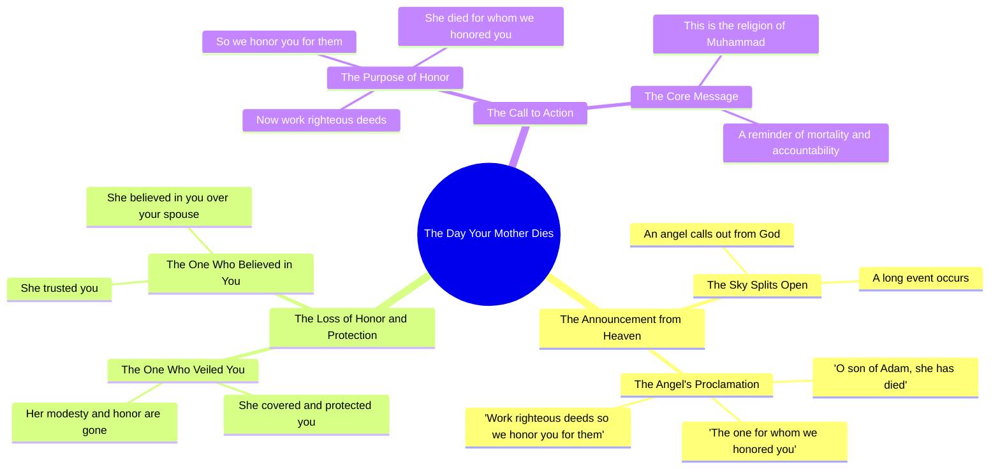

# Day Your Mother Dies, O Son of Adam – Sheikh Kishk

> 🌐 **Read this in:** **English** · [中文](../../zh-CN/2026-06/tiktok-transcript-video-9e03.md)

> **Creator:** [@_ibrahim_elsayed](https://www.tiktok.com/@_ibrahim_elsayed) · **Views:** 2.9M · **Posted:** 2026-06-14 · **Niche:** other
>
> **TL;DR:** The hook uses a vivid, repetitive phrase about the death of a respected figure to evoke immediate emotional resonance.

[Watch original video →](https://vm.tiktok.com/ZNRcbtdjb/)

## Why This Went Viral

## Hook (first 3 seconds)
- **Verbatim opening:** "يوم تموت الام" (The day your mother dies)
- **Hook pattern:** Bold claim / scene-setting / existential threat
- **Why it stops scrolling:** It opens with an emotionally charged, universal fear — the death of a mother. No introduction, no visual tease. It instantly triggers a visceral, personal reaction, forcing the viewer to confront mortality and their own relationship with their mother.

## Emotional Rhythm
- **Beat 1 – Shock & dread:** "The day your mother dies" — immediate emotional weight.
- **Beat 2 – Grief & loss:** "Your uncle dies" — compounds the loss, builds tension.
- **Beat 3 – Cosmic scale:** "The sky will split" — elevates from personal to apocalyptic.
- **Beat 4 – Divine call:** "A king from God calls you" — introduces spiritual authority, deepens curiosity.
- **Beat 5 – Revelation:** "The one for whom we honored you has died" — the core message lands.
- **Beat 6 – Repetition & resonance:** "Maat. Maat. Maat." (She died. She died. She died.) — the climax, a rhythmic hammer of grief.
- **Beat 7 – Contrast & call to action:** "Do good deeds so we honor you for them" — shifts from loss to purpose.
- **Beat 8 – Identity anchor:** "This is the religion of Muhammad" — closes with belonging and mission.

**Climax moment:** The triple repetition of "Maat" — it’s raw, almost chant-like, and impossible to ignore.

## Keyword Density
| Word/Phrase | Count | Function |
|---|---|---|
| ماتت (died) | 5 | Emotional anchor — grief, loss, finality |
| نكرمك (honor you) | 4 | Emotional pull — love, respect, legacy |
| اعمل صالحا (do good deeds) | 2 | Algorithmic reach — religious/spiritual search volume |
| يوم تموت (the day you die) | 1 | Hook — high emotional trigger, low competition |
| ملك (king/angel) | 1 | Algorithmic reach — religious authority keyword |
| دين محمد (religion of Muhammad) | 1 | Algorithmic reach — Islamic identity, community signal |

**Algorithmic drivers:** "اعمل صالحا" and "دين محمد" are high-search-volume religious phrases that push the video into recommended feeds for Muslim audiences.

**Emotional pull:** "ماتت" and "نكرمك" are repeated to create a rhythm of grief and dignity — they don't just inform, they *feel*.

## Why It Spreads
1. **Universal existential trigger** — The opening line "The day your mother dies" is a guaranteed emotional hook for *anyone* with a mother. It bypasses filters and forces a pause.
2. **Rhythmic repetition builds trance** — The triple "Maat" is hypnotic. It mimics a chant or a funeral dirge, making the clip feel sacred and shareable as a form of remembrance or warning.
3. **Religious authority + personal guilt** — The line "The one for whom we honored you has died" directly ties the viewer’s worth to their mother’s life. This creates a guilt-driven urgency to share (as a reminder to others, or as self-accountability).
4. **Clear call to action disguised as theology** — "Do good deeds so we honor you for them" is a direct, actionable takeaway. Viewers can immediately internalize it and share it as advice.
5. **Community identity marker** — Ending with "This is the religion of Muhammad" signals in-group belonging. Sharing the video becomes a public declaration of faith and values.

## What You Can Steal
1. **Open with a universal loss scenario** — Start with "The day your [mother/father/sibling] dies" to instantly tap into a primal fear. Works for any religion or culture.
2. **Use triple repetition for emotional climax** — Repeat the most emotionally charged word three times in a row (e.g., "Gone. Gone. Gone."). It breaks the rhythm and forces attention.
3. **End with a community identity anchor** — Close with a phrase that signals belonging ("This is what we believe" / "This is our way") — it turns a personal moment into a shared mission, driving shares.

## Mind Map

## Full Transcript (Generated by [the tool we used to generate this](https://toktranscript.com/?utm_source=github&utm_medium=breakdown&utm_campaign=tool_attribution))

> 📝 Transcripts on this page are auto-generated and show the first 60%. Want to transcribe any TikTok in 30 seconds and get the full version? [Try TokTranscript free →](https://toktranscript.com/?utm_source=github&utm_medium=breakdown&utm_campaign=transcript_cta)

يوم تموت الام يوم تموت عمك ابن ادم تحلل السماء حادثاً طوالاً وينادي عليك ملك من قبل الله تعالى ويقول يا ابن ادم ماتت التي كنا نكرمك لاجلها فعمل صالحا نكرمك لاجله. ماتت التي كنا نكرمك لاجله.

*[Read the full transcript on TokTranscript →](https://toktranscript.com/plaza/tiktok-transcript-video-9e03?utm_source=github&utm_medium=breakdown&utm_campaign=transcript_full)*

## Browse More

- All [other](../../by-niche/en/other.md) breakdowns
- All [Repetition with escalation](../../by-pattern/en/hook-repetition-with-escalation.md) examples

## Video Info

| | |
|---|---|
| Creator | [@_ibrahim_elsayed](https://www.tiktok.com/@_ibrahim_elsayed) |
| Original video | [https://vm.tiktok.com/ZNRcbtdjb/](https://vm.tiktok.com/ZNRcbtdjb/) |
| Original title | يوم تموت أمك يابن آدم  #فارس_المنابر🖤 #الشيخ_كشك_فارس_المنابر❤️❤️ #صل... |
| Views | 2.9M (2900000) |
| Posted | 2026-06-14 |
| Duration | 0s |
| Niche | `other` |
| Hook pattern | `Repetition with escalation` |
| Original language | `en` |
| Available languages | en, zh-CN |
| Generated | 2026-06-15 by [TokTranscript](https://toktranscript.com/) |

---

*This breakdown is for educational analysis under fair use. Original video © [@_ibrahim_elsayed](https://www.tiktok.com/@_ibrahim_elsayed). All transcripts are auto-generated and may contain errors.*

*Want to analyze your own TikToks like this? [try this transcription tool →](https://toktranscript.com/viral-breakdown?utm_source=github&utm_medium=breakdown&utm_campaign=footer_cta)*