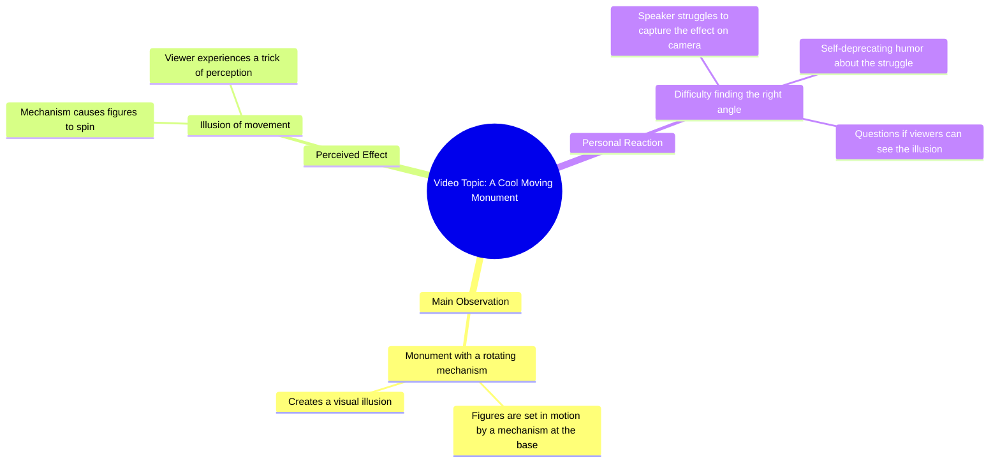

# Chinese Rotating Monument Mechanism Illusion

> 🌐 **Read this in:** **English** · [中文](../../zh-CN/2026-06/tiktok-transcript-video-f1b0.md)

> **Creator:** [@zubarefff](https://www.tiktok.com/@zubarefff) · **Views:** 516.2K · **Posted:** 2026-06-17 · **Niche:** other
>
> **TL;DR:** Opens with a direct address and a promise of something impressive, creating immediate curiosity.

[Watch original video →](https://www.tiktok.com/@zubarefff/video/6862304433431137538)

## Why This Went Viral

## Hook (first 3 seconds)
- **Verbatim opening line:** "Вот, ребятки, еще очень крутой памятник."
- **Hook pattern:** Scene + contrast (sets up a "cool monument" expectation, then undercuts it)
- **Why it stops scroll:** The friendly, direct address ("ребятки") and the promise of something "very cool" create immediate intrigue. But the real hook is the *mismatch* between the confident setup and the self-deprecating punchline that follows—it tricks the viewer into expecting awe, then delivers comedy.

## Emotional Rhythm
- **Beat 1 (Curiosity + Anticipation):** "Вот, ребятки, еще очень крутой памятник." → Viewer expects a reveal of something impressive.
- **Beat 2 (Tension + Confusion):** "Внизу есть механизм... заставляет эти фигуры вращаться." → The description builds a sense of wonder.
- **Beat 3 (Suspense):** "И вот настолько круто создается иллюзия, что..." → The pause ("Не знаю, вам видно или нет") heightens expectation.
- **Beat 4 (Climax – Twist + Relief):** "Создается иллюзия, что я долбоеб и не могу найти нужный ракурс." → The punchline lands. Tension releases into laughter or surprise.
- **Beat 5 (Resonance):** The viewer realizes the entire setup was a deadpan joke about the creator's own failure.

## Keyword Density
- **"Иллюзия"** (illusion) – repeated twice, frames the core joke (the "illusion" is not the monument, but the creator's incompetence).
- **"Крутой/круто"** (cool) – repeated twice, sets up the contrast between expectation and reality.
- **"Памятник"** (monument) – anchors the visual subject, drives algorithmic reach (travel/art content).
- **"Долбоеб"** (dumbass) – the emotional punchline, high-impact, drives shareability (shock value + humor).
- **"Ракурс"** (angle) – niche term for video creators, resonates with the audience's own struggles.
- **"Вращаться"** (rotate) – descriptive, adds visual context, but low emotional pull.

**Algorithmic drivers:** "памятник," "механизм," "вращаться" – these are searchable, niche terms that help the video appear in travel/art/curiosity feeds.  
**Emotional pull:** "долбоеб," "иллюзия," "крутой" – these create the contrast and self-deprecating humor that makes the video relatable and shareable.

## Why It Spreads
1. **Unexpected self-own:** The entire video is a bait-and-switch. The viewer is set up to see a cool monument, but the punchline is the creator admitting they're an idiot. This subverts the "travel/art awe" genre, making it memorable and shareable.  
   *Concrete line:* "Создается иллюзия, что я долбоеб и не могу найти нужный ракурс."

2. **Relatable failure:** Every creator has struggled to find the right angle. The joke is universal for anyone who films content. This turns a niche observation into a broadly relatable moment.  
   *Concrete line:* "Не знаю, вам видно или нет. Создается иллюзия..."

3. **Deadpan delivery:** The tone is completely flat and matter-of-fact, which amplifies the comedy. The viewer feels like they're in on the joke with the creator.  
   *Concrete line:* The entire transcript is delivered with zero vocal irony.

4. **Short, tight structure:** 3 sentences. No wasted words. The punchline lands fast, making it perfect for short-form loops and repeat views.  
   *Concrete line:* The entire transcript is the video.

5. **Word-of-mouth trigger:** "Долбоеб" is a strong, taboo-ish word that people will quote and share because it's funny and surprising in the context of a "cool monument" video.  
   *Concrete line:* "Создается иллюзия, что я долбоеб."

## What You Can Steal
1. **The bait-and-switch hook:** Start with a generic, positive setup ("This is so cool...") then undercut it with a self-deprecating or absurd twist. This works for any genre (travel, DIY, tutorials, reviews).
2. **Deadpan delivery for comedy:** Say the punchline with zero emotion. The contrast between the flat tone and the ridiculous content makes the joke land harder.
3. **Relatable failure as a universal angle:** Instead of showing success, show your own incompetence. It builds connection and makes the video feel like an inside joke with the viewer.

## Mind Map

## Full Transcript (Generated by [analyze your own TikToks](https://toktranscript.com/?utm_source=github&utm_medium=breakdown&utm_campaign=tool_attribution))

> 📝 Transcripts on this page are auto-generated and show the first 60%. Want to transcribe any TikTok in 30 seconds and get the full version? [Try TokTranscript free →](https://toktranscript.com/?utm_source=github&utm_medium=breakdown&utm_campaign=transcript_cta)

Вот, ребятки, еще очень крутой памятник. Внизу есть механизм, который заставляет эти фигуры вращаться.

*[Read the full transcript on TokTranscript →](https://toktranscript.com/plaza/tiktok-transcript-video-f1b0?utm_source=github&utm_medium=breakdown&utm_campaign=transcript_full)*

## Browse More

- All [other](../../by-niche/en/other.md) breakdowns
- All [Curiosity gap with promise of coolness](../../by-pattern/en/hook-curiosity-gap-with-promise-of-coolness.md) examples

## Video Info

| | |
|---|---|
| Creator | [@zubarefff](https://www.tiktok.com/@zubarefff) |
| Original video | [https://www.tiktok.com/@zubarefff/video/6862304433431137538](https://www.tiktok.com/@zubarefff/video/6862304433431137538) |
| Original title | #китай #смех |
| Views | 516.2K (516200) |
| Posted | 2026-06-17 |
| Duration | 0s |
| Niche | `other` |
| Hook pattern | `Curiosity gap with promise of coolness` |
| Original language | `en` |
| Available languages | en, zh-CN |
| Generated | 2026-06-20 by [TokTranscript](https://toktranscript.com/) |

---

*This breakdown is for educational analysis under fair use. Original video © [@zubarefff](https://www.tiktok.com/@zubarefff). All transcripts are auto-generated and may contain errors.*

*Want to analyze your own TikToks like this? [TokTranscript.com →](https://toktranscript.com/viral-breakdown?utm_source=github&utm_medium=breakdown&utm_campaign=footer_cta)*