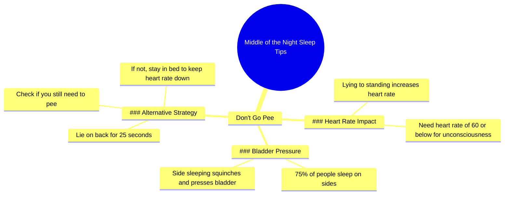

# Why You Shouldn't Pee When Waking Up at Night

> 🌐 **Read this in:** **English** · [中文](../../zh-CN/2026-06/tiktok-transcript-waking-up-in-the-middle-of-the-night-and-immediately-getting-e708.md)

> **Creator:** [@thesleepdoctor](https://www.tiktok.com/@thesleepdoctor) · **Views:** 1.2M · **Posted:** 2026-06-15 · **Niche:** other
>
> **TL;DR:** Challenges a common habit to grab attention.

[Watch original video →](https://www.tiktok.com/@thesleepdoctor/video/7629164280289512717)

## Why This Went Viral

## Hook (first 3 seconds)
- **Verbatim opening:** "Now let's talk about the middle of the night. So number one, don't go pee."
- **Hook pattern:** Counter-intuitive command ("don't go pee") + numbered list framing ("number one")
- **Why it stops scroll:** It directly contradicts a universal, deeply ingrained behavior (waking up to pee). The viewer instantly thinks, "Wait, what? That's bad?" — creating an information gap that demands closure.

## Emotional Rhythm
1. **Curiosity** — "Now let's talk about the middle of the night" signals a secret or hack is coming.
2. **Slight tension** — "Don't go pee" feels wrong, creates cognitive dissonance.
3. **Explanation / Relief** — Heart rate science is introduced, making the counter-intuitive advice feel logical.
4. **Resonance** — "75% of people sleep on their sides" – viewer recognizes themselves.
5. **Actionable twist** — "Lie on your back for 25 seconds" – a tiny, low-effort fix.
6. **Climax** — "If you don't need to pee, stay in bed and keep your heart rate down." The entire argument resolves into a single, repeatable takeaway.

## Keyword Density
- **"Heart rate"** (3x) — algorithmic driver: health/sleep niche keyword.
- **"Pee" / "go to the bathroom"** (5x) — emotional pull: taboo, relatable, mildly funny.
- **"Middle of the night"** (2x) — emotional pull: universal sleep disruption.
- **"Keep your heart rate down"** (2x) — algorithmic + emotional: clear benefit statement.
- **"Lie on your back"** (2x) — actionable: drives saves and shares.
- **"75%"** — algorithmic: specific stat boosts credibility.
- **"Bladder"** — emotional: creates physical empathy.

**Algorithmic drivers:** "heart rate," "75%," "sleep" — these trigger health/sleep content recommendation systems.
**Emotional pull:** "pee," "middle of the night," "bladder" — these feel personal, slightly awkward, and highly relatable.

## Why It Spreads
1. **Universal pain point + counter-intuitive fix** — Almost everyone has woken up to pee. Telling them *not to* is shocking enough to earn a watch. The transcript directly says, "People wake up... they say to themselves, well, I'm up. I might as well go pee, right?" — this mirrors the viewer's own internal monologue.
2. **Micro-actionable science** — The "25 seconds on your back" test is so specific and low-effort that viewers can try it tonight. That testability drives comments ("Tried it, worked!") and shares ("You have to watch this").
3. **Authority via mechanism** — The creator doesn't just say "don't pee." They explain *why* (heart rate spikes). The line "in order to enter into a state of unconsciousness, you need a heart rate of 60 or below" sounds like insider knowledge, building trust.
4. **Relatable self-diagnosis** — "75% of people sleep on their sides and they kind of squinch up" makes the viewer think, "That's me!" This personal resonance triggers the "tag someone" share behavior.
5. **Low barrier to try** — The advice requires zero cost, zero products, zero effort. The final line "stay in bed and keep your heart rate down" is a simple, memorable command that loops back to the core insight.

## What You Can Steal
1. **Start with a forbidden instruction.** Lead with "Don't [common behavior]" to create immediate cognitive friction. Your hook should make people think *"Wait, I do that — am I wrong?"*
2. **Give a 25-second fix.** Offer an absurdly specific, low-effort test (time + position + action). Specificity = memorability = shareability.
3. **Anchor advice in a single metric.** Pick one measurable number (heart rate, steps, minutes, reps) and make every tip circle back to it. This creates a mental "glue" that makes the entire video feel like one coherent idea, not a list.

## Mind Map

## Full Transcript (Generated by [TokTranscript](https://toktranscript.com/?utm_source=github&utm_medium=breakdown&utm_campaign=tool_attribution))

> 📝 Transcripts on this page are auto-generated and show the first 60%. Want to transcribe any TikTok in 30 seconds and get the full version? [Try TokTranscript free →](https://toktranscript.com/?utm_source=github&utm_medium=breakdown&utm_campaign=transcript_cta)

Now let's talk about the middle of the night. So number one, don't go pee. People wake up in the middle of the night, they say to themselves, well, I'm up. I might as well go pee, right? Here's the problem. Remember I told you the big metric was in order to enter into a state of unconsciousness, you need a heart rate of 60 or below, right? What do you think happens to your heart rate when you go from a lying position to a seated position to a standing position, walk across the room, your heart rate goes straight up. So what we want to do is keep your heart rate down.

*[Read the full transcript on TokTranscript →](https://toktranscript.com/plaza/tiktok-transcript-waking-up-in-the-middle-of-the-night-and-immediately-getting-e708?utm_source=github&utm_medium=breakdown&utm_campaign=transcript_full)*

## Browse More

- All [other](../../by-niche/en/other.md) breakdowns
- All [Contrarian advice](../../by-pattern/en/hook-contrarian-advice.md) examples

## Video Info

| | |
|---|---|
| Creator | [@thesleepdoctor](https://www.tiktok.com/@thesleepdoctor) |
| Original video | [https://www.tiktok.com/@thesleepdoctor/video/7629164280289512717](https://www.tiktok.com/@thesleepdoctor/video/7629164280289512717) |
| Original title | Waking up in the middle of the night and immediately getting up to pe... |
| Views | 1.2M (1200000) |
| Posted | 2026-06-15 |
| Duration | 0s |
| Niche | `other` |
| Hook pattern | `Contrarian advice` |
| Original language | `en` |
| Available languages | en, zh-CN |
| Generated | 2026-06-16 by [TokTranscript](https://toktranscript.com/) |

---

*This breakdown is for educational analysis under fair use. Original video © [@thesleepdoctor](https://www.tiktok.com/@thesleepdoctor). All transcripts are auto-generated and may contain errors.*

*Want to analyze your own TikToks like this? [analyze your own TikToks →](https://toktranscript.com/viral-breakdown?utm_source=github&utm_medium=breakdown&utm_campaign=footer_cta)*