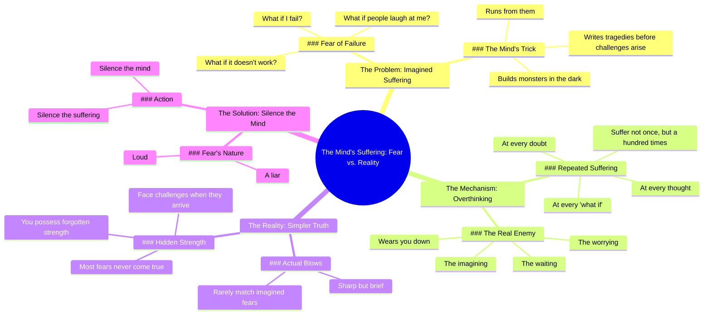

# We Suffer More in Imagination Than in Reality

> 🌐 **Read this in:** **English** · [中文](../../zh-CN/2026-06/tiktok-transcript-we-suffer-more-in-imagination-than-in-reality-seneca-stoicis-2c7e.md)

> **Creator:** [@gloryofachilles](https://www.tiktok.com/@gloryofachilles) · **Views:** 5.0M · **Posted:** 2026-06-28 · **Niche:** entertainment
>
> **TL;DR:** Opens with relatable anxieties then flips with a stoic truth.

[Watch original video →](https://vt.tiktok.com/ZSCAayhFb/)

## Why This Went Viral

## Hook (first 3 seconds)
- **Verbatim opening line:** "But what if I fail? What if it doesn't work? What if people laugh at me?"
- **Hook pattern:** Question cascade (rapid-fire rhetorical questions that mirror internal doubt)
- **Why it stops scrolling:** It immediately voices the viewer's own unspoken anxiety, creating a visceral "this is about me" jolt. The three questions escalate in social severity (failure → outcome → shame), which traps the viewer's attention before they can swipe.

## Emotional Rhythm
1. **Anxiety (0–3s):** The question cascade triggers mild discomfort by naming common fears.
2. **Validation (3–6s):** "We suffer more in imagination than in reality" — a recognizable Stoic quote that offers relief.
3. **Tension build (6–12s):** "It builds monsters in the dark... writes tragedies" — imagery of the mind as an enemy. Suspense rises.
4. **Contrast pivot (12–15s):** "But reality. Reality is simpler." — the twist lands here. The word "simpler" signals a resolution.
5. **Climax (15–20s):** "The blow, when it comes, is sharp but brief." — the core insight delivered with punchy, poetic rhythm.
6. **Empowerment (20–28s):** "You will face it with strength you forgot you had." — emotional release and self-trust.
7. **Final punch (28–30s):** "Fear is loud, but it is a liar. Silence the mind, and you silence the suffering." — call to action that feels like a mic drop.

## Keyword Density
| Word/Phrase | Frequency | Function |
|---|---|---|
| **what if** | 4x | Algorithmic: high search volume for anxiety content. Emotional: triggers identification. |
| **imagination / imagining** | 3x | Emotional: contrasts internal vs. external suffering. |
| **reality** | 3x | Algorithmic: ties to "Stoicism" and "mindfulness" keywords. |
| **suffer / suffering** | 3x | Emotional: creates resonance with pain. |
| **fear** | 2x | Algorithmic: high-engagement topic. Emotional: names the antagonist. |
| **mind** | 3x | Emotional: personifies the enemy. |
| **silence** | 2x | Algorithmic: ties to meditation/mental health. Emotional: offers a solution. |

## Why It Spreads
1. **Universal pain point + immediate relief:** The opening questions ("What if I fail?") are the exact words 90% of people say to themselves. The video answers within 3 seconds ("We suffer more in imagination..."), creating a dopamine hit of recognition and relief. *Transcript line: "We suffer more in imagination than in reality."*
2. **Rhythmic, shareable language:** The script uses short, punchy sentences with a beat-like cadence ("It builds monsters in the dark, then runs from them"). This makes it easy to quote, remix, or repost — the currency of short-form virality. *Transcript line: "Fear is loud, but it is a liar."*
3. **The "twist" creates a save-for-later reflex:** The contrast between "imagination" and "reality" is so clean that viewers save the video to rewatch or send to a friend. *Transcript line: "But reality. Reality is simpler."*
4. **Empowerment arc that feels earned:** The video doesn't just comfort — it builds a case. The emotional journey from fear to strength makes the ending feel like a personal breakthrough, which drives comments like "I needed this." *Transcript line: "You will face it with strength you forgot you had."*
5. **Algorithmic keyword stacking:** "What if," "fear," "suffering," "mind," "silence" — these are high-volume search terms for anxiety, Stoicism, and mental health content. The video is discoverable from multiple angles. *Transcript line: "Silence the mind, and you silence the suffering."*

## What You Can Steal
1. **Lead with the viewer's inner voice:** Start your video with the exact question or doubt your audience whispers to themselves. Don't explain — just echo. The hook becomes a mirror, not a pitch.
2. **Use the "contrast pivot" structure:** Frame your entire script around one clean opposition (imagination vs. reality, fear vs. strength, waiting vs. impact). The pivot word ("But") signals the brain that a reward is coming.
3. **End with a quotable, rhythmic one-liner:** The final 3 seconds should be a standalone sentence that can be screenshot, shared, or used as a caption. Make it rhyme or have a pulse ("Fear is loud, but it is a liar"). That's your viral seed.

## Mind Map

## Full Transcript (Generated by [TokTranscript.com](https://toktranscript.com/?utm_source=github&utm_medium=breakdown&utm_campaign=tool_attribution))

> 📝 Transcripts on this page are auto-generated and show the first 60%. Want to transcribe any TikTok in 30 seconds and get the full version? [Try TokTranscript free →](https://toktranscript.com/?utm_source=github&utm_medium=breakdown&utm_campaign=transcript_cta)

But what if I fail? What if it doesn't work? What if people laugh at me? We suffer more in imagination than in reality. The mind is a strange thing. It builds monsters in the dark, then runs from them. It writes tragedies before life has even whispered a challenge. And so you suffer not once, but a hundred times. At every thought, every doubt, every what if. But reality. Reality is simpler.

*[Read the full transcript on TokTranscript →](https://toktranscript.com/plaza/tiktok-transcript-we-suffer-more-in-imagination-than-in-reality-seneca-stoicis-2c7e?utm_source=github&utm_medium=breakdown&utm_campaign=transcript_full)*

## Browse More

- All [entertainment](../../by-niche/en/entertainment.md) breakdowns
- All [Rhetorical questions + contrast](../../by-pattern/en/hook-rhetorical-questions-contrast.md) examples

## Video Info

| | |
|---|---|
| Creator | [@gloryofachilles](https://www.tiktok.com/@gloryofachilles) |
| Original video | [https://vt.tiktok.com/ZSCAayhFb/](https://vt.tiktok.com/ZSCAayhFb/) |
| Original title | We suffer more in imagination than in reality.  #seneca #stoicism #st... |
| Views | 5.0M (5000000) |
| Posted | 2026-06-28 |
| Duration | 0s |
| Niche | `entertainment` |
| Hook pattern | `Rhetorical questions + contrast` |
| Original language | `en` |
| Available languages | en, zh-CN |
| Generated | 2026-06-29 by [TokTranscript](https://toktranscript.com/) |

---

*This breakdown is for educational analysis under fair use. Original video © [@gloryofachilles](https://www.tiktok.com/@gloryofachilles). All transcripts are auto-generated and may contain errors.*

*Want to analyze your own TikToks like this? [the tool we used to generate this →](https://toktranscript.com/viral-breakdown?utm_source=github&utm_medium=breakdown&utm_campaign=footer_cta)*