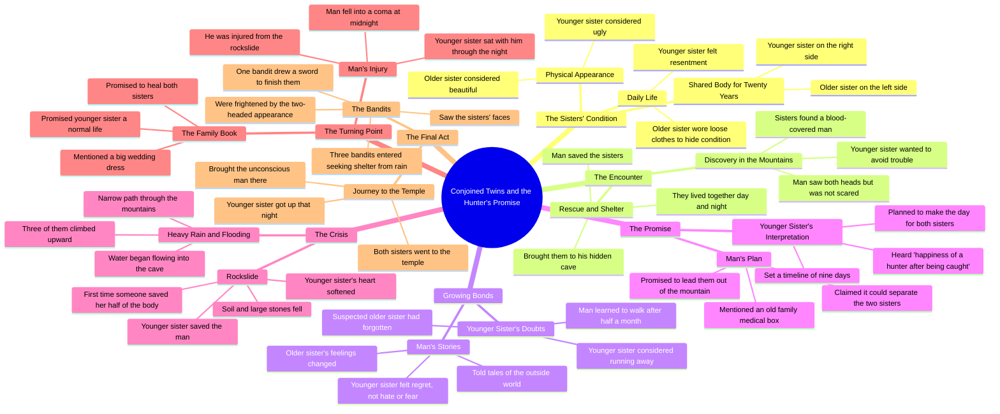

# Best Movie Recaps: Editing & Narrating Top Film Stories

> 🌐 **Read this in:** **English** · [中文](../../zh-CN/2026-06/tiktok-transcript-welcome-to-my-channel-here-i-edit-and-narrating-the-best-mov-e49d.md)

> **Creator:** [@bryanmoviefacts](https://www.tiktok.com/@bryanmoviefacts) · **Views:** 3.9M · **Posted:** 2026-06-14 · **Niche:** entertainment
>
> **TL;DR:** Immediately introduces a bizarre, high-stakes scenario that compels viewers to learn more.

[Watch original video →](https://vt.tiktok.com/ZSQQuNRR9/)

## Why This Went Viral

## Hook (first 3 seconds)
- **Verbatim opening:** "A woman and her older sister. Both were in the same body for twenty years. The older sister was on the left. He had control over most of his body."
- **Hook pattern:** **Scene + Curious Contrast** — immediately presents an impossible physical situation (two people sharing one body) with a clear visual distinction (left/right, control imbalance).
- **Why it stops scroll:** The premise is so bizarre and specific that the brain cannot categorize it — it forces a "What? How? Who?" response. The detail "twenty years" adds a time-anchored stakes layer that signals a long, unresolved story.

## Emotional Rhythm
- **Curiosity spike** (0–5s): "Both in the same body" — immediate cognitive dissonance.
- **Tension + Unease** (5–15s): Descriptions of hiding, loose clothes, "strange woman," rubble, blood-covered man.
- **Suspense plateau** (15–30s): The man sees both heads, trembles, saves them. The little sister's doubt ("My sister has forgotten") builds relational tension.
- **Relief + Warmth** (30–45s): The man tells stories, the little sister feels regret, not hate. "Every wall of the little heart fell into a bridge."
- **False hope / Twist** (45–60s): Separation promise is made — but the little sister hears "the happiness of a hunter after being caught." Dread returns.
- **Climax** (60–75s): Rainstorm, cave flooding, narrow path, rocks fall. The man saves the little sister's half — "For the first time in twenty years, someone was ugly. He saved half his body."
- **Final spike (danger + cliffhanger)** (75–end): Bandits arrive, see two heads, draw a sword. The video cuts before resolution.

## Keyword Density
| Word/Phrase | Count (approx.) | Driver |
|---|---|---|
| "sister" / "little one" / "great one" | ~25 | **Emotional pull** — familial bond is the heart |
| "body" / "half" | ~12 | **Algorithmic reach** — visual, shareable, unique concept |
| "mountain" / "cave" | ~8 | **Setting anchor** — creates a contained, mythic world |
| "save" / "saved" | ~6 | **Emotional pull** — heroism, sacrifice, catharsis |
| "blood" / "injured" / "coma" | ~5 | **Tension + retention** — stakes keep watch time high |
| "two heads" / "ugly" | ~4 | **Algorithmic reach** — shocking, memorable, clickable |
| "promise" / "happy" | ~4 | **Emotional pull** — hope vs. betrayal tension |

## Why It Spreads
1. **Impossible premise = instant curiosity engine.** "Two people in one body" is a hook so strange that viewers *must* know more. The transcript opens with it verbatim, making the first 3 seconds a guaranteed stop.
2. **Mythic storytelling structure without exposition.** Every line advances the plot (cave, rescue, promise, betrayal, storm, bandits). No filler — this keeps retention high and makes the video easy to rewatch or retell.
3. **Emotional whiplash keeps viewers glued.** The video oscillates between warmth (man telling stories) and dread (hunter metaphor, rain, bandits). Each emotional beat is short (3–5 seconds), preventing boredom and encouraging comments like "I can't look away."
4. **Open-ended cliffhanger drives sharing.** The final line ("picked up the sword to finish there") cuts off mid-action. Viewers are forced to share or comment to speculate, discuss, or demand part 2.
5. **Universal themes + specific imagery = shareable.** "Saving someone who is 'ugly,'" "sibling sacrifice," "choosing love over fear" — these are emotionally resonant archetypes. The specific details (two-headed, cave, blood-covered man) make it feel original and fresh, not generic.

## What You Can Steal
1. **Lead with a "What?!" premise in the first 3 seconds.** Don't build up — drop the weirdest, most specific fact immediately. "Two sisters in one body for 20 years" is better than "This is a story about conjoined twins."
2. **Use a 3-sentence emotional rollercoaster per scene.** Every paragraph in this transcript is a mini-story: setup → tension → twist. In your own video, force yourself to change the emotional tone every 5–10 seconds (curiosity → fear → hope → dread).
3. **End on a cliffhanger that requires a reaction.** Don't resolve. Cut at the moment of highest tension (sword raised, door opening, secret revealed). This forces comments, shares, and "part 2" requests — all algorithmic signals.

## Mind Map

## Full Transcript (Generated by [TokTranscript](https://toktranscript.com/?utm_source=github&utm_medium=breakdown&utm_campaign=tool_attribution))

> 📝 Transcripts on this page are auto-generated and show the first 60%. Want to transcribe any TikTok in 30 seconds and get the full version? [Try TokTranscript free →](https://toktranscript.com/?utm_source=github&utm_medium=breakdown&utm_campaign=transcript_cta)

A woman and her older sister. Both were in the same body for twenty years. The older sister was on the left. He had control over most of his body. It was beautiful and beautiful. The little one was on the right. Not to be confused with face and face. The older sister always wears loose clothes. So that half of his body is hidden. Look outside and see a strange woman. One day on both sides of the mountain. And then they took one of the rubble. Then came the sound. And the great ones were removed. A man was covered in blood. The little one said, “Don’t get into other people’s troubles. ” Get out of here and open your eyes. He saw both heads. Not scared, not scared. Trembling Then he took his hands and saved them. He did not see his sister die. Then both of them came to him, and they both came to him. Where he was hiding from the world. Then the morning and the evening came. The little man was doubtful. My sister has forgotten. Then, for the first half of the month, the son of man was able to walk. The little one was going to run away, or he was going to run away. And he didn’t do anything great. The mountains of the mountains. Tell stories of the outside world. The big hairs of the hair. The little one was not afraid. No hate. Whenever he looked at it, he would only regret it. It is not as if he were a sick man. Who needs care. This feeling won the heart of the great sister. Even small walls sometimes shake. One day he took hold of his hand and promised As soon as the foot is full, it will lead them out of the mountain. And together I told him that an old one in his family medical box. The two sisters. They can be separated. He said, “I want to be happy. Who did he hold? “He will make it his own. The little one heard something else. The happiness of a hunter after being caught.

*[Read the full transcript on TokTranscript →](https://toktranscript.com/plaza/tiktok-transcript-welcome-to-my-channel-here-i-edit-and-narrating-the-best-mov-e49d?utm_source=github&utm_medium=breakdown&utm_campaign=transcript_full)*

## Browse More

- All [entertainment](../../by-niche/en/entertainment.md) breakdowns
- All [Curiosity gap with shocking premise](../../by-pattern/en/hook-curiosity-gap-with-shocking-premise.md) examples

## Video Info

| | |
|---|---|
| Creator | [@bryanmoviefacts](https://www.tiktok.com/@bryanmoviefacts) |
| Original video | [https://vt.tiktok.com/ZSQQuNRR9/](https://vt.tiktok.com/ZSQQuNRR9/) |
| Original title | Welcome to my channel, here I Edit and narrating the best Movie Recap... |
| Views | 3.9M (3900000) |
| Posted | 2026-06-14 |
| Duration | 0s |
| Niche | `entertainment` |
| Hook pattern | `Curiosity gap with shocking premise` |
| Original language | `en` |
| Available languages | en, zh-CN |
| Generated | 2026-06-15 by [TokTranscript](https://toktranscript.com/) |

---

*This breakdown is for educational analysis under fair use. Original video © [@bryanmoviefacts](https://www.tiktok.com/@bryanmoviefacts). All transcripts are auto-generated and may contain errors.*

*Want to analyze your own TikToks like this? [TokTranscript.com →](https://toktranscript.com/viral-breakdown?utm_source=github&utm_medium=breakdown&utm_campaign=footer_cta)*