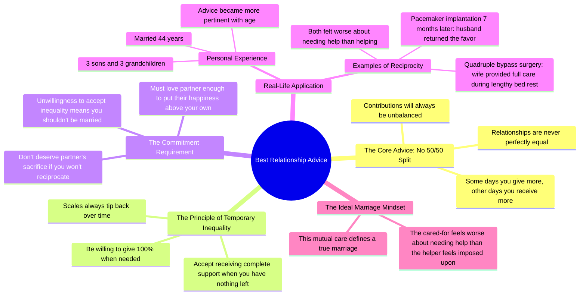

# Best Relationship Advice From a Father

> 🌐 **Read this in:** **English** · [中文](../../zh-CN/2026-06/tiktok-transcript-what-s-the-best-relationship-advice-you-ve-ever-gotten-reddi-c803.md)

> **Creator:** [@etherstories](https://www.tiktok.com/@etherstories) · **Views:** 3.9M · **Posted:** 2026-06-23 · **Niche:** entertainment
>
> **TL;DR:** Opens with a relatable, universal question that immediately engages viewers and promises a valuable answer.

[Watch original video →](https://vm.tiktok.com/ZNRTAUBpa/)

## Why This Went Viral

## Hook (first 3 seconds)
- **Verbatim opening:** "What's the best relationship advice you've ever gotten?"
- **Hook pattern:** Question (open-ended, personal, universal)
- **Why it stops scrolling:** The question is instantly relatable and taps into a universal human curiosity—everyone has either sought or received relationship advice. It promises a personal, authoritative answer from a father figure, which signals emotional depth and wisdom. The phrasing ("best… ever") creates a high-stakes, definitive claim that demands attention.

## Emotional Rhythm
- **Beat 1 – Curiosity (0–5s):** The question hooks, then the speaker grounds it in personal context ("my father gave me this advice shortly after I got married").
- **Beat 2 – Tension (5–15s):** The speaker describes feeling "put upon" and "suspicions" about an unequal workload—this creates relatable conflict.
- **Beat 3 – Resolution via wisdom (15–30s):** Father delivers the core advice: "There is no such thing as a 50/50 split." This is the twist—it reframes the problem.
- **Beat 4 – Emotional resonance (30–40s):** The father's line "if you don't love your wife enough to put her happiness above your own" lands as a moral climax.
- **Beat 5 – Proof & payoff (40–55s):** The speaker shares 44-year marriage, surgeries, and reciprocal care—this validates the advice with real-life evidence.
- **Beat 6 – Gratitude & closure (55–60s):** "Thanks, pop."—a soft, resonant ending that ties the emotional arc.

**Climax moment:** The father's line "if you don't love your wife enough to put her happiness above your own, then you don't deserve it when she does that for you."

## Keyword Density
- **"advice"** – 3x (frames the video as wisdom-sharing, drives searchability)
- **"wife"** – 5x (emotional pull, relatable relationship anchor)
- **"50/50 split"** – 3x (memorable phrase that becomes the central concept)
- **"give" / "need"** – 6x combined (drives the core tension of unequal effort)
- **"marriage" / "married"** – 5x (universal topic, high search volume)
- **"love"** – 3x (emotional resonance, algorithmic keyword for relationship content)
- **"years"** – 3x (time markers like "44 years" signal longevity and credibility)

**Algorithmic reach drivers:** "advice," "marriage," "relationship" — these are high-volume, evergreen search terms. **Emotional pull drivers:** "love," "wife," "give" — these trigger empathy and relatability.

## Why It Spreads
1. **Universal problem, specific solution** — The video addresses a near-universal marital tension (unequal workload) and offers a counterintuitive, memorable reframe ("no such thing as 50/50"). The father's advice is simple, quotable, and shareable. *Concrete line:* "There is no such thing as a 50 to 50 split."
2. **Emotional proof over time** — The speaker doesn't just give advice; he proves it with 44 years of marriage and two serious surgeries. This builds credibility and emotional weight. *Concrete line:* "My wife and I have been married for 44 years… I had a quadruple bypass… she had a pacemaker implanted."
3. **Generational wisdom transfer** — The father figure (now deceased) becomes a timeless authority. The "thanks, pop" ending creates a tear-jerking, shareable moment that honors legacy. *Concrete line:* "My dad's been gone for 7 years now… Thanks, pop."
4. **Relatable conflict, satisfying resolution** — The opening frustration (feeling "put upon") is something many married people feel but rarely hear addressed with such clarity. The resolution (accepting temporary inequality) feels like a permission slip to be imperfect. *Concrete line:* "If you are not willing to accept this temporarily unequal state of affairs, then you shouldn't be married."
5. **Highly quotable, low-friction share** — The core advice can be extracted as a standalone quote. Viewers can screenshot or repost it without watching the full video. *Concrete line:* "Some days you will be called on to give more… next week you may need her support."

## What You Can Steal
1. **Use a question hook that promises a definitive answer.** Start with "What's the best [X] you've ever [Y]?" — it's open-ended but implies you have the ultimate answer. This triggers curiosity and keeps viewers watching.
2. **Structure a "problem → reframe → proof" arc.** First, describe a common frustration (unequal effort). Then, deliver a counterintuitive reframe (no 50/50). Finally, back it with real-life evidence (44 years, surgeries). This pattern works for any topic where conventional wisdom can be challenged.
3. **End with a short, emotional callback.** The "Thanks, pop" line is only 3 words but packs the entire video's emotional weight. A brief, personal sign-off (thanking someone, naming a person, or a single line of gratitude) makes the video feel complete and shareable.

## Mind Map

## Full Transcript (Generated by [analyze your own TikToks](https://toktranscript.com/?utm_source=github&utm_medium=breakdown&utm_campaign=tool_attribution))

> 📝 Transcripts on this page are auto-generated and show the first 60%. Want to transcribe any TikTok in 30 seconds and get the full version? [Try TokTranscript free →](https://toktranscript.com/?utm_source=github&utm_medium=breakdown&utm_campaign=transcript_cta)

What's the best relationship advice you've ever gotten? My father gave me this advice shortly after I got married to the love of my life. He knew a thing or 3 about lifelong love. When my mother passed away, they had just celebrated their 63rd anniversary. I was working long hours and feeling put upon when I would come home to my wife needing help with the housework and the baby. She didn't come right out and accuse me of slacking, but I felt the suspicions. I was lamenting to my dad that I just wanted a 50 to 50 split, thinking in my naivete that would be an egalitarian solution. He nodded and in his own no nonsense way, gave me the sages piece of life's wisdom. There is no such thing as a 50 to 50 split. Things will always be unequal between partners. Some days you will be called on to give more because your wife needs more help. But the scales always tip back, and next week you may need her support. At times you may be called on to give 100%, or you may need her complete support because you have nothing left to give. Here's the important part. If you are not willing to accept this temporarily unequal state of affairs, then you shouldn't be married.

*[Read the full transcript on TokTranscript →](https://toktranscript.com/plaza/tiktok-transcript-what-s-the-best-relationship-advice-you-ve-ever-gotten-reddi-c803?utm_source=github&utm_medium=breakdown&utm_campaign=transcript_full)*

## Browse More

- All [entertainment](../../by-niche/en/entertainment.md) breakdowns
- All [Question Hook](../../by-pattern/en/hook-question-hook.md) examples

## Video Info

| | |
|---|---|
| Creator | [@etherstories](https://www.tiktok.com/@etherstories) |
| Original video | [https://vm.tiktok.com/ZNRTAUBpa/](https://vm.tiktok.com/ZNRTAUBpa/) |
| Original title | What's the best relationship advice you've ever gotten? #reddit #redd... |
| Views | 3.9M (3900000) |
| Posted | 2026-06-23 |
| Duration | 0s |
| Niche | `entertainment` |
| Hook pattern | `Question Hook` |
| Original language | `en` |
| Available languages | en, zh-CN |
| Generated | 2026-06-24 by [TokTranscript](https://toktranscript.com/) |

---

*This breakdown is for educational analysis under fair use. Original video © [@etherstories](https://www.tiktok.com/@etherstories). All transcripts are auto-generated and may contain errors.*

*Want to analyze your own TikToks like this? [the tool we used to generate this →](https://toktranscript.com/viral-breakdown?utm_source=github&utm_medium=breakdown&utm_campaign=footer_cta)*