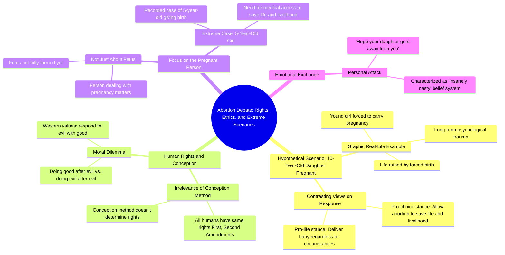

# 10-Year-Old Daughter Pregnancy Dilemma

> 🌐 **Read this in:** **English** · [中文](../../zh-CN/2026-06/tiktok-transcript-yikessss-ce18.md)

> **Creator:** [@charliekirkdebateclips](https://www.tiktok.com/@charliekirkdebateclips) · **Views:** 30.1M · **Posted:** 2026-06-14 · **Niche:** other
>
> **TL;DR:** Starts with a shocking hypothetical to immediately engage and provoke emotional response.

[Watch original video →](https://vt.tiktok.com/ZSQQunsGf/)

## Why This Went Viral

## Hook (first 3 seconds)
- **Verbatim opening:** "So if you had a daughter and she was 10 and she got. And she was gonna give birth and she would. No, wait. Oh, and she was gonna give birth and she was gonna live, would you want her to go through that and carry her baby?"
- **Hook pattern:** Shocking hypothetical scenario + stuttering delivery (creates raw, unpolished urgency)
- **Why it stops scrolling:** The extreme age (10), the graphic premise (birth), and the speaker's own fumbling ("No, wait") signal a high-stakes, emotionally charged debate—viewers instinctively lean in to see where this is going.

## Emotional Rhythm
1. **Shock & Disgust** (0–5s): "10-year-old daughter giving birth" hits a visceral nerve.
2. **Confusion & Curiosity** (5–15s): Speaker's stumble + "That's awfully graphic" creates tension—viewer asks, "Is this real?"
3. **Moral Dissonance** (15–30s): "The answer is yes" vs. "That's insane" — two opposing emotional poles clash.
4. **Escalation & Entrapment** (30–50s): "Which ultrasound is which?" trap question forces viewer to pick a side.
5. **Frustration & Anger** (50–90s): Interruptions ("Hold on," "No, no, no") raise heat; both speakers talk over each other.
6. **Climax — Moral High Ground** (90–110s): "What makes the west great is that we do good after evil, not evil after evil" — a resonant, quotable line that reframes the entire debate.
7. **Final Blow** (110–end): "I hope your daughter lives a very happy life and gets away from you" — personal attack that seals the viral "drama" payoff.

## Keyword Density
| Keyword / Phrase | Frequency | Function |
|---|---|---|
| "Daughter" | 8 | Emotional pull — triggers parental empathy |
| "Give birth / pregnant" | 6 | Shocking, graphic — drives curiosity |
| "Evil" | 4 | Moral framing — algorithmic reach (polarizing) |
| "Human rights" | 3 | Political trigger — algorithmic reach |
| "Freedom" | 2 | Core ideological clash — emotional resonance |
| "Cells / fetus / being" | 5 | Dehumanization vs. personhood debate — drives engagement |
| "Crime" | 2 | Moral judgment — emotional pull |
| "Listen" (repeated) | 5 | Interruption marker — signals conflict (keeps viewers watching) |

- **Algorithmic reach drivers:** "Evil," "human rights," "freedom" — these are high-engagement political keywords that YouTube/TikTok's recommendation systems amplify.
- **Emotional pull drivers:** "Daughter," "give birth," "cells" — these tap into primal empathy and disgust, making viewers comment or share.

## Why It Spreads
1. **Shock + Personalization:** The "10-year-old daughter" hypothetical is extreme and specific. It forces viewers to imagine their own child, making the abstract debate visceral. *Transcript line: "If you had a daughter and she was 10... would you want her to go through that?"*
2. **Interruption Drama:** The constant overlapping ("No, hold on," "Listen, listen, listen") mimics a real-time fight. Viewers stay to see who "wins" — high retention. *Transcript line: "No, no, no, I'm speaking."*
3. **Trap Question (Ultrasound):** The "which baby is which?" challenge is a classic debate trap. It forces the opponent into a corner, creating a satisfying "gotcha" moment that viewers share. *Transcript line: "There's two ultrasounds I have... which one is which?"*
4. **Quotable Climax:** "Do good after evil, not evil after evil" is a pithy, moral-sounding soundbite. It's easily clipped and shared as a standalone quote, driving cross-platform spread.
5. **Personal Attack Finale:** "I hope your daughter gets away from you" is the ultimate engagement bait — it invites outrage, defense, and replies. Viewers feel compelled to comment their take. *Transcript line: "I hope your daughter lives a very happy life and gets away from you."*

## What You Can Steal
1. **Lead with a Shocking Hypothetical (Personalized):** Instead of stating an opinion, frame it as "What if YOUR [family member] was in this scenario?" — it forces emotional investment before logic kicks in.
2. **Use the "Interruption Loop" for Retention:** Strategically interrupt yourself or your opponent (e.g., "Hold on, let me ask you a question") to reset the viewer's attention and keep them watching for the next punch.
3. **Plant a Trap Question Early:** Ask a question that has no "good" answer for the other side (e.g., "Which ultrasound is which?"). This creates a debate climax that viewers will replay and share to see the "gotcha" moment.

## Mind Map

## Full Transcript (Generated by [free TikTok transcript generator](https://toktranscript.com/?utm_source=github&utm_medium=breakdown&utm_campaign=tool_attribution))

> 📝 Transcripts on this page are auto-generated and show the first 60%. Want to transcribe any TikTok in 30 seconds and get the full version? [Try TokTranscript free →](https://toktranscript.com/?utm_source=github&utm_medium=breakdown&utm_campaign=transcript_cta)

So if you had a daughter and she was 10 and she got. And she was gonna give birth and she would. No, wait. Oh, and she was gonna give birth and she was gonna live, would you want her to go through that and carry her baby? That's awfully graphic. It's no, but it's a real life scenario that happens to many people. The answer is yes. The baby would be delivered. Oh, okay, great. So I. That's insane. Um. But let me tell you why. No, hold on, let me ask you a question. There's two ultrasounds I have. One is a baby conceived in. One is a baby conceived by a loving couple. Which one is which? You don't know exactly. Cause it's all human rights. But it's all human beings matter. It's. But it's about your daughter who's has to give birth to it. And it's gonna be tortured by that for the rest of her life. You are not gonna take away every freedom she's ever gonna have. That's gonna ruin her life. She's gonna grow up and she's gonna be attached to another thing. And it's not a victimless crime. At the point is how you were conceived is irrelevant what human rights you get. But when you. Hold on one second. If a person conceived in walks on the side of the street, it's not like they don't get First Amendment rights or Second Amendment rights. It's not about that person. The worst Thing to do to that, the daughter, is to then say, hey, we're gonna go the being in inside of you. They wouldn't even know. Like, listen, they. They wouldn't know. Listen, listen, listen, listen. But wouldn't it. Wouldn't it be a better story to say it wouldn't. no. Evil happened, and we do something good in the face of evil. No, instead of saying we're gonna do evil and then for the being, because we're gonna. We're gonna. We're gonna pander to the evil. No, what makes.

*[Read the full transcript on TokTranscript →](https://toktranscript.com/plaza/tiktok-transcript-yikessss-ce18?utm_source=github&utm_medium=breakdown&utm_campaign=transcript_full)*

## Browse More

- All [other](../../by-niche/en/other.md) breakdowns
- All [Hypothetical Scenario](../../by-pattern/en/hook-hypothetical-scenario.md) examples

## Video Info

| | |
|---|---|
| Creator | [@charliekirkdebateclips](https://www.tiktok.com/@charliekirkdebateclips) |
| Original video | [https://vt.tiktok.com/ZSQQunsGf/](https://vt.tiktok.com/ZSQQunsGf/) |
| Original title | Yikessss |
| Views | 30.1M (30100000) |
| Posted | 2026-06-14 |
| Duration | 0s |
| Niche | `other` |
| Hook pattern | `Hypothetical Scenario` |
| Original language | `en` |
| Available languages | en, zh-CN |
| Generated | 2026-06-15 by [TokTranscript](https://toktranscript.com/) |

---

*This breakdown is for educational analysis under fair use. Original video © [@charliekirkdebateclips](https://www.tiktok.com/@charliekirkdebateclips). All transcripts are auto-generated and may contain errors.*

*Want to analyze your own TikToks like this? [TokTranscript →](https://toktranscript.com/viral-breakdown?utm_source=github&utm_medium=breakdown&utm_campaign=footer_cta)*