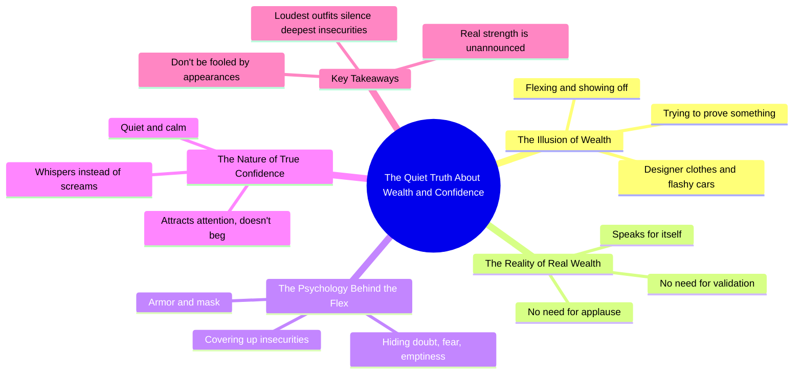

# Wealthy People Don’t Need to Show Off

> 🌐 **Read this in:** **English** · [中文](../../zh-CN/2026-06/tiktok-transcript-you-ever-notice-how-the-loudest-people-in-the-room-are-usual-4cd4.md)

> **Creator:** [@carlosthewizardalvarez](https://www.tiktok.com/@carlosthewizardalvarez) · **Views:** 1.5M · **Posted:** 2026-06-03 · **Niche:** finance
>
> **TL;DR:** Warns the viewer to reconsider a common assumption, creating immediate curiosity.

[Watch original video →](https://www.tiktok.com/@carlosthewizardalvarez/video/7562245352363920671)

## Why This Went Viral

## Hook (first 3 seconds)
- **Verbatim opening:** "Be careful when you see somebody dressed from head to toe in designer clothes flexing like they got it all figured out."
- **Hook pattern:** Warning + contrast (caution against a common behavior, then implied opposite truth)
- **Why it stops scrolling:** It triggers immediate self-reflection ("Do I do this?") and social judgment ("I know someone like that"). The word "be careful" creates a sense of hidden danger or insider knowledge, making the viewer feel they're about to learn a secret.

## Emotional Rhythm
- **Beat 1 – Curiosity/Alert:** "Be careful when you see somebody..." – viewer's brain switches to pattern-recognition mode
- **Beat 2 – Tension:** "Really wealthy people, they don't need to prove a damn thing." – direct contradiction to the flashy image, creates cognitive dissonance
- **Beat 3 – Validation/Relief:** "Real wealth speaks for itself." – viewer feels confirmed in their own suspicion
- **Beat 4 – Twist/Insight:** "The louder the outfit... the more likely it's just covering up something deeper." – escalates from observation to psychological diagnosis
- **Beat 5 – Resonance:** "True confidence, it doesn't scream, it whispers." – quotable climax, emotionally satisfying
- **Beat 6 – Call to Action (implicit):** "So the next time you see somebody doing the most..." – reframes future behavior, gives the viewer a new lens

## Keyword Density
| Keyword/Phrase | Count (approx.) | Driver |
|---|---|---|
| "wealth"/"wealthy" | 4 | Algorithmic + aspirational search |
| "confidence"/"confident" | 3 | Emotional pull, self-improvement |
| "loud"/"loudest" | 4 | Contrast hook, memorability |
| "quiet"/"whispers" | 3 | Emotional pull, brandable phrase |
| "prove"/"validation" | 3 | Psychological trigger (insecurity) |
| "armor"/"mask" | 2 | Visual metaphor, shareable imagery |
| "real" | 5 | Authority marker, authenticity signal |

- **Algorithmic drivers:** "wealth," "real" – high search volume, evergreen topics in finance/self-help niches
- **Emotional pull:** "whispers," "loudest," "armor" – create mental imagery and emotional contrast that triggers sharing

## Why It Spreads
1. **Social identity validation** – The video validates viewers who already believe flashy = insecure, making them feel smart and confirmed. Line: "The loudest people in the room are usually the most insecure."
2. **Shareable contrast formula** – Every sentence is a binary (loud vs. quiet, fake vs. real, scream vs. whisper). This makes the message easy to remember and repeat. Line: "True confidence, it doesn't scream, it whispers."
3. **Insider knowledge payoff** – The video frames itself as revealing a hidden truth ("here's the truth," "here's the funniest part"). Viewers share to appear knowledgeable. Line: "Really wealthy people, they don't need to prove a damn thing."
4. **Emotional catharsis** – It releases pent-up frustration about status-signaling culture. The climax ("armor," "mask," "emptiness") gives language to a feeling many have but can't articulate.
5. **Universal applicability** – The message works for money, status, relationships, career. Anyone can apply it to their own context, widening the share audience.

## What You Can Steal
1. **Open with a warning, not a promise.** "Be careful when you see..." creates immediate tension and authority. Replace "Here's how to..." with "Watch out when..." to trigger curiosity.
2. **End every third sentence with a contrast.** Alternate between "X is Y" and "X isn't Y, it's Z." This creates a rhythmic, quotable structure that's easy to clip and share.
3. **Use physical metaphors for abstract concepts.** "Armor," "mask," "whispers," "screams" – turn emotions into tangible objects. This makes the message visual and memorable, increasing the chance of verbal sharing ("you know, that armor thing").

## Mind Map

## Full Transcript (Generated by [try this transcription tool](https://toktranscript.com/?utm_source=github&utm_medium=breakdown&utm_campaign=tool_attribution))

> 📝 Transcripts on this page are auto-generated and show the first 60%. Want to transcribe any TikTok in 30 seconds and get the full version? [Try TokTranscript free →](https://toktranscript.com/?utm_source=github&utm_medium=breakdown&utm_campaign=transcript_cta)

Be careful when you see somebody dressed from head to toe in designer clothes flexing like they got it all figured out. Because here's the truth. Really wealthy people, they don't need to prove a damn thing. They're not concerned with showing off. They don't care whether you think they're rich or not. Why? Because real wealth speaks for itself. It doesn't need validation. It doesn't need applause. And here's the funniest part. The louder the outfit, the flashier the car, the bigger the flex, the more likely it's just covering up something deeper. The loudest people in the room are usually the most insecure.

*[Read the full transcript on TokTranscript →](https://toktranscript.com/plaza/tiktok-transcript-you-ever-notice-how-the-loudest-people-in-the-room-are-usual-4cd4?utm_source=github&utm_medium=breakdown&utm_campaign=transcript_full)*

## Browse More

- All [finance](../../by-niche/en/finance.md) breakdowns
- All [Cautionary reversal](../../by-pattern/en/hook-cautionary-reversal.md) examples

## Video Info

| | |
|---|---|
| Creator | [@carlosthewizardalvarez](https://www.tiktok.com/@carlosthewizardalvarez) |
| Original video | [https://www.tiktok.com/@carlosthewizardalvarez/video/7562245352363920671](https://www.tiktok.com/@carlosthewizardalvarez/video/7562245352363920671) |
| Original title | You ever notice how the loudest people in the room... are usually the... |
| Views | 1.5M (1500000) |
| Posted | 2026-06-03 |
| Duration | 0s |
| Niche | `finance` |
| Hook pattern | `Cautionary reversal` |
| Original language | `en` |
| Available languages | en, zh-CN |
| Generated | 2026-06-04 by [TokTranscript](https://toktranscript.com/) |

---

*This breakdown is for educational analysis under fair use. Original video © [@carlosthewizardalvarez](https://www.tiktok.com/@carlosthewizardalvarez). All transcripts are auto-generated and may contain errors.*

*Want to analyze your own TikToks like this? [try this transcription tool →](https://toktranscript.com/viral-breakdown?utm_source=github&utm_medium=breakdown&utm_campaign=footer_cta)*