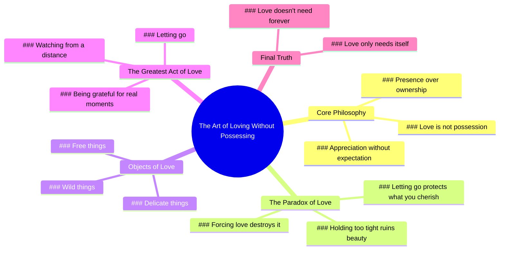

# Letting Go of Love Without Possession

> 🌐 **Read this in:** **English** · [中文](../../zh-CN/2026-06/tiktok-transcript-you-have-to-let-it-go-not-because-it-didn-t-matter-not-becau-6f93.md)

> **Creator:** [@growthinpeace_](https://www.tiktok.com/@growthinpeace_) · **Views:** 370.4K · **Posted:** 2026-06-10 · **Niche:** other
>
> **TL;DR:** Subverts the expected action of picking a flower, creating immediate intrigue and emotional depth.

[Watch original video →](https://vt.tiktok.com/ZSQDQb3SD/)

## Why This Went Viral

## Hook (first 3 seconds)
- **Verbatim opening:** "I once loved a flower so much, instead of picking it, I left it alone."
- **Hook pattern:** **Scene + Contrast** (a specific, visual memory paired with an unexpected action — loving something by *not* taking it)
- **Why it stops scroll:** The line subverts the default "love = possession" assumption, creating instant cognitive dissonance. The word "flower" is concrete and universal, making the metaphor immediately accessible, while the twist ("left it alone") sparks curiosity about the deeper meaning.

## Emotional Rhythm
1. **Curiosity** (0–3s): "I once loved a flower so much, instead of picking it, I left it alone." — Why would love mean leaving?
2. **Resonance + Reflection** (3–10s): "Not everything you love is meant to be held… Sometimes love isn't about possession. It's about presence." — The viewer feels recognized; it mirrors a quiet truth they've sensed but never heard spoken.
3. **Tension** (10–15s): "I've learned that… forcing it, keeping it, holding on too tight can ruin the very thing you fell in love with." — A warning that escalates emotional stakes.
4. **Release + Beauty** (15–25s): "The greatest act of love isn't always to take, it's to let go, to watch it bloom from a distance…" — The tension resolves into a peaceful, almost sacred image.
5. **Climax / Emotional Peak** (25–30s): "Because love doesn't always need a forever. It just needs itself." — The final line lands as a mantra; it’s the thesis that ties the entire metaphor into a single, shareable insight.

## Keyword Density
| Keyword / Phrase | Count (approx.) | Function |
|------------------|-----------------|----------|
| love / loved / loving | 8 | **Emotional pull** — the core human desire that drives shares (universal, aspirational) |
| not / never | 6 | **Algorithmic reach** — contrast words create high engagement (negation triggers attention) |
| let go / leaving | 3 | **Emotional pull** — the key action that viewers want to embody or understand |
| possession / presence | 2 | **Emotional pull** — a binary contrast that makes the message sticky |
| forever | 1 | **Emotional pull** — a high-impact word that lands the climax (also triggers nostalgia) |
| bloom / wild / free | 3 | **Algorithmic reach** — poetic, visual keywords that improve watch time and shareability |

**Why it works:** The repetition of "love" anchors the video in a high-empathy, high-share emotion. The negations ("not," "never") create friction that keeps the viewer listening for the resolution. The poetic nouns ("bloom," "wild," "free") are algorithm-friendly because they score high on sentiment analysis and encourage saves.

## Why It Spreads
1. **Universal metaphor + personal confession** — The flower metaphor is instantly understood by anyone who has ever loved something they couldn't keep. The "I once loved…" framing makes it feel like a secret being shared, not a lecture. *Concrete line: "I once loved a flower so much, instead of picking it, I left it alone."*
2. **Emotional closure in 30 seconds** — The video delivers a complete emotional arc (curiosity → tension → release → insight) in under half a minute. This makes it highly shareable because viewers feel they've received a satisfying "aha" moment without needing to invest time. *Concrete line: "Because love doesn't always need a forever. It just needs itself."*
3. **High "save" value** — The script reads like a poetic affirmation. Viewers save it to re-watch, send to a friend going through a breakup, or post as a caption. Saves are a strong algorithmic signal. *Concrete line: "The greatest act of love isn't always to take, it's to let go, to watch it bloom from a distance."*
4. **Contrast-driven curiosity** — Every line sets up a tension and resolves it: "not picking → leaving," "possession → presence," "take → let go." This pattern keeps the viewer engaged because each sentence feels like a mini-revelation. *Concrete line: "Sometimes love isn't about possession. It's about presence."*

## What You Can Steal
1. **Open with a specific, sensory memory** — Instead of "Love is about letting go," start with "I once loved a flower so much…" The concrete image makes the abstract idea feel real and personal. Apply this to any topic: "I once held a job I hated so much, I quit without a backup."
2. **Use the "Not X, It's Y" structure** — This contrast pattern (possession vs. presence, take vs. let go) creates instant clarity and memorability. Write your core message as a negation + positive reframe. Example: "Success isn't about grinding 24/7. It's about knowing when to rest."
3. **End with a one-line mantra** — The final sentence should be a self-contained quote that viewers can screenshot, repost, or tattoo. Make it short, rhythmic, and slightly paradoxical. Example: "Love doesn't always need a forever. It just needs itself."

## Mind Map

## Full Transcript (Generated by [the tool we used to generate this](https://toktranscript.com/?utm_source=github&utm_medium=breakdown&utm_campaign=tool_attribution))

> 📝 Transcripts on this page are auto-generated and show the first 60%. Want to transcribe any TikTok in 30 seconds and get the full version? [Try TokTranscript free →](https://toktranscript.com/?utm_source=github&utm_medium=breakdown&utm_campaign=transcript_cta)

I once loved a flower so much, instead of picking it, I left it alone. Not everything you love is meant to be held. Not everything you admire is meant to be yours. Sometimes love isn't about possession. It's about presence. It's about appreciation without expectation. I've Learned that the deeper you love for something or someone, the more you realise that forcing it, keeping it, holding on too tight can ruin the very thing you fell in love with.

*[Read the full transcript on TokTranscript →](https://toktranscript.com/plaza/tiktok-transcript-you-have-to-let-it-go-not-because-it-didn-t-matter-not-becau-6f93?utm_source=github&utm_medium=breakdown&utm_campaign=transcript_full)*

## Browse More

- All [other](../../by-niche/en/other.md) breakdowns
- All [Unexpected twist on a common metaphor](../../by-pattern/en/hook-unexpected-twist-on-a-common-metaphor.md) examples

## Video Info

| | |
|---|---|
| Creator | [@growthinpeace_](https://www.tiktok.com/@growthinpeace_) |
| Original video | [https://vt.tiktok.com/ZSQDQb3SD/](https://vt.tiktok.com/ZSQDQb3SD/) |
| Original title | You have to let it go.. Not because it didn't matter. Not because it ... |
| Views | 370.4K (370400) |
| Posted | 2026-06-10 |
| Duration | 0s |
| Niche | `other` |
| Hook pattern | `Unexpected twist on a common metaphor` |
| Original language | `en` |
| Available languages | en, zh-CN |
| Generated | 2026-06-11 by [TokTranscript](https://toktranscript.com/) |

---

*This breakdown is for educational analysis under fair use. Original video © [@growthinpeace_](https://www.tiktok.com/@growthinpeace_). All transcripts are auto-generated and may contain errors.*

*Want to analyze your own TikToks like this? [try this transcription tool →](https://toktranscript.com/viral-breakdown?utm_source=github&utm_medium=breakdown&utm_campaign=footer_cta)*