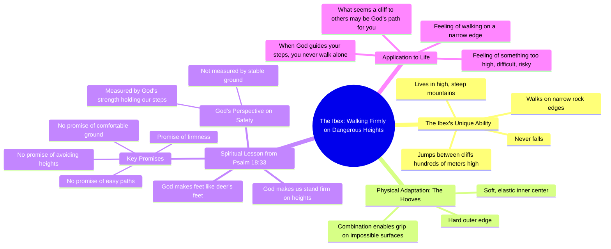

# Mountain Goat Walks Dangerous Cliff Edges Without Falling

> 🌐 **Read this in:** **English** · [中文](../../zh-CN/2026-07/tiktok-transcript-1-3m-views-63k-reactions-dios-cre-un-animal-capaz-de-caminar-92a5.md)

> **Creator:** [@Historias Millonarias](https://www.tiktok.com/@Historias Millonarias) · **Views:** 656.9K · **Posted:** 2026-07-06 · **Niche:** other
>
> **TL;DR:** Opens with a surprising claim about a goat's ability to walk dangerous cliffs without falling, immediately engaging curiosity.

[Watch original video →](https://www.facebook.com/share/r/17rzqCACkj/)

## Why This Went Viral

## Hook (first 3 seconds)
- **Verbatim opening:** "¿Sabías que Dios creó un animal capaz de caminar por los precipicios más peligrosos del mundo?"
- **Hook pattern:** **Question + bold claim** (rhetorical "¿Sabías que…?" paired with an extreme, almost unbelievable statement about a divine creation)
- **Why it stops scroll:** The combination of a curiosity-gap question ("¿Sabías que…?") and a superlative claim ("más peligrosos del mundo") creates instant intrigue. The word "Dios" also signals a faith-based angle, targeting a specific audience that will lean in for spiritual content.

## Emotional Rhythm
1. **Curiosity** – "¿Sabías que Dios creó un animal…?" (opens a knowledge gap)
2. **Awe / Wonder** – Description of the mountain goat's impossible feats ("camina por bordes de roca tan estrechos… nunca cae")
3. **Tension** – The question "¿Cómo es posible?" builds suspense
4. **Revelation** – Explanation of the hoof's dual structure (hard edge + soft center) → intellectual satisfaction
5. **Resonance / Spiritual Lift** – Psalm 18:33 quoted, then reinterpreted: "No promete caminos fáciles… promete firmeza"
6. **Personal Application (Climax)** – "Tal vez hoy sientes que caminas por un borde estrecho… recuerda a la cabra montés"
7. **Comfort / Resolution** – Final reassurance: "nunca caminas solo"

**Climax moment:** The line "Porque los lugares donde Dios te lleva muchas veces son altos, expuestos, inciertos… pero Dios nunca mide tu seguridad por lo estable que parece el terreno."

## Keyword Density
| Word/Phrase | Frequency (approx.) | Driver |
|-------------|---------------------|--------|
| **Dios** | 5 | Algorithmic (faith niche) + emotional (authority) |
| **cabra montés** | 3 | Niche specificity (nature + metaphor) |
| **alturas / precipicio / borde** | 6 | Emotional (tension, danger) |
| **firmeza / firme** | 3 | Emotional (resolution, trust) |
| **camino / caminas** | 4 | Emotional (metaphor for life journey) |
| **nunca** | 3 | Emotional (reassurance, contrast) |

- **Algorithmic drivers:** "Dios" (high-volume faith keyword), "cabra montés" (low-competition, high-engagement nature curiosity)
- **Emotional pull:** "alturas", "precipicio", "firmeza", "nunca" — these create a tension-relief arc and reinforce the core metaphor.

## Why It Spreads
1. **Universal metaphor + specific niche** – The mountain goat is a literal animal fact that becomes a spiritual metaphor. This dual appeal hooks both nature lovers and faith audiences. (Transcript: "Sus pezuñas tienen un borde duro por fuera, y un centro suave y elástico por dentro.")
2. **Scriptural authority + emotional reframe** – The video takes a well-known verse (Psalm 18:33) and reinterprets it in a fresh, personal way. This gives viewers a "aha" moment they want to share. (Transcript: "No promete caminos fáciles… promete firmeza.")
3. **Personalization at the climax** – The video directly addresses the viewer's current pain ("Tal vez hoy sientes que caminas por un borde estrecho…"). This makes it feel like a personal message, increasing shareability.
4. **Tension → relief structure** – The video builds suspense around the goat's ability, then resolves with a spiritual lesson. This emotional arc keeps retention high and makes the ending feel earned.
5. **Strong call-to-action (implicit)** – The final line "nunca caminas solo" is a powerful, shareable statement that viewers will repost as a status or caption.

## What You Can Steal
1. **Start with a "¿Sabías que…?" + extreme fact** – Open any video with a curiosity-gap question and a superlative claim. This pattern works across niches (nature, science, history, faith) because it triggers an immediate need to close the gap.
2. **Use a physical object as a metaphor for an abstract truth** – The mountain goat's hoof (hard edge + soft center) becomes a tangible symbol for spiritual stability. In your next video, find a concrete object or animal that visually represents your core message.
3. **End with a direct "you" statement that reframes a common struggle** – Instead of a generic conclusion, address the viewer's current emotional state ("Tal vez hoy sientes…") and offer a reframe. This turns a passive viewer into an active sharer who feels seen.

## Mind Map

## Full Transcript (Generated by [the tool we used to generate this](https://toktranscript.com/?utm_source=github&utm_medium=breakdown&utm_campaign=tool_attribution))

> 📝 Transcripts on this page are auto-generated and show the first 60%. Want to transcribe any TikTok in 30 seconds and get the full version? [Try TokTranscript free →](https://toktranscript.com/?utm_source=github&utm_medium=breakdown&utm_campaign=transcript_cta)

¿Sabías que Dios creó un animal capaz de caminar por los precipicios más peligrosos del mundo? Sin caer jamás, la cabra montés habita en montañas altas y escarpadas. Camina por bordes de roca tan estrechos que apenas cabe una pisada. Salta entre peñascos a cientos de metros de altura. Y nunca cae. ¿Cómo es posible? Sus pezuñas tienen un borde duro por fuera, y un centro suave y elástico por dentro. Esa combinación le permite agarrarse a superficies que parecen imposibles, donde cualquier otro animal vería solo peligro y vacío. Ella ve un camino. Salmo 18, 33 lo describe así. Él hace mis pies como de siervas y me hace estar firme sobre mis alturas. Observa bien lo que dice. No promete caminos fáciles. No promete terrenos cómodos. No promete que nunca enfrentarás alturas. Promete algo mucho más poderoso, firmeza.

*[Read the full transcript on TokTranscript →](https://toktranscript.com/plaza/tiktok-transcript-1-3m-views-63k-reactions-dios-cre-un-animal-capaz-de-caminar-92a5?utm_source=github&utm_medium=breakdown&utm_campaign=transcript_full)*

## Browse More

- All [other](../../by-niche/en/other.md) breakdowns
- All [Curiosity gap + surprising fact](../../by-pattern/en/hook-curiosity-gap-surprising-fact.md) examples

## Video Info

| | |
|---|---|
| Creator | [@Historias Millonarias](https://www.tiktok.com/@Historias Millonarias) |
| Original video | [https://www.facebook.com/share/r/17rzqCACkj/](https://www.facebook.com/share/r/17rzqCACkj/) |
| Original title | 1.3M views · 63K reactions | Dios creó un animal capaz de caminar por los precipicios más peligrosos del mundo... sin caer jamás... #fblifestyle #amorpropio #abundancia #Historias #reelsviralfb | Historias Millonarias |
| Views | 656.9K (656940) |
| Posted | 2026-07-06 |
| Duration | 0s |
| Niche | `other` |
| Hook pattern | `Curiosity gap + surprising fact` |
| Original language | `en` |
| Available languages | en, zh-CN |
| Generated | 2026-07-08 by [TokTranscript](https://toktranscript.com/) |

---

*This breakdown is for educational analysis under fair use. Original video © [@Historias Millonarias](https://www.tiktok.com/@Historias Millonarias). All transcripts are auto-generated and may contain errors.*

*Want to analyze your own TikToks like this? [TokTranscript.com →](https://toktranscript.com/viral-breakdown?utm_source=github&utm_medium=breakdown&utm_campaign=footer_cta)*