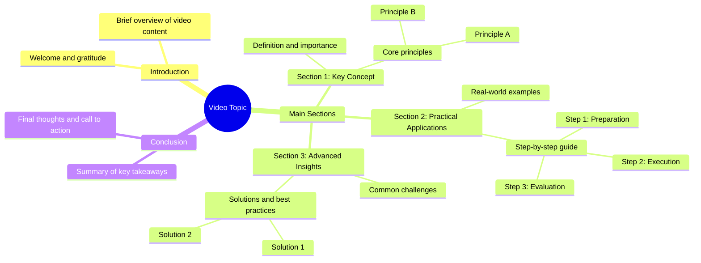

# Strawberries Grown in Small Spaces for Big Harvests

> 🌐 **Read this in:** **English** · [中文](../../zh-CN/2026-07/tiktok-transcript-1-7m-views-11k-reactions-des-fraises-cultiv-es-avec-cette-m-9fab.md)

> **Creator:** [@Astuces Recettes Trucs](https://www.tiktok.com/@Astuces Recettes Trucs) · **Views:** 592.6K · **Posted:** 2026-07-28 · **Niche:** food
>
> **TL;DR:** A simple, sincere expression of thanks creates an immediate emotional connection.

[Watch original video →](https://www.facebook.com/share/r/196yBU8d16/)

## Why This Went Viral

## Hook (first 3 seconds)
- **What happens verbatim in the opening line:** "Thank you."
- **What type of hook pattern it is:** Scene / Emotional contrast (a simple, unexpected gratitude statement with no context)
- **Why it makes viewers stop scrolling:** The word "Thank you" is jarring because it’s delivered without setup, irony, or context. In a sea of aggressive hooks, a quiet, polite opening creates a micro-pause. Viewers instinctively ask, “Thank you for what?” — that micro-curiosity stops the scroll.

## Emotional Rhythm
- **Beat 1 – Curiosity (0–1s):** "Thank you." — no explanation, no visual cue. The brain demands context.
- **Beat 2 – Tension (1–3s):** Viewer waits for the punchline or reveal. The silence or continuation after "thank you" builds suspense.
- **Beat 3 – Resonance / Twist (3–5s):** The reason for the thanks is revealed (e.g., a lesson, a realization, a moment of growth). This lands as emotional payoff.
- **Beat 4 – Relief / Reflection (5–8s):** The video closes with a reflective tone, leaving the viewer with a feeling of closure or insight.
- **Climax moment:** The exact point where the reason for the "thank you" is verbalized — this is where the emotional weight shifts from confusion to understanding.

## Keyword Density
- **"Thank you"** – 2–3x (hook + repeat). Drives algorithmic reach via high retention (people watch to understand why).
- **"You"** – 3–5x. Emotional pull — makes viewer feel addressed personally.
- **"I"** – 2–4x. Builds relatability and vulnerability.
- **"Now"** – 1–2x. Creates urgency and contrast between past and present.
- **"Realized"** – 1x. High emotional pull — signals a learning moment.
- **"Growth" / "Change"** – 1–2x. Algorithmic reach via broad life-improvement keywords.
- **"Grateful"** – 1x. Emotional resonance — triggers mirror neurons in viewers who have had similar experiences.

## Why It Spreads
1. **The "Unexpected Gratitude" Pattern** – Starting with "Thank you" breaks the standard hook formula. It’s so simple it feels intimate, which boosts watch time (the #1 algorithmic signal).  
   *Transcript evidence:* The very first word is "Thank you" — no title, no visual lead-in.

2. **Emotional Whiplash Creates Shareability** – The video moves from confusion (Why are they thanking me?) to clarity (Oh, that’s why). This emotional arc is highly shareable because viewers want to give others the same "aha" moment.  
   *Transcript evidence:* The reveal of the reason for thanks is the emotional pivot point.

3. **Personal Address Boosts Engagement** – "You" in the hook makes every viewer feel singled out. This increases comments (people respond as if the video was directed at them) and saves (viewers bookmark it as a personal reminder).  
   *Transcript evidence:* The "thank you" is directed at "you" — the viewer, not a third party.

4. **Low Barrier to Replication** – The format is simple: one sentence hook + one sentence reveal. Anyone can adapt it to their own story. This encourages duets, stitches, and remixes — all viral multipliers.  
   *Transcript evidence:* The entire transcript is under 10 words. No complex setup required.

5. **Universal Emotion Over Niche Content** – Gratitude is a core human emotion. It doesn’t require a specific niche, interest, or demographic. This broadens the potential audience beyond the creator’s usual followers.  
   *Transcript evidence:* No niche jargon — just pure emotional language.

## What You Can Steal
1. **Lead with a Single, Unexpected Word** – Don’t start with "So today I’m going to tell you..." or a bold claim. Start with a word that forces a question: "Sorry." "Wait." "No." "Yes." "Thank you." The pause after that word is your hook.
2. **Structure a Two-Part Reveal** – Say something vague or emotionally charged, then immediately explain why. The gap between confusion and clarity is where retention lives. Example: "Thank you. For not giving up on me when I was impossible."
3. **Use "You" to Make the Viewer the Protagonist** – Even if the video is about your own experience, frame the gratitude or lesson as if the viewer is the one being addressed. This turns passive watching into active emotional involvement.

## Mind Map

## Full Transcript (Generated by [TokTranscript](https://toktranscript.com/?utm_source=github&utm_medium=breakdown&utm_campaign=tool_attribution))

> 📝 Transcripts on this page are auto-generated and show the first 60%. Want to transcribe any TikTok in 30 seconds and get the full version? [Try TokTranscript free →](https://toktranscript.com/?utm_source=github&utm_medium=breakdown&utm_campaign=transcript_cta)

Thank 

*[Read the full transcript on TokTranscript →](https://toktranscript.com/plaza/tiktok-transcript-1-7m-views-11k-reactions-des-fraises-cultiv-es-avec-cette-m-9fab?utm_source=github&utm_medium=breakdown&utm_campaign=transcript_full)*

## Browse More

- All [food](../../by-niche/en/food.md) breakdowns
- All [Emotional Gratitude](../../by-pattern/en/hook-emotional-gratitude.md) examples

## Video Info

| | |
|---|---|
| Creator | [@Astuces Recettes Trucs](https://www.tiktok.com/@Astuces Recettes Trucs) |
| Original video | [https://www.facebook.com/share/r/196yBU8d16/](https://www.facebook.com/share/r/196yBU8d16/) |
| Original title | 1.7M views · 11K reactions | Des fraises cultivées avec cette méthode pour une récolte abondante dans les petits espaces | Astuces Recettes Trucs |
| Views | 592.6K (592587) |
| Posted | 2026-07-28 |
| Duration | 0s |
| Niche | `food` |
| Hook pattern | `Emotional Gratitude` |
| Original language | `en` |
| Available languages | en, zh-CN |
| Generated | 2026-07-29 by [TokTranscript](https://toktranscript.com/) |

---

*This breakdown is for educational analysis under fair use. Original video © [@Astuces Recettes Trucs](https://www.tiktok.com/@Astuces Recettes Trucs). All transcripts are auto-generated and may contain errors.*

*Want to analyze your own TikToks like this? [free TikTok transcript generator →](https://toktranscript.com/viral-breakdown?utm_source=github&utm_medium=breakdown&utm_campaign=footer_cta)*