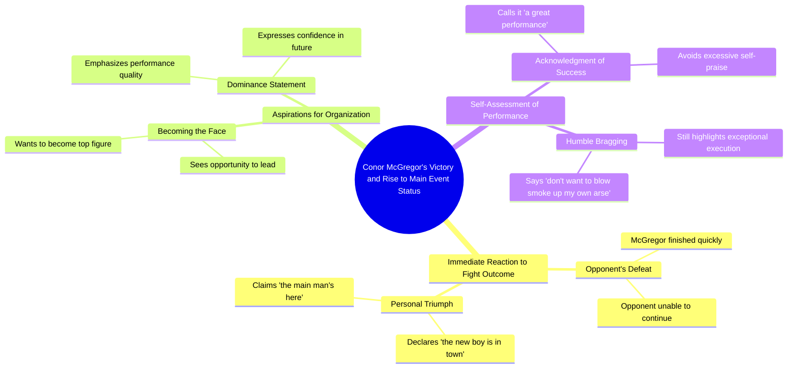

# Paddy Pimblett Reacts to Main Event Outcome Mid-Interview

> 🌐 **Read this in:** **English** · [中文](../../zh-CN/2026-07/tiktok-transcript-1-9m-views-29k-reactions-classic-paddy-paddy-pimblett-reacts-7da8.md)

> **Creator:** [@UFC](https://www.tiktok.com/@UFC) · **Views:** 728.7K · **Posted:** 2026-07-12 · **Niche:** entertainment
>
> **TL;DR:** Immediately grabs attention by expressing shock at a major fighter's quick defeat.

[Watch original video →](https://www.facebook.com/share/r/1Bc1vVqdut/)

## Why This Went Viral

## Hook (first 3 seconds)
- **Verbatim opening:** "I'll exchange with him, I need to shoot in. What's happened? Oh my God, McGregor's done already?"
- **Hook pattern:** Scene disruption + bold claim (a major fighter is "done" in a shocking upset)
- **Why it stops scrolling:** The immediate chaos and disbelief ("Oh my God") signal a high-stakes, unexpected event. Viewers are compelled to see what just happened to McGregor, a global combat sports icon.

## Emotional Rhythm
- **Beat 1 (Curiosity):** "I'll exchange with him, I need to shoot in." — sets up a fight scenario.
- **Beat 2 (Shock/Tension):** "What's happened? Oh my God, McGregor's done already?" — sudden, dramatic reveal that a superstar has lost.
- **Beat 3 (Relief/Arrogance):** "Well he's finished, the new boy is in town..." — speaker pivots from disbelief to self-congratulation.
- **Beat 4 (Resonance/Twist):** "Don't want to blow smoke up my own arse, but what a performance." — humblebrag lands as the climax; the speaker claims victory while pretending modesty.
- **Climax moment:** "I can become the face of the organisation now" — the ultimate power shift, cementing the upset.

## Keyword Density
| Keyword/Phrase | Frequency Context | Algorithmic Reach | Emotional Pull |
|----------------|------------------|-------------------|----------------|
| McGregor | 2x | High (brand name, searchable) | Triggers fan loyalty/outrage |
| done/finished | 2x | Medium (conflict signal) | Creates finality, stakes |
| new boy / main man | 2x | Low (colloquial) | Boasts dominance, underdog rise |
| face of the organisation | 1x | Medium (power phrase) | Aspirational, title-claim |
| performance | 1x | Low (generic) | Self-praise, validation |
| blow smoke up my own arse | 1x | Low (unique idiom) | Humor, self-awareness |

- **Algorithmic drivers:** "McGregor" (searchable name), "done" (conflict/upset triggers engagement).
- **Emotional pull:** "new boy," "face of the organisation" — underdog-to-champion narrative; "blow smoke up my own arse" — relatable, funny humility.

## Why It Spreads
1. **Shock of a superstar upset** — "McGregor's done already?" instantly hooks fans who want to see the fall of a giant. The transcript exploits a universal sports narrative: the king is dead, long live the king.
2. **Self-aware arrogance** — "Don't want to blow smoke up my own arse" is a perfect humblebrag. It’s simultaneously cocky and disarming, making viewers share it as a meme or reaction clip.
3. **Clear power shift** — "I can become the face of the organisation now" is a direct, marketable claim. It invites debate (is he really the face?) and fuels fan engagement in comments.
4. **Short, punchy, conversational** — The transcript reads like a live reaction, not a script. This authenticity encourages shares, especially on platforms like TikTok or Instagram Reels where raw moments outperform polished content.
5. **Relatable underdog energy** — The speaker positions himself as the "new boy" who dethroned the "main man." This David-vs-Goliath arc is universally shareable across sports, business, and personal growth audiences.

## What You Can Steal
1. **Lead with a shock reveal** — Open with a direct, unexpected statement about a known figure or event (e.g., "They just fired the CEO" or "The champion just lost"). Don't build up; drop the bomb immediately.
2. **Use a humblebrag as a climax** — After claiming victory, add a self-deprecating line like "Don't want to blow smoke up my own arse" to make arrogance relatable and meme-able.
3. **Claim a title or power shift** — End with a clear, bold statement of new status ("I can become the face of the organisation now"). This gives viewers a takeaway they can quote, debate, or repost.

## Mind Map

## Full Transcript (Generated by [TokTranscript](https://toktranscript.com/?utm_source=github&utm_medium=breakdown&utm_campaign=tool_attribution))

> 📝 Transcripts on this page are auto-generated and show the first 60%. Want to transcribe any TikTok in 30 seconds and get the full version? [Try TokTranscript free →](https://toktranscript.com/?utm_source=github&utm_medium=breakdown&utm_campaign=transcript_cta)

I'll exchange with him, I need to shoot in. What's happened? Oh my God, McGregor's done already? Well he's finished, the new boy is in town, the main man's here, you know what I mean?

*[Read the full transcript on TokTranscript →](https://toktranscript.com/plaza/tiktok-transcript-1-9m-views-29k-reactions-classic-paddy-paddy-pimblett-reacts-7da8?utm_source=github&utm_medium=breakdown&utm_campaign=transcript_full)*

## Browse More

- All [entertainment](../../by-niche/en/entertainment.md) breakdowns
- All [Shock and disbelief](../../by-pattern/en/hook-shock-and-disbelief.md) examples

## Video Info

| | |
|---|---|
| Creator | [@UFC](https://www.tiktok.com/@UFC) |
| Original video | [https://www.facebook.com/share/r/1Bc1vVqdut/](https://www.facebook.com/share/r/1Bc1vVqdut/) |
| Original title | 1.9M views · 29K reactions | Classic Paddy 😂 Paddy Pimblett reacts to the outcome of the main event mid interview! #UFC329 | UFC |
| Views | 728.7K (728716) |
| Posted | 2026-07-12 |
| Duration | 0s |
| Niche | `entertainment` |
| Hook pattern | `Shock and disbelief` |
| Original language | `en` |
| Available languages | en, zh-CN |
| Generated | 2026-07-13 by [TokTranscript](https://toktranscript.com/) |

---

*This breakdown is for educational analysis under fair use. Original video © [@UFC](https://www.tiktok.com/@UFC). All transcripts are auto-generated and may contain errors.*

*Want to analyze your own TikToks like this? [TokTranscript →](https://toktranscript.com/viral-breakdown?utm_source=github&utm_medium=breakdown&utm_campaign=footer_cta)*