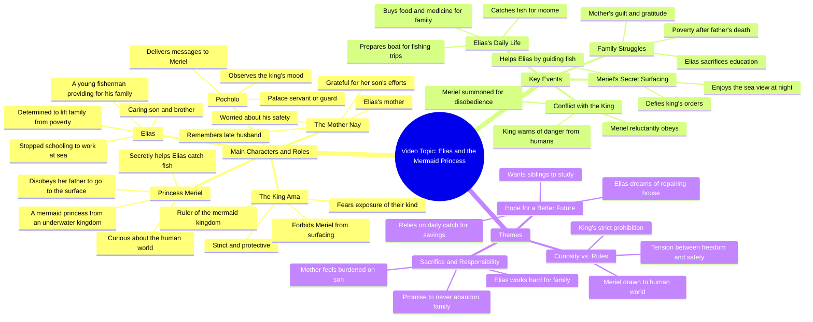

# Elias and Serina: The Secret Friend Part 2

> 🌐 **Read this in:** **English** · [中文](../../zh-CN/2026-07/tiktok-transcript-12m-views-548k-reactions-part-2-si-elias-at-ang-kanyang-lihi-76c9.md)

> **Creator:** [@Rey Martin Bas Lim](https://www.tiktok.com/@Rey Martin Bas Lim) · **Views:** 6.7M · **Posted:** 2026-07-17 · **Niche:** other
>
> **TL;DR:** Opens with a relatable scarcity problem and a generous solution, hooking viewers into the family's struggle.

[Watch original video →](https://www.facebook.com/share/v/1LqfGBiwkQ/)

## Why This Went Viral

## Hook (first 3 seconds)
- **Verbatim opening line:** "Ay, naubos po agad yung isdana nila kuko at eto po, namili ako ng mga prutas at gamot nyo po at inihaw po na manok yung magiging ulam natin."
- **Hook pattern:** Scene-setting with emotional context (family care + sacrifice). It’s a **contrast** hook: scarcity ("naubos isda") vs. abundance ("prutas, gamot, manok").
- **Why it stops scrolling:** Instantly establishes a relatable, heartfelt family dynamic—poverty, hard work, and generosity. Viewers feel the tension of limited resources and the warmth of a son providing for his mother. The specificity ("prutas at gamot") adds authenticity, making it feel real and emotionally gripping.

## Emotional Rhythm
- **Beats:** Curiosity (What happened to the fish?) → Warmth (son buys food/medicine) → Tension (mother’s worry, "ang dami nitong prutas") → Relief (son reassures) → Suspense (Princess Meriel called by angry father) → Conflict (father forbids surface visits) → Empathy (son’s struggle: "napilitan kang huminto sa pag-aaral") → Hope (son vows to provide) → Action (Elias goes fishing again) → Suspense (followed by unknown characters).
- **Climax:** The father’s angry line: "Basta, Meriel. Ayaw ko na umakyat ka ulit dun sa ibabaw." This reveals the fantasy twist (sirens) and heightens stakes—Elias’s kindness might expose them.
- **Twist:** The shift from realistic poverty drama to fantasy (sirens, kingdom) is the emotional pivot that re-engages viewers.

## Keyword Density
- **Strongest words/phrases:** "isda" (fish), "pamilya" (family), "anak" (child), "ama" (father), "dagat" (sea), "mag-ingat" (be careful), "sirena" (mermaid), "hirap" (poverty), "pangako" (promise), "masusunod" (will obey).
- **Algorithmic reach:** "isda," "dagat," "sirena" drive search and discovery (niche fantasy + fishing content). "Pamilya," "hirap," "anak" trigger emotional resonance and shareability.
- **Emotional pull:** "Pangako," "mag-ingat," "masusunod" amplify loyalty, sacrifice, and duty—universal themes that feel personal.

## Why It Spreads
1. **Relatable poverty-to-hope arc:** The son’s line, "Ang importante sa akin ngayon na makaahon tayo sa hirap," is a universal struggle. Viewers see themselves or people they know, driving empathy and shares.
2. **Unexpected fantasy twist:** The father’s reveal ("totoong may mga sirena") flips the genre from slice-of-life to fantasy. This surprise keeps viewers watching and commenting ("Akala ko totoo lang!").
3. **Cliffhanger suspense:** The final line—"Kailangan masundan natin siya para malaman natin kung saan siya nang lalambat ng isda"—creates a "what happens next?" loop. Viewers are forced to comment or wait for part 2, boosting retention.
4. **Authentic dialogue + acting:** Lines like "Huwag nyo na po ako alalahanin, Nay" feel raw, not scripted. This emotional realism makes viewers trust the content and share it as "feel-good" or "nakakaiyak."
5. **Family + fantasy combo:** The mother-son bond ("Salamat, anak") paired with mermaid lore taps into two high-engagement niches (family drama + fantasy) simultaneously, expanding reach.

## What You Can Steal
1. **Start with a micro-conflict:** Open with a small problem (naubos isda) that immediately shows character (son buys food/medicine). This sets stakes and emotion in under 5 seconds.
2. **Use a genre shift as a retention tool:** Start realistic (poverty/fishing) then reveal a fantasy element (sirens). This surprises viewers and makes them rewatch or comment.
3. **End with a direct call to action for part 2:** The final line ("Kailangan masundan natin siya") is a natural cliffhanger. Explicitly hint at a follow-up to boost series engagement.

## Mind Map

## Full Transcript (Generated by [TokTranscript.com](https://toktranscript.com/?utm_source=github&utm_medium=breakdown&utm_campaign=tool_attribution))

> 📝 Transcripts on this page are auto-generated and show the first 60%. Want to transcribe any TikTok in 30 seconds and get the full version? [Try TokTranscript free →](https://toktranscript.com/?utm_source=github&utm_medium=breakdown&utm_campaign=transcript_cta)

Ay, naubos po agad yung isdana nila kuko at eto po, namili ako ng mga prutas at gamot nyo po at inihaw po na manok yung magiging ulam natin. Ang dami nitong prutas na binili mo anak, at saka ang sarap nga ng magiging ulam natin. At ngayon lang ulit ako makakatikim nito. Kuya Elias, ang sarap po ng ulam natin ngayon at meron pang prutas. Marami kasi akong nahuli kanina, kaya meron tayong pambili ng ganito ngayon. Sana ganito kasarap parati yung kinakain natin, Kuya Elias. Elias. Huwag ka mag-alala, meme. Magsusumikap ang kuya mo na makahuli ng marami parate. Princess Mariel, kanina ka pa po hinahanap ng mahal na hari. Bakit ako hinahanap ni Ama Pocholo at anong sadya niya? Hindi ko rin alam, mahal na prinsesa, at tangging tugon niya lang nahanapin ka. Medyo galit ba si ama nang hinahanap niya ako, Pocholo? Medyo nakasimangot nga yung mukha ng mahal na hari at halatang galit. Sige, Pocholo, at tayo nang umuwi dun sa palasyo. Anak, ba't nandiyan ka pa sa labas at gabing gabi na at ang lamig dito? Nagpapahangin lang, Nay, at ang sarap tingnan nung dagat napakakalmado. Salamat pala, anak, sa gamot at masarap na pagkain ngayon. Wala yun, Nay. Alam nyo naman na ibibigay ko lahat para sa pamilya natin. Pasensya ka na, anak. At ikaw na yung tumaguyod ng pamilya natin simula nang mawala yung tatay mo. Napilitan ka pang huminto sa pag-aaral para lang pumalaot sa dagat araw-araw. Pagpasensyahan muna ako, anak. Huwag nyo na po ako alalahanin Nay Ang importante sa akin ngayon na makaahon tayo sa hirap at pangako hindi ko papabayaan tong pamilya natin Ama nandito na po ako at sabi ni Pocholo hinahanap niyo daw ako Meriel sangka na naman bagaling Umusad ka naman ba sa ibabaw ng dagat Bakit po ama? Bawal po ba umusad pa ibabaw at adganda ng tanawin dun sa itaas? Ikaw talaga bata ka?

*[Read the full transcript on TokTranscript →](https://toktranscript.com/plaza/tiktok-transcript-12m-views-548k-reactions-part-2-si-elias-at-ang-kanyang-lihi-76c9?utm_source=github&utm_medium=breakdown&utm_campaign=transcript_full)*

## Browse More

- All [other](../../by-niche/en/other.md) breakdowns
- All [Immediate problem + solution](../../by-pattern/en/hook-immediate-problem-solution.md) examples

## Video Info

| | |
|---|---|
| Creator | [@Rey Martin Bas Lim](https://www.tiktok.com/@Rey Martin Bas Lim) |
| Original video | [https://www.facebook.com/share/v/1LqfGBiwkQ/](https://www.facebook.com/share/v/1LqfGBiwkQ/) |
| Original title | 12M views · 548K reactions | Part 2: Si Elias at ang kanyang lihim na kaibigan na Serina 🧜‍♀️ #aianimation #AIStoryteller #mermaid #viralreels | Rey Martin Bas Lim |
| Views | 6.7M (6705114) |
| Posted | 2026-07-17 |
| Duration | 0s |
| Niche | `other` |
| Hook pattern | `Immediate problem + solution` |
| Original language | `en` |
| Available languages | en, zh-CN |
| Generated | 2026-07-18 by [TokTranscript](https://toktranscript.com/) |

---

*This breakdown is for educational analysis under fair use. Original video © [@Rey Martin Bas Lim](https://www.tiktok.com/@Rey Martin Bas Lim). All transcripts are auto-generated and may contain errors.*

*Want to analyze your own TikToks like this? [TokTranscript →](https://toktranscript.com/viral-breakdown?utm_source=github&utm_medium=breakdown&utm_campaign=footer_cta)*