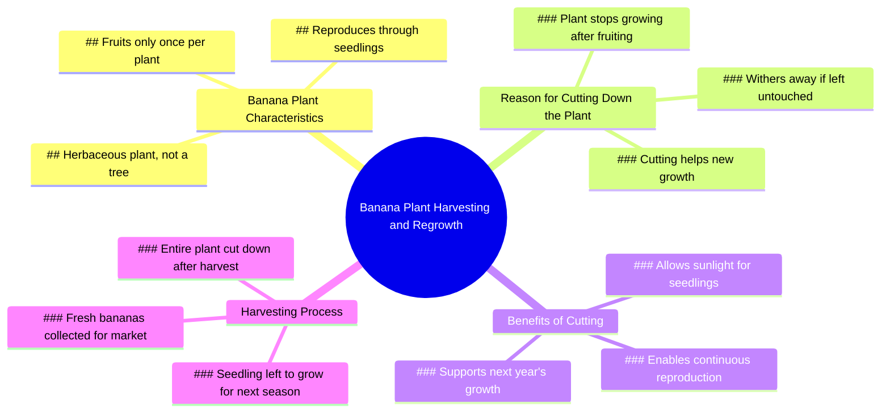

# Why Banana Trees Are Cut Down After Harvest

> 🌐 **Read this in:** **English** · [中文](../../zh-CN/2026-07/tiktok-transcript-14m-views-231k-reactions-why-banana-trees-get-cut-down-after-e7e0.md)

> **Creator:** [@Dr.Bota](https://www.tiktok.com/@Dr.Bota) · **Views:** 7.2M · **Posted:** 2026-07-13 · **Niche:** other
>
> **TL;DR:** Creates immediate curiosity and action-oriented tension.

[Watch original video →](https://www.facebook.com/reel/1444700600748952)

## Why This Went Viral

## Hook (first 3 seconds)
- **Verbatim opening:** "Hey, hurry up and take the fresh bananas. Nice! That should sell for a fortune in the market."
- **Hook pattern:** Scene + Contrast (urgent action vs. impending conflict)
- **Why it stops scrolling:** The immediate tension between excitement over profit ("fortune") and the shocking action ("chopping down the whole plant") creates a cognitive dissonance that forces the viewer to ask "Why are they destroying the source of value?"

## Emotional Rhythm
- **Beat 1: Curiosity** – "Hurry up, take the fresh bananas" sets a fast, profitable scene.
- **Beat 2: Shock/Confusion** – "What are you doing? Why are you chopping down the whole plant?" — viewer feels the same confusion as the character.
- **Beat 3: Tension** – "Banana plants only fruit once... they'll just wither away" — a logical, almost sad explanation.
- **Beat 4: Twist/Relief** – "Banana plants are actually herbaceous plants... cutting them down helps the new ones grow" — reframes destruction as regeneration.
- **Beat 5: Surprise/Comedy** – "Is that your excuse to slice me down?" — personification of the plant breaks the educational tone.
- **Beat 6: Resolution + Delight** – "I'm alive again!" — the seedling metaphor lands, and the cycle of life feels hopeful.
- **Climax moment:** The reveal that the plant is "herbaceous" and the seedling is visible — the entire video hinges on this factual twist.

## Keyword Density
| Keyword/Phrase | Count (approx.) | Role |
|----------------|----------------|------|
| "banana" | 6 | Algorithmic reach (high-volume search term) |
| "cut/cutting down" | 4 | Emotional pull (violence/action) |
| "grow" | 3 | Emotional pull (hope/regeneration) |
| "alive" | 2 | Emotional pull (surprise/relief) |
| "fortune" | 1 | Algorithmic reach (money-related trigger) |
| "herbaceous" | 1 | Algorithmic reach (educational/curiosity gap) |
| "seedling" | 1 | Emotional pull (visual anchor, hope) |

- **Algorithmic drivers:** "banana" (high search volume), "fortune" (money hook), "herbaceous" (educational niche, low competition).
- **Emotional drivers:** "cut down" (violence), "alive" (relief), "grow" (optimism).

## Why It Spreads
1. **Educational Twist on a Common Misconception** – Most people think cutting a banana plant kills it. The line "Banana plants are actually herbaceous plants" flips that script. This is a classic "I didn't know that" moment, which drives shares.
2. **Personification Creates Meme Potential** – "Is that your excuse to slice me down?" turns the plant into a character. This line is highly quotable and can be repurposed into memes, remixes, or reaction videos.
3. **Visual Before/After Contrast** – The "chopping down" action is visually violent, but the seedling reveal ("Look down there") is visually hopeful. This contrast is inherently satisfying and loops well on short-form platforms.
4. **Emotional Rollercoaster in 30 Seconds** – The video moves from greed → shock → sadness → relief → joy. This compressed emotional arc is proven to increase completion rate and shares (people want others to feel the same twist).
5. **Universal Life Lesson** – The line "Cutting you down helps it get more sunlight" is a metaphor for sacrifice and renewal. This makes the video feel deeper than a gardening tip, encouraging cross-demographic sharing (farmers, parents, entrepreneurs).

## What You Can Steal
1. **The "Destruction → Regeneration" Frame** – Start with an action that looks bad, then reveal it's actually good. Works for pruning plants, deleting old content, firing a client, or ending a relationship. The hook is the apparent loss; the twist is the hidden gain.
2. **Personify the Object** – Give the inanimate thing (plant, tool, code, product) a voice. "Is that your excuse to slice me down?" creates instant character and humor. Use this in any tutorial or explainer to add personality.
3. **End with a Visual Payoff** – The seedling reveal is the entire reason the video works. Don't just explain the twist — show it. In your next video, plan a single frame or shot that visually confirms the lesson (e.g., a before/after, a zoom-in, a time-lapse). That image is what gets saved and shared.

## Mind Map

## Full Transcript (Generated by [TokTranscript.com](https://toktranscript.com/?utm_source=github&utm_medium=breakdown&utm_campaign=tool_attribution))

> 📝 Transcripts on this page are auto-generated and show the first 60%. Want to transcribe any TikTok in 30 seconds and get the full version? [Try TokTranscript free →](https://toktranscript.com/?utm_source=github&utm_medium=breakdown&utm_campaign=transcript_cta)

Hey, hurry up and take the fresh bananas. Nice! That should sell for a fortune in the market. What are you doing? Why are you chopping down the whole plant? Banana plants only fruit once. After that, they stop growing, and even if you leave them, they'll just wither away. So you just cut everything down like that? Banana plants are actually herbaceous plants.

*[Read the full transcript on TokTranscript →](https://toktranscript.com/plaza/tiktok-transcript-14m-views-231k-reactions-why-banana-trees-get-cut-down-after-e7e0?utm_source=github&utm_medium=breakdown&utm_campaign=transcript_full)*

## Browse More

- All [other](../../by-niche/en/other.md) breakdowns
- All [Urgent command with reward](../../by-pattern/en/hook-urgent-command-with-reward.md) examples

## Video Info

| | |
|---|---|
| Creator | [@Dr.Bota](https://www.tiktok.com/@Dr.Bota) |
| Original video | [https://www.facebook.com/reel/1444700600748952](https://www.facebook.com/reel/1444700600748952) |
| Original title | 14M views · 231K reactions | Why Banana Trees Get Cut Down After Harvest | Dr.Bota |
| Views | 7.2M (7164577) |
| Posted | 2026-07-13 |
| Duration | 0s |
| Niche | `other` |
| Hook pattern | `Urgent command with reward` |
| Original language | `en` |
| Available languages | en, zh-CN |
| Generated | 2026-07-14 by [TokTranscript](https://toktranscript.com/) |

---

*This breakdown is for educational analysis under fair use. Original video © [@Dr.Bota](https://www.tiktok.com/@Dr.Bota). All transcripts are auto-generated and may contain errors.*

*Want to analyze your own TikToks like this? [TokTranscript.com →](https://toktranscript.com/viral-breakdown?utm_source=github&utm_medium=breakdown&utm_campaign=footer_cta)*