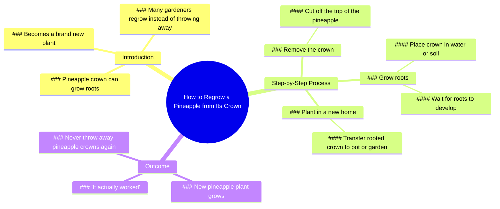

# How to Grow a New Pineapple From the Top

> 🌐 **Read this in:** **English** · [中文](../../zh-CN/2026-07/tiktok-transcript-2-6m-views-58k-reactions-don-t-throw-away-this-part-of-a-pin-14df.md)

> **Creator:** [@Dr.Bota](https://www.tiktok.com/@Dr.Bota) · **Views:** 1.4M · **Posted:** 2026-07-12 · **Niche:** other
>
> **TL;DR:** The pineapple speaks, creating immediate curiosity and humor.

[Watch original video →](https://www.facebook.com/reel/1014524507730017)

## Why This Went Viral

## Hook (first 3 seconds)
- **Verbatim opening line:** "Hey, are you here to harvest my pineapple?"
- **Hook pattern:** Scene + personification (talking pineapple)
- **Why it stops scrolling:** The viewer is immediately disoriented by a pineapple that speaks, defying reality. The question is direct and absurd, creating instant "what the hell?" curiosity.

## Emotional Rhythm
- **Beat 1 – Surprise/Comedy (0–3s):** Talking pineapple breaks expectation.
- **Beat 2 – Confusion/Tension (3–8s):** "Why'd you cut my hair off?" – the viewer doesn't know what's happening.
- **Beat 3 – Pain/Relief (8–12s):** "Ouch, hey, easy" → physical comedy of a plant feeling pain.
- **Beat 4 – Anticipation (12–18s):** "Wow, look at all those roots" – payoff begins to form.
- **Beat 5 – Resolution/Satisfaction (18–22s):** "Wow, it actually worked" – the experiment succeeds.
- **Beat 6 – Education/Closure (22s–end):** "That's why many gardeners regrow pineapples" – lesson delivered.
- **Climax moment:** "Wow, it actually worked" – the emotional peak where curiosity is rewarded.

## Keyword Density
- **Pineapple** (4x) – core object, drives search and topic relevance.
- **Crown** (3x) – specific gardening term, signals niche authority.
- **Roots** (3x) – biological process, algorithmic hook for gardening/plant content.
- **Grow** (2x) – action verb, high search volume in DIY/gardening.
- **New** (2x) – transformation trigger, emotional pull for "before/after" content.
- **Throw away** (2x) – waste-reduction angle, taps into sustainability trend.
- **Worked** (1x) – success signal, drives satisfaction and shareability.

**Algorithmic reach drivers:** "pineapple," "crown," "roots," "grow" – all high-volume gardening keywords.  
**Emotional pull drivers:** "throw away," "worked," "new" – create relatability and reward.

## Why It Spreads
1. **Absurd premise hooks instantly:** A talking pineapple is so unexpected that viewers must watch to resolve the cognitive dissonance. The first line ("harvest my pineapple") is a question that demands an answer.
2. **Emotional rollercoaster compresses into 30 seconds:** From surprise → confusion → pain → anticipation → satisfaction → education. This rapid emotional cycling increases retention and completion rate.
3. **"I'm never throwing away a pineapple crown again" is a viral call-to-action:** It's a personal transformation statement that viewers want to replicate. It implies a simple, low-cost hack they can try themselves.
4. **Education disguised as entertainment:** The gardening lesson ("the crown can grow roots") is delivered only after the viewer is emotionally invested. This increases information retention and shareability among DIY/gardening communities.
5. **The "actually worked" moment triggers a dopamine hit:** The climax (roots visible, new plant) is a clear, visual reward. Viewers feel vicarious success, which drives them to share the "hack" with friends.

## What You Can Steal
1. **Start with personification of an inanimate object:** Give a common item (pineapple, avocado, seed packet) a voice. This instantly creates curiosity and emotional investment without needing expensive visuals.
2. **Use a "pain → relief" arc for any how-to content:** Instead of just showing the solution, first show the problem or the "pain" (e.g., cutting the crown, the "ouch" moment). The relief (roots growing) feels earned.
3. **End with a personal transformation statement:** "I'm never throwing away [X] again" is a powerful, repeatable template. It turns a generic tip into a personal revelation, making viewers feel they've discovered a secret worth sharing.

## Mind Map

## Full Transcript (Generated by [try this transcription tool](https://toktranscript.com/?utm_source=github&utm_medium=breakdown&utm_campaign=tool_attribution))

> 📝 Transcripts on this page are auto-generated and show the first 60%. Want to transcribe any TikTok in 30 seconds and get the full version? [Try TokTranscript free →](https://toktranscript.com/?utm_source=github&utm_medium=breakdown&utm_campaign=transcript_cta)

Hey, are you here to harvest my pineapple? Whoa, what are you doing? Why'd you cut my hair off? What are you doing with me? You can't even eat me. Why would I eat you? I need you to grow a new pineapple. But first, you need some roots. Ouch, hey, easy. Later. Wow, look at all those roots. Time to get you a new home. You know what? This place is pretty nice.

*[Read the full transcript on TokTranscript →](https://toktranscript.com/plaza/tiktok-transcript-2-6m-views-58k-reactions-don-t-throw-away-this-part-of-a-pin-14df?utm_source=github&utm_medium=breakdown&utm_campaign=transcript_full)*

## Browse More

- All [other](../../by-niche/en/other.md) breakdowns
- All [Unexpected personification](../../by-pattern/en/hook-unexpected-personification.md) examples

## Video Info

| | |
|---|---|
| Creator | [@Dr.Bota](https://www.tiktok.com/@Dr.Bota) |
| Original video | [https://www.facebook.com/reel/1014524507730017](https://www.facebook.com/reel/1014524507730017) |
| Original title | 2.6M views · 58K reactions | Don’t Throw Away This Part Of A Pineapple | Dr.Bota |
| Views | 1.4M (1374511) |
| Posted | 2026-07-12 |
| Duration | 0s |
| Niche | `other` |
| Hook pattern | `Unexpected personification` |
| Original language | `en` |
| Available languages | en, zh-CN |
| Generated | 2026-07-13 by [TokTranscript](https://toktranscript.com/) |

---

*This breakdown is for educational analysis under fair use. Original video © [@Dr.Bota](https://www.tiktok.com/@Dr.Bota). All transcripts are auto-generated and may contain errors.*

*Want to analyze your own TikToks like this? [TokTranscript →](https://toktranscript.com/viral-breakdown?utm_source=github&utm_medium=breakdown&utm_campaign=footer_cta)*