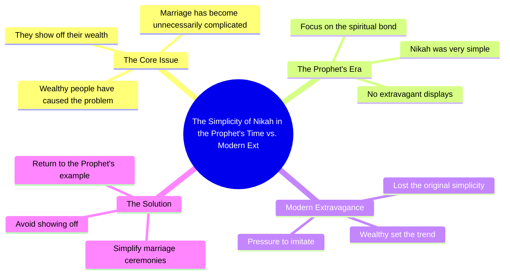

# Nikkah Was Very Simple In Our Prophet’s Time

> 🌐 **Read this in:** **English** · [中文](../../zh-CN/2026-07/tiktok-transcript-2-8m-views-218k-reactions-warna-nikkah-bohot-aasan-tha-hamar-de02.md)

> **Creator:** [@Ahmed Khan](https://www.tiktok.com/@Ahmed Khan) · **Views:** 1.3M · **Posted:** 2026-07-13 · **Niche:** other
>
> **TL;DR:** Opens with a provocative blame on the rich, then contrasts with a simpler past to hook viewers.

[Watch original video →](https://www.facebook.com/share/r/1BwZzm7hFs/)

## Why This Went Viral

## Hook (first 3 seconds)
- **Verbatim:** "امیروں نے ہی آگ لگائی ہے امیری دکھانے میں" (It's the rich who started this fire, by showing off their wealth)
- **Hook pattern:** Bold claim + accusation
- **Why it stops scrolling:** It frames the rich as the root cause of a social problem, triggering instant emotional reaction—either agreement (for those frustrated with materialism) or curiosity (to hear the argument). The word "آگ" (fire) adds metaphorical intensity.

## Emotional Rhythm
1. **Curiosity + Anger (0–3s):** Bold accusation against the rich creates tension.
2. **Contrast (3–6s):** "ورنہ نکاح بہت آسان تھا" (otherwise marriage was very simple) – shifts to a nostalgic, simpler ideal.
3. **Resonance (6–9s):** "ہمارے نبی کے زمانے میں" (in the time of our Prophet) – invokes religious authority and collective identity, deepening emotional pull.
4. **Climax (9–12s):** The implied contrast between past simplicity and present complexity lands the point—viewers feel both righteous anger and longing.
5. **Resolution:** The statement ends open-ended, leaving viewers to reflect or share.

## Keyword Density
| Keyword/Phrase | Frequency (approx.) | Driver |
|----------------|---------------------|--------|
| امیروں (rich) | 1 (strongly placed) | Emotional pull – targets a group, creates "us vs. them" |
| آگ لگائی (started fire) | 1 (metaphor) | Algorithmic reach – dramatic, shareable language |
| نکاح (marriage) | 1 | Emotional pull – universal life event, relatable |
| آسان (simple) | 1 | Emotional pull – nostalgia, desire for ease |
| نبی (Prophet) | 1 | Algorithmic reach + emotional – religious keyword, high engagement in target audience |

- **Algorithmic reach:** "نبی" and "آگ" are high-engagement triggers in Urdu-speaking religious/social media spaces.
- **Emotional pull:** "امیروں" and "آسان" tap into class resentment and longing for simplicity.

## Why It Spreads
1. **Us vs. Them framing:** "امیروں نے ہی آگ لگائی" positions the rich as villains, instantly uniting viewers against a common target. This drives shares as viewers signal their values.
2. **Religious authority as emotional anchor:** "ہمارے نبی کے زمانے میں" invokes a sacred past, making the critique feel morally justified and harder to dismiss.
3. **Short, punchy structure:** The entire argument is delivered in under 10 seconds—perfect for retention and looped viewing. No filler.
4. **Controversial but safe:** The accusation is against "the rich" (a vague, safe target) not a specific person, so it avoids backlash while still feeling bold.
5. **Universal pain point:** Marriage costs are a widespread frustration in South Asian/Muslim communities—the video solves a real emotional need (validation of anger).

## What You Can Steal
1. **Open with a villain, not a problem.** Instead of "marriage is expensive," blame a specific group ("the rich started this fire"). This creates instant emotional buy-in.
2. **Anchor your critique in a universally respected ideal.** Use a religious, historical, or cultural reference (e.g., "in the time of the Prophet") to make your argument feel timeless and morally grounded.
3. **Keep it under 10 seconds.** Deliver one complete emotional arc (accusation → contrast → resolution) in a single breath. No explanations, no transitions—just the punch.

## Mind Map

## Full Transcript (Generated by [free TikTok transcript generator](https://toktranscript.com/?utm_source=github&utm_medium=breakdown&utm_campaign=tool_attribution))

> 📝 Transcripts on this page are auto-generated and show the first 60%. Want to transcribe any TikTok in 30 seconds and get the full version? [Try TokTranscript free →](https://toktranscript.com/?utm_source=github&utm_medium=breakdown&utm_campaign=transcript_cta)

امیروں نے ہی آگ لگائی ہے امیری دکھانے میں ورنہ نکاح 

*[Read the full transcript on TokTranscript →](https://toktranscript.com/plaza/tiktok-transcript-2-8m-views-218k-reactions-warna-nikkah-bohot-aasan-tha-hamar-de02?utm_source=github&utm_medium=breakdown&utm_campaign=transcript_full)*

## Browse More

- All [other](../../by-niche/en/other.md) breakdowns
- All [Bold accusation + contrast](../../by-pattern/en/hook-bold-accusation-contrast.md) examples

## Video Info

| | |
|---|---|
| Creator | [@Ahmed Khan](https://www.tiktok.com/@Ahmed Khan) |
| Original video | [https://www.facebook.com/share/r/1BwZzm7hFs/](https://www.facebook.com/share/r/1BwZzm7hFs/) |
| Original title | 2.8M views · 218K reactions | Warna Nikkah Bohot Aasan Tha Hamare Nabi Ke Zamane Mein🥺🖤🙏 #shortsvideos #facebookreel #Ahmedkhantv #reelsinstagram #kalabandar #sadreels #shayari #RemyMa #shorts #reel #BarkatUzmi | Ahmed Khan |
| Views | 1.3M (1338229) |
| Posted | 2026-07-13 |
| Duration | 0s |
| Niche | `other` |
| Hook pattern | `Bold accusation + contrast` |
| Original language | `en` |
| Available languages | en, zh-CN |
| Generated | 2026-07-16 by [TokTranscript](https://toktranscript.com/) |

---

*This breakdown is for educational analysis under fair use. Original video © [@Ahmed Khan](https://www.tiktok.com/@Ahmed Khan). All transcripts are auto-generated and may contain errors.*

*Want to analyze your own TikToks like this? [the tool we used to generate this →](https://toktranscript.com/viral-breakdown?utm_source=github&utm_medium=breakdown&utm_campaign=footer_cta)*