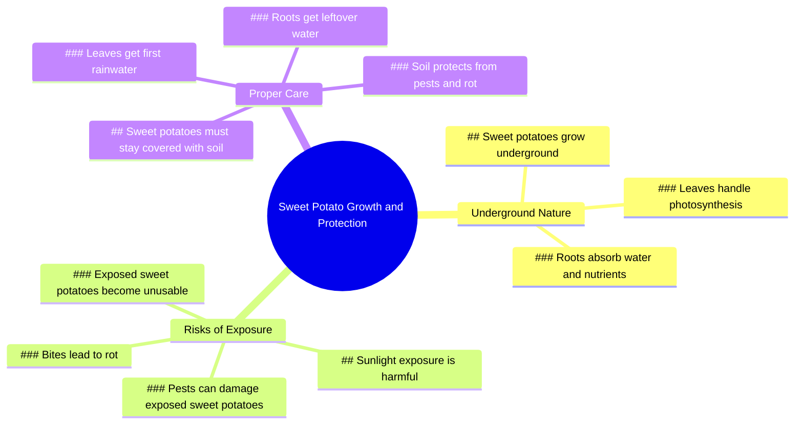

# Sweet Potatoes Argue Over Sunlight Exposure

> 🌐 **Read this in:** **English** · [中文](../../zh-CN/2026-07/tiktok-transcript-2-9m-views-24k-reactions-never-let-sweet-potatoes-stick-out-260c.md)

> **Creator:** [@Dr.Bota](https://www.tiktok.com/@Dr.Bota) · **Views:** 1.5M · **Posted:** 2026-07-16 · **Niche:** other
>
> **TL;DR:** The hook uses a dramatic confrontation between anthropomorphized sweet potatoes, instantly creating curiosity and humor.

[Watch original video →](https://www.facebook.com/share/r/19LjiFDT65/)

## Why This Went Viral

## Hook (first 3 seconds)
- **Verbatim opening:** "Dude, get back here! You're exposing yourself!"
- **Hook pattern:** Scene-based conflict with personified dialogue (contrast between expected behavior and defiance)
- **Why it stops scrolling:** The sudden, dramatic confrontation between two sweet potatoes creates immediate cognitive dissonance — viewers expect a cooking or gardening video, not a vegetable having an existential crisis about sunlight. The absurdity forces a "what the hell?" pause.

## Emotional Rhythm
1. **Curiosity/Shock** (0:00–0:02) — "Dude, get back here!" creates instant tension and confusion
2. **Amusement** (0:03–0:06) — "Exposing myself? I just want some sunlight!" flips expectation with deadpan humor
3. **Escalating Tension** (0:07–0:12) — The photosynthesis argument creates a pseudo-serious debate, building mock conflict
4. **Surprise/Twist** (0:13–0:15) — "Ouch! Stay away from my sweet potato!" introduces physical stakes
5. **Climax + Education** (0:16–0:20) — The narrator drops the joke to deliver a real gardening fact: "pests can damage them... leads to rot"
6. **Satisfaction/Closure** (0:21) — "This one's no good anymore" resolves the conflict with a practical consequence

**Climax moment:** The shift from absurd comedy to genuine horticultural advice at "Once they're exposed, pests can damage them" — this is where the video earns its value.

## Keyword Density
| Word/Phrase | Count | Function |
|-------------|-------|----------|
| "sweet potato" | 4 | **Algorithmic reach** — high search volume for gardening/food content |
| "expose" | 3 | **Emotional pull** — creates tension and risk narrative |
| "sunlight" | 2 | **Dual-purpose** — algorithmic (gardening) + emotional (freedom vs safety) |
| "pests" | 1 | **Educational anchor** — triggers "how-to" search intent |
| "rot" | 1 | **Emotional consequence** — creates urgency and fear of loss |
| "stay" | 2 | **Emotional pull** — reinforces the "should vs. want" conflict |
| "underground" | 1 | **Visual anchor** — reinforces the gardening context |

**Algorithmic drivers:** "sweet potato" (niche topic), "sunlight" (general gardening), "pests" (problem-solving search)
**Emotional drivers:** "expose" (vulnerability), "rot" (loss aversion), "stay" (compliance vs rebellion)

## Why It Spreads
1. **Unexpected personification creates shareability** — "Dude, get back here!" makes a vegetable relatable. People share because it's absurd, not because they care about sweet potatoes. The line "The leaves do the photosynthesis for us!" is the kind of deadpan humor that gets clipped and reposted.

2. **Educational twist prevents skip** — The transition from comedy to "Once they're exposed, pests can damage them" rewards viewers who stayed for the joke. This "surprise learning" pattern increases watch time and completion rate — both algorithmic signals.

3. **Conflict-driven micro-narrative** — The video has a clear protagonist (the rebellious sweet potato), antagonist (the cautious one), and resolution (the rot consequence). This three-act structure in 20 seconds makes it feel complete, driving shares and replays.

4. **Relatable tension between "should" and "want"** — "I just want some sunlight!" vs. "We're supposed to stay underground" mirrors every human conflict between safety and freedom. Viewers project their own desires onto the potato, creating emotional investment.

5. **Visual novelty** — Talking sweet potatoes with distinct voices (the cautious one sounds panicked, the rebel sounds carefree) creates a memorable character pair. This "odd couple" dynamic is proven to increase recall and quote-tweeting.

## What You Can Steal
1. **The "fake conflict → real education" structure** — Open with an absurd argument between two inanimate objects or characters, then pivot to a genuine fact. Viewers stay for the joke but leave with knowledge. Works for any niche: "Stop fighting, you two! Actually, that's why…"

2. **Personify your subject matter** — Give your product, plant, or process a voice. A sweet potato that wants sunlight is funny. A car that wants to be driven fast is funny. A tax form that wants to be filed early is funny. The key is making the "rebellious" character relatable and the "cautious" one sound like a nag.

3. **End with a concrete consequence** — Don't just educate; show the cost of ignoring the advice. "This one's no good anymore" is more powerful than "So keep your sweet potatoes covered." Visual proof of failure (the rotted potato) creates emotional closure and reinforces the lesson.

## Mind Map

## Full Transcript (Generated by [analyze your own TikToks](https://toktranscript.com/?utm_source=github&utm_medium=breakdown&utm_campaign=tool_attribution))

> 📝 Transcripts on this page are auto-generated and show the first 60%. Want to transcribe any TikTok in 30 seconds and get the full version? [Try TokTranscript free →](https://toktranscript.com/?utm_source=github&utm_medium=breakdown&utm_campaign=transcript_cta)

Dude, get back here! You're exposing yourself! Exposing myself? I just want some sunlight! But we're sweet potatoes! We're supposed to stay underground! The leaves do the photosynthesis for us!

*[Read the full transcript on TokTranscript →](https://toktranscript.com/plaza/tiktok-transcript-2-9m-views-24k-reactions-never-let-sweet-potatoes-stick-out-260c?utm_source=github&utm_medium=breakdown&utm_campaign=transcript_full)*

## Browse More

- All [other](../../by-niche/en/other.md) breakdowns
- All [Unexpected Personification](../../by-pattern/en/hook-unexpected-personification.md) examples

## Video Info

| | |
|---|---|
| Creator | [@Dr.Bota](https://www.tiktok.com/@Dr.Bota) |
| Original video | [https://www.facebook.com/share/r/19LjiFDT65/](https://www.facebook.com/share/r/19LjiFDT65/) |
| Original title | 2.9M views · 24K reactions | Never Let Sweet Potatoes Stick Out | Dr.Bota |
| Views | 1.5M (1464721) |
| Posted | 2026-07-16 |
| Duration | 0s |
| Niche | `other` |
| Hook pattern | `Unexpected Personification` |
| Original language | `en` |
| Available languages | en, zh-CN |
| Generated | 2026-07-17 by [TokTranscript](https://toktranscript.com/) |

---

*This breakdown is for educational analysis under fair use. Original video © [@Dr.Bota](https://www.tiktok.com/@Dr.Bota). All transcripts are auto-generated and may contain errors.*

*Want to analyze your own TikToks like this? [try this transcription tool →](https://toktranscript.com/viral-breakdown?utm_source=github&utm_medium=breakdown&utm_campaign=footer_cta)*