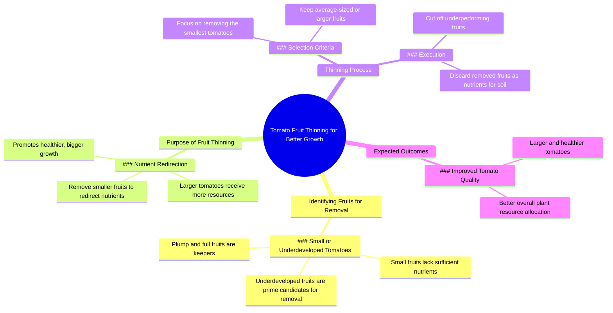

# Why Gardeners Remove Small Tomatoes

> 🌐 **Read this in:** **English** · [中文](../../zh-CN/2026-07/tiktok-transcript-8-3m-views-120k-reactions-why-gardeners-remove-small-tomatoe-fdbc.md)

> **Creator:** [@Dr.Bota](https://www.tiktok.com/@Dr.Bota) · **Views:** 4.0M · **Posted:** 2026-07-12 · **Niche:** other
>
> **TL;DR:** The hook uses tactile and visual appreciation to create curiosity about the subject.

[Watch original video →](https://www.facebook.com/share/r/1EPKJ9LuBZ/?mibextid=wwXIfr)

## Why This Went Viral

## Hook (first 3 seconds)
- **Verbatim opening:** "Mmm, this one looks good, plump and full. This one's not bad either. Still about average size. Hey, what's going on with you? Why are you so small?"
- **Hook pattern:** **Contrast + personification** — juxtaposing "plump and full" with a direct, accusatory question to a small tomato ("Why are you so small?")
- **Why it stops scroll:** The unexpected shift from admiring tomatoes to "bullying" one creates cognitive dissonance. Viewers stop because they feel a mini-drama unfolding — they want to see the "punishment" for the small tomato.

## Emotional Rhythm
1. **Curiosity** (0–3s) — "Mmm, this one looks good" sets up a positive, satisfying inspection
2. **Tension** (3–5s) — "Hey, what's going on with you? Why are you so small?" introduces conflict and shame
3. **Suspense** (5–7s) — "Please don't cut me off" — the tomato (personified) begs for mercy, raising stakes
4. **Twist/Relief** (7–9s) — "Since you're not getting enough nutrients, you're going to be the nutrients" — dark humor punchline
5. **Resolution** (9–12s) — Educational payoff: "Tomatoes grow best with proper fruit thinning..." — satisfying explanation that justifies the "cruelty"
- **Climax:** "You're going to be the nutrients" — the moment the joke lands and the gardening logic clicks

## Keyword Density
| Word/Phrase | Count | Function |
|-------------|-------|----------|
| "nutrients" | 3 | **Algorithmic reach** (gardening niche keyword) + **emotional pull** (creates irony — "you're the nutrients") |
| "small" | 2 | **Emotional pull** (shame/contrast) + **algorithmic** (common search term for gardening tips) |
| "plump and full" | 1 | **Emotional pull** (desirability, contrast) |
| "cut me off" | 1 | **Emotional pull** (personification, drama) |
| "fruit thinning" | 1 | **Algorithmic reach** (specific gardening technique, high-intent search) |
| "bigger tomatoes" | 1 | **Algorithmic + emotional** (desired outcome, searchable) |

## Why It Spreads
1. **Personification creates shareable drama** — The tomato "pleading" ("Please don't cut me off") turns a mundane gardening task into a relatable character arc. Viewers tag friends saying "This is me when I skip leg day."
2. **Dark humor + education combo** — The twist ("you're going to be the nutrients") is both funny and informative. Viewers feel smart for getting the joke, then validated by the real science. This dual payoff drives saves and shares.
3. **High contrast visual + audio** — The visual of a hand holding a small tomato vs. a large one, paired with a deadpan voice, creates a meme template. The "bullying" tone is absurd enough to be re-created by other creators.
4. **Universal gardening frustration** — "Why are you so small?" taps into every gardener's annoyance with uneven growth. The solution (thinning) is a common knowledge gap — so the video gets searched, saved, and referenced.

## What You Can Steal
1. **Personify your subject** — Give an inanimate object a voice and a problem. "Why are you so small?" works for tomatoes, but also for wilting plants, slow-growing succulents, or even a tiny pepper. It turns instruction into story.
2. **Use the "villain origin story" structure** — Start with praise ("this one looks good"), then introduce a "flawed" character, then deliver a dark twist that justifies the "punishment." This hook pattern works for any "culling" or "pruning" advice.
3. **End with a 3-second educational payoff** — After the joke, immediately explain the science in plain language. This satisfies both the "entertainment" viewer and the "I need to fix my garden" viewer — doubling the chance of a save.

## Mind Map

## Full Transcript (Generated by [free TikTok transcript generator](https://toktranscript.com/?utm_source=github&utm_medium=breakdown&utm_campaign=tool_attribution))

> 📝 Transcripts on this page are auto-generated and show the first 60%. Want to transcribe any TikTok in 30 seconds and get the full version? [Try TokTranscript free →](https://toktranscript.com/?utm_source=github&utm_medium=breakdown&utm_campaign=transcript_cta)

Mmm, this one looks good, plump and full. This one's not bad either. Still about average size. Hey, what's going on with you? Why are you so small? It's not that I wanted to. I'm just not getting enough nutrients. Please don't cut me off.

*[Read the full transcript on TokTranscript →](https://toktranscript.com/plaza/tiktok-transcript-8-3m-views-120k-reactions-why-gardeners-remove-small-tomatoe-fdbc?utm_source=github&utm_medium=breakdown&utm_campaign=transcript_full)*

## Browse More

- All [other](../../by-niche/en/other.md) breakdowns
- All [Sensory Appreciation](../../by-pattern/en/hook-sensory-appreciation.md) examples

## Video Info

| | |
|---|---|
| Creator | [@Dr.Bota](https://www.tiktok.com/@Dr.Bota) |
| Original video | [https://www.facebook.com/share/r/1EPKJ9LuBZ/?mibextid=wwXIfr](https://www.facebook.com/share/r/1EPKJ9LuBZ/?mibextid=wwXIfr) |
| Original title | 8.3M views · 120K reactions | Why Gardeners Remove Small Tomatoes | Dr.Bota |
| Views | 4.0M (4013304) |
| Posted | 2026-07-12 |
| Duration | 0s |
| Niche | `other` |
| Hook pattern | `Sensory Appreciation` |
| Original language | `en` |
| Available languages | en, zh-CN |
| Generated | 2026-07-13 by [TokTranscript](https://toktranscript.com/) |

---

*This breakdown is for educational analysis under fair use. Original video © [@Dr.Bota](https://www.tiktok.com/@Dr.Bota). All transcripts are auto-generated and may contain errors.*

*Want to analyze your own TikToks like this? [try this transcription tool →](https://toktranscript.com/viral-breakdown?utm_source=github&utm_medium=breakdown&utm_campaign=footer_cta)*