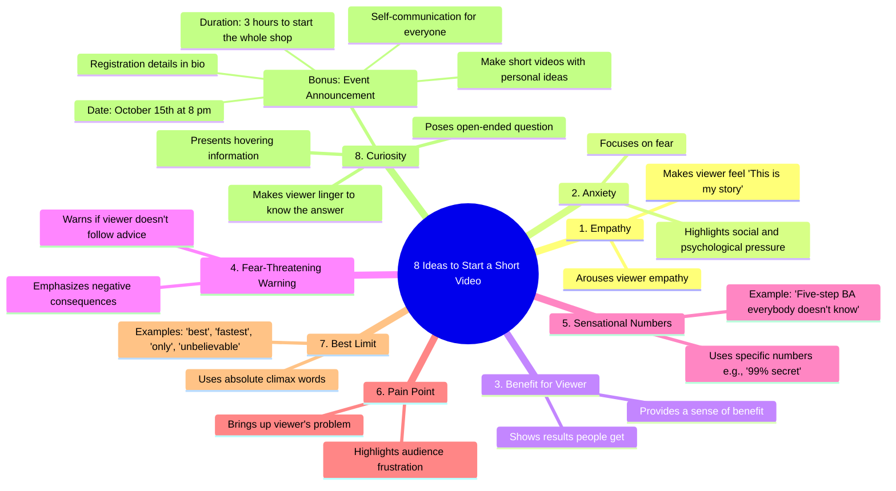

# 8 Short Video Opening Ideas to Hook Viewers

> 🌐 **Read this in:** **English** · [中文](../../zh-CN/2026-07/tiktok-transcript-8-t-ng-b-t-u-video-ng-n-dcgr-tutruyenthong-nguoimoixayken-95c1.md)

> **Creator:** [@duymuoi](https://www.tiktok.com/@duymuoi) · **Views:** 1.1M · **Posted:** 2026-07-30 · **Niche:** marketing
>
> **TL;DR:** Promises a specific number of actionable ideas, creating immediate curiosity and perceived value.

[Watch original video →](https://www.tiktok.com/@duymuoi/video/7559107509257129234)

## Why This Went Viral

## Hook (first 3 seconds)
- **Verbatim:** "Sending you 8 ideas to start with a short video, remember to memorize 8 sentences like this first."
- **Hook pattern:** Numbers + Bold Claim (explicitly promising a list of "8 ideas" and implying a memorization shortcut)
- **Why it stops scrolling:** The number "8" is specific and actionable, the phrase "sending you" creates a sense of direct personal value, and the instruction to "memorize" signals insider knowledge — all of which trigger a scarcity-driven curiosity.

## Emotional Rhythm
- **Curiosity** (0–3s): "8 ideas" — what are they? → **Anticipation** (3–10s): List begins with empathy, anxiety, benefit → **Tension** (10–20s): Anxiety, fear-threat, pain-point hits — viewer feels pressure → **Relief/Resonance** (20–30s): "It turns out that this is also my story" — empathy lands → **Climax** (30–35s): "The 8th Curious" — open-ended question creates unresolved intrigue → **Urgency** (35–40s): "October 15th at 8 pm" — time-bound call-to-action spikes FOMO.
- **Twist:** The final "Curious" hook type is presented as the strongest, subverting the list's earlier patterns.
- **Climax moment:** "Finally the 8th Curious poses an open-ended question... causes the viewer to linger."

## Keyword Density
| Keyword/Phrase | Frequency (approx.) | Driver |
|---|---|---|
| "8 ideas" / "8 sentences" | 3 | Algorithmic reach (number specificity) |
| "empathy" / "my story" | 2 | Emotional pull (resonance) |
| "anxiety" / "fear" / "threat" | 3 | Emotional pull (tension) |
| "benefit" / "results" | 2 | Emotional pull (value) |
| "pain" / "frustration" | 2 | Emotional pull (pain-point) |
| "October 15th at 8 pm" | 1 | Algorithmic reach (time-bound event) |
| "bio" | 1 | Algorithmic reach (call-to-action) |

- **Algorithmic drivers:** Numbers ("8," "99%"), time-bound ("October 15th"), and action cue ("bio") boost click-through and retention.
- **Emotional drivers:** "Empathy," "my story," "anxiety," "frustration" trigger mirror neurons and keep viewers watching.

## Why It Spreads
1. **Pattern-Interrupt List Format** — "8 ideas" is a classic listicle hook that promises quick, digestible value. Viewers share because they feel they've received a "cheat sheet" for virality itself.  
   *Transcript evidence:* "Sending you 8 ideas to start with a short video."

2. **Emotional Rollercoaster** — The sequence (empathy → anxiety → benefit → threat → pain → curiosity) mimics a mini-drama. Viewers stay for the resolution of each emotional beat, then share because the video "gets" their psychology.  
   *Transcript evidence:* "This type of empathy will arouse empathy... the second is anxiety... the third is beneficial."

3. **Curiosity Gap with a Cliffhanger** — The final hook type ("Curious") is deliberately left open-ended, forcing the viewer to either rewatch or click the bio to satisfy the gap. This drives retention and bio clicks.  
   *Transcript evidence:* "Finally the 8th Curious poses an open-ended question... causes the viewer to linger."

4. **Scarcity + FOMO Call-to-Action** — The specific date/time ("October 15th at 8 pm") creates a deadline. Viewers share to avoid missing out, and the "bio" link drives off-platform conversion.  
   *Transcript evidence:* "On October 15th at 8 pm we will have three hours to start the whole shop."

5. **Self-Referential Virality** — The video teaches how to go viral *while* using those exact techniques (empathy, anxiety, numbers). This meta-layer makes it shareable as a "masterclass" in content strategy.  
   *Transcript evidence:* "We have this idea... everyone can go up here to self-communicate, make short videos for themselves."

## What You Can Steal
1. **The "8-Pack" Listicle Hook** — Lead with a specific, odd number (e.g., 8, 7, 5) and promise a memorizable sequence. It primes the brain for easy consumption and sharing.  
   *Apply:* "5 sentences that triple your comments — memorize them now."

2. **Emotional Sequencing Map** — Write your script as a 4-beat emotional arc: Empathy → Anxiety → Benefit → Curiosity. Test which beat lands hardest for your niche.  
   *Apply:* Start with "You feel stuck" (empathy), then "Here's what keeps you up at night" (anxiety), then "Here's the fix" (benefit), then "But there's one thing you're missing..." (curiosity).

3. **The "Bio Bait" Cliffhanger** — End with an unresolved question or a time-bound event that forces the viewer to click your bio. Don't give the full answer in the video.  
   *Apply:* "The 8th idea? It's the one that 99% of creators miss. I explain it in my bio — but only for the next 24 hours."

## Mind Map

## Full Transcript (Generated by [free TikTok transcript generator](https://toktranscript.com/?utm_source=github&utm_medium=breakdown&utm_campaign=tool_attribution))

> 📝 Transcripts on this page are auto-generated and show the first 60%. Want to transcribe any TikTok in 30 seconds and get the full version? [Try TokTranscript free →](https://toktranscript.com/?utm_source=github&utm_medium=breakdown&utm_campaign=transcript_cta)

Sending you 8 ideas to start with a short video, remember to memorize 8 sentences like this first, this type of empathy will arouse empathy that makes the viewer feel ah It turns out that this is also my story, the second is anxiety, focusing on fear, social and psychological pressure, the third is beneficial for the viewer. There's a sense of benefit -- the results that people get right in the fourth video -- the same kind of fear-threatening warning that emphasizes the negative consequences if the viewer doesn't follow their advice. Fifth Give numbers using sensational specific numbers such as the 99% secret five-step BA, for example. Everybody doesn't know this. Friday is about hitting the pain, bringing up the problem or the frustration that people in the audience are having.

*[Read the full transcript on TokTranscript →](https://toktranscript.com/plaza/tiktok-transcript-8-t-ng-b-t-u-video-ng-n-dcgr-tutruyenthong-nguoimoixayken-95c1?utm_source=github&utm_medium=breakdown&utm_campaign=transcript_full)*

## Browse More

- All [marketing](../../by-niche/en/marketing.md) breakdowns
- All [List-based promise](../../by-pattern/en/hook-list-based-promise.md) examples

## Video Info

| | |
|---|---|
| Creator | [@duymuoi](https://www.tiktok.com/@duymuoi) |
| Original video | [https://www.tiktok.com/@duymuoi/video/7559107509257129234](https://www.tiktok.com/@duymuoi/video/7559107509257129234) |
| Original title | 8 ý tưởng để bắt đầu video ngắn. #dcgr #tutruyenthong #nguoimoixayken... |
| Views | 1.1M (1100000) |
| Posted | 2026-07-30 |
| Duration | 0s |
| Niche | `marketing` |
| Hook pattern | `List-based promise` |
| Original language | `en` |
| Available languages | en, zh-CN |
| Generated | 2026-07-30 by [TokTranscript](https://toktranscript.com/) |

---

*This breakdown is for educational analysis under fair use. Original video © [@duymuoi](https://www.tiktok.com/@duymuoi). All transcripts are auto-generated and may contain errors.*

*Want to analyze your own TikToks like this? [TokTranscript →](https://toktranscript.com/viral-breakdown?utm_source=github&utm_medium=breakdown&utm_campaign=footer_cta)*