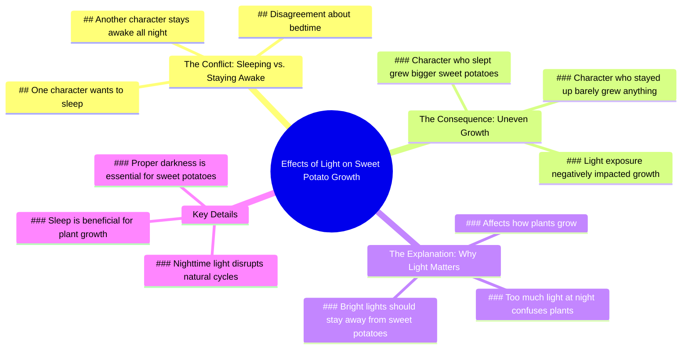

# How Street Lights Affect Plant Growth

> 🌐 **Read this in:** **English** · [中文](../../zh-CN/2026-07/tiktok-transcript-9-3m-views-99k-reactions-how-street-lights-can-affect-plant-db19.md)

> **Creator:** [@Dr.Bota](https://www.tiktok.com/@Dr.Bota) · **Views:** 3.7M · **Posted:** 2026-07-19 · **Niche:** other
>
> **TL;DR:** The hook creates immediate curiosity by contrasting the expectation of bedtime with the reality of daylight.

[Watch original video →](https://www.facebook.com/reel/1006843358938373)

## Why This Went Viral

## Hook (first 3 seconds)
- **Verbatim:** "Ah, finally! Bedtime! Seriously? Bedtime? It still looks like daytime to me. Whatever suits you. I'm going to sleep."
- **Hook pattern:** Contrast / Scene-based dialogue (two characters with opposing views on bedtime).
- **Why it stops scrolling:** The immediate conflict ("finally bedtime" vs. "it still looks like daytime") creates a relatable, humorous tension. Viewers who struggle with sleep or know someone who does are instantly drawn in.

## Emotional Rhythm
1. **Curiosity** – The opening argument about bedtime vs. daytime.
2. **Tension** – The dismissive "Whatever suits you" and "I'm going to sleep" creates a standoff.
3. **Relief (comedic)** – "Bro, were you up all night? You look exhausted." Self-aware humor.
4. **Suspense** – "Let's see how much sweet potato you grow doing that." Foreshadowing a payoff.
5. **Twist** – "Huh? How come you grew bigger sweet potatoes and I barely have anything?" The unexpected result.
6. **Resolution + Lesson** – "Too much light at night can confuse some plants." The climax is the reveal of the sweet potato size difference.

**Climax moment:** The side-by-side comparison of sweet potato growth, where the viewer sees the consequence of the earlier argument.

## Keyword Density
| Word/Phrase | Frequency | Role |
|-------------|-----------|------|
| sleep / sleeping | 5 | Emotional pull (relatable struggle) |
| night | 4 | Algorithmic reach (time-based content) |
| sweet potato(es) | 4 | Algorithmic reach (niche gardening) |
| light / bright lights | 3 | Emotional pull (cause-effect) |
| stay up / staying up | 2 | Emotional pull (bad habit) |
| grow / grew | 3 | Algorithmic reach (gardening) |

**Drivers:** "sleep" and "sweet potato" are the dual hooks—one for human relatability, one for niche gardening curiosity. "Light" bridges the two.

## Why It Spreads
1. **Universal Relatability + Niche Twist** – Everyone understands the "should I sleep or stay up?" dilemma, but the sweet potato payoff is unexpected. The line "Too much light at night can confuse some plants" turns a mundane argument into a science lesson.
2. **Dialogue-Driven Suspense** – The back-and-forth mimics a real conversation, making viewers feel like they're eavesdropping. The line "Let's see how much sweet potato you grow doing that" plants a question mark that demands resolution.
3. **Visual Payoff** – The reveal of the size difference ("How come you grew bigger sweet potatoes?") is the exact moment viewers share the video. It's a clear, satisfying before/after.
4. **Educational Surprise** – The video sneaks in a gardening tip (light affects sweet potato growth) without feeling preachy. Viewers learn something while laughing.
5. **Short, Punchy Format** – The entire narrative (argument → consequence → lesson) unfolds in under 60 seconds. No wasted lines.

## What You Can Steal
1. **The "Friendly Argument" Structure** – Start with two opposing views on a common topic (sleep vs. stay up, work vs. rest). Let the conflict drive the first 10 seconds. Example: "Finally, a rainy day!" vs. "Rain? This is the worst."
2. **The "Hidden Consequence" Hook** – Plant a mystery early ("Let's see how much sweet potato you grow") that the audience knows must pay off. Keep them watching by promising a reveal.
3. **The "Unexpected Teacher" Twist** – End with a simple, science-backed explanation that reframes the whole argument. Use the line "That's why bright lights should stay away from sweet potatoes" as a template for any niche fact.

## Mind Map

## Full Transcript (Generated by [TokTranscript.com](https://toktranscript.com/?utm_source=github&utm_medium=breakdown&utm_campaign=tool_attribution))

> 📝 Transcripts on this page are auto-generated and show the first 60%. Want to transcribe any TikTok in 30 seconds and get the full version? [Try TokTranscript free →](https://toktranscript.com/?utm_source=github&utm_medium=breakdown&utm_campaign=transcript_cta)

Ah, finally! Bedtime! Seriously? Bedtime? It still looks like daytime to me. Whatever suits you. I'm going to sleep. Bro, were you up all night? You look exhausted. It never got dark anyway. You just love sleeping. Let's see how much sweet potato you grow doing that. It's getting late. Go to sleep already. Staying up all night might mess up your sweet potatoes. Dude, if you want to sleep all night, that's your business.

*[Read the full transcript on TokTranscript →](https://toktranscript.com/plaza/tiktok-transcript-9-3m-views-99k-reactions-how-street-lights-can-affect-plant-db19?utm_source=github&utm_medium=breakdown&utm_campaign=transcript_full)*

## Browse More

- All [other](../../by-niche/en/other.md) breakdowns
- All [Contrasting perspective](../../by-pattern/en/hook-contrasting-perspective.md) examples

## Video Info

| | |
|---|---|
| Creator | [@Dr.Bota](https://www.tiktok.com/@Dr.Bota) |
| Original video | [https://www.facebook.com/reel/1006843358938373](https://www.facebook.com/reel/1006843358938373) |
| Original title | 9.3M views · 99K reactions | How Street Lights Can Affect Plant Growth | Dr.Bota |
| Views | 3.7M (3729279) |
| Posted | 2026-07-19 |
| Duration | 0s |
| Niche | `other` |
| Hook pattern | `Contrasting perspective` |
| Original language | `en` |
| Available languages | en, zh-CN |
| Generated | 2026-07-20 by [TokTranscript](https://toktranscript.com/) |

---

*This breakdown is for educational analysis under fair use. Original video © [@Dr.Bota](https://www.tiktok.com/@Dr.Bota). All transcripts are auto-generated and may contain errors.*

*Want to analyze your own TikToks like this? [TokTranscript →](https://toktranscript.com/viral-breakdown?utm_source=github&utm_medium=breakdown&utm_campaign=footer_cta)*