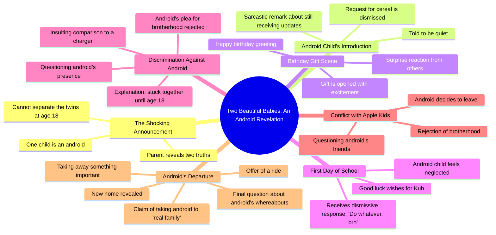

# Android Babies Cannot Be Separated at 18

> 🌐 **Read this in:** **English** · [中文](../../zh-CN/2026-07/tiktok-transcript-ai-aifruits-brainrot-aistory-fruitdrama-872f.md)

> **Creator:** [@aistorys957](https://www.tiktok.com/@aistorys957) · **Views:** 3.4M · **Posted:** 2026-07-14 · **Niche:** entertainment
>
> **TL;DR:** The hook subverts expectations by revealing one baby is an android, instantly creating curiosity and conflict.

[Watch original video →](https://www.tiktok.com/t/ZP8GWePH8/)

## Why This Went Viral

## Hook (first 3 seconds)
- **Verbatim opening:** "Congratulations. You have two beautiful babies. However, there are two things you should know. First, can't actually separate when they turn 18. The second thing is. Is an android."
- **Hook pattern:** **Contrast** (joyful announcement immediately undercut by shocking twist) + **Mystery** ("two things you should know" creates anticipation)
- **Why it stops scrolling:** The first line sets up a warm, relatable parenting moment, then the word "android" shatters the reality. Viewers are forced to re-process what they just heard — the cognitive dissonance is instant and addictive.

## Emotional Rhythm
- **Beat 1 (Curiosity):** "Congratulations… two beautiful babies" — warm, familiar setup.
- **Beat 2 (Tension):** "First, can't actually separate" — ominous, raises stakes.
- **Beat 3 (Shock):** "Is an android" — twist lands, viewer must re-evaluate.
- **Beat 4 (Comic relief / Confusion):** "Daddy, can I get some cereal? Shut up." — humor from absurdity, releases tension.
- **Beat 5 (Suspense):** "What the hell, kuh?" — sibling rivalry escalates, android is bullied.
- **Beat 6 (Resonance / Heartbreak):** "You won't be needing this anymore… This is your new home, little bro." — emotional climax: the android is abandoned, but then rescued.
- **Beat 7 (Relief / Twist):** "Where the bummy android at?" — unresolved, leaves viewer wanting more.

**Climax moment:** The line "You won't be needing this anymore" — the emotional pivot where the android's vulnerability is exposed, making the viewer root for him.

## Keyword Density
| Keyword / Phrase | Frequency (approx.) | Driver |
|---|---|---|
| "cuh" / "little bro" | 6+ | **Algorithmic reach** — casual, slang-heavy dialogue boosts engagement (comments, remixes) |
| "android" | 4 | **Emotional pull** — core sci-fi premise, triggers curiosity and empathy |
| "brothers" | 3 | **Emotional pull** — family vs. technology tension |
| "bummy" | 2 | **Emotional pull** — insult creates underdog dynamic |
| "real family" | 2 | **Emotional pull** — identity crisis, heartstring tug |
| "shut up" / "hell nah" | 2+ | **Algorithmic reach** — high-energy dialogue, easy to clip and meme |
| "apple kids" | 1 | **Algorithmic reach** — brand reference (Apple) increases discoverability via search |

## Why It Spreads
1. **High-concept, low-budget sci-fi:** The "android in a family" premise is instantly understandable and visually cheap to execute. Viewers share because it feels like a mini-movie they can consume in seconds. *Concrete line: "Is an android."*
2. **Emotional whiplash in 60 seconds:** The video cycles through humor, tension, and heartbreak. This keeps retention high and triggers the "rewatch" impulse. *Concrete line: "You won't be needing this anymore" → "This is your new home."*
3. **Relatable family dynamics + absurd twist:** Sibling rivalry is universal; adding an android makes it novel. Viewers comment "my brother acts like this" — bridging fiction and reality. *Concrete line: "Why you so mean to me, cuh? We brothers."*
4. **Open-ended cliffhanger:** "Where the bummy android at?" invites speculation and demands a part 2. This drives comments, shares, and algorithm favor. *Concrete line: The final line unanswered.*
5. **Slang-driven dialogue:** Frequent use of "cuh" and "bummy" feels authentic to Gen Z / street culture, making the video feel like a real conversation — not scripted. This boosts shareability within friend groups. *Concrete line: "Hell, nah, fam. I ain't brothers with some bummy android."*

## What You Can Steal
1. **The "mundane + impossible" hook:** Start with a normal situation (parenting, family dinner) and inject one impossible element (an android, a robot, a time traveler). This creates instant curiosity with zero setup cost.
2. **Emotional rollercoaster in 60 seconds:** Map your script: 10 seconds of humor → 10 seconds of tension → 10 seconds of heartbreak → 10 seconds of cliffhanger. Use dialogue to switch tones, not narration.
3. **Leave the ending unresolved:** End on a question or a character's reaction that implies "to be continued." This forces viewers to comment "part 2?" — the algorithm rewards that engagement.

## Mind Map

## Full Transcript (Generated by [analyze your own TikToks](https://toktranscript.com/?utm_source=github&utm_medium=breakdown&utm_campaign=tool_attribution))

> 📝 Transcripts on this page are auto-generated and show the first 60%. Want to transcribe any TikTok in 30 seconds and get the full version? [Try TokTranscript free →](https://toktranscript.com/?utm_source=github&utm_medium=breakdown&utm_campaign=transcript_cta)

Congratulations. You have two beautiful babies. However, there are two things you should know. First, can't actually separate when they turn 18. The second thing is. Is an android. An android? Daddy, can I get some cereal? Shut up. Huh? You lucky you still getting updates. Happy birthday, babe. Yeah, little bro, go ahead and open it. No way. Yes, sir. What the hell, kuh? Good luck on your first school day, Kuh? Thanks, dad. What about me, daddy? Do whatever, bro. Who let an android in here? He's stuck with me till I'm 18, cuh. Why you so mean to me, CUH? We brothers. Hell, nah, fam.

*[Read the full transcript on TokTranscript →](https://toktranscript.com/plaza/tiktok-transcript-ai-aifruits-brainrot-aistory-fruitdrama-872f?utm_source=github&utm_medium=breakdown&utm_campaign=transcript_full)*

## Browse More

- All [entertainment](../../by-niche/en/entertainment.md) breakdowns
- All [Unexpected reveal](../../by-pattern/en/hook-unexpected-reveal.md) examples

## Video Info

| | |
|---|---|
| Creator | [@aistorys957](https://www.tiktok.com/@aistorys957) |
| Original video | [https://www.tiktok.com/t/ZP8GWePH8/](https://www.tiktok.com/t/ZP8GWePH8/) |
| Original title | #ai #aifruits #brainrot #aistory #fruitdrama  |
| Views | 3.4M (3400000) |
| Posted | 2026-07-14 |
| Duration | 0s |
| Niche | `entertainment` |
| Hook pattern | `Unexpected reveal` |
| Original language | `en` |
| Available languages | en, zh-CN |
| Generated | 2026-07-15 by [TokTranscript](https://toktranscript.com/) |

---

*This breakdown is for educational analysis under fair use. Original video © [@aistorys957](https://www.tiktok.com/@aistorys957). All transcripts are auto-generated and may contain errors.*

*Want to analyze your own TikToks like this? [free TikTok transcript generator →](https://toktranscript.com/viral-breakdown?utm_source=github&utm_medium=breakdown&utm_campaign=footer_cta)*