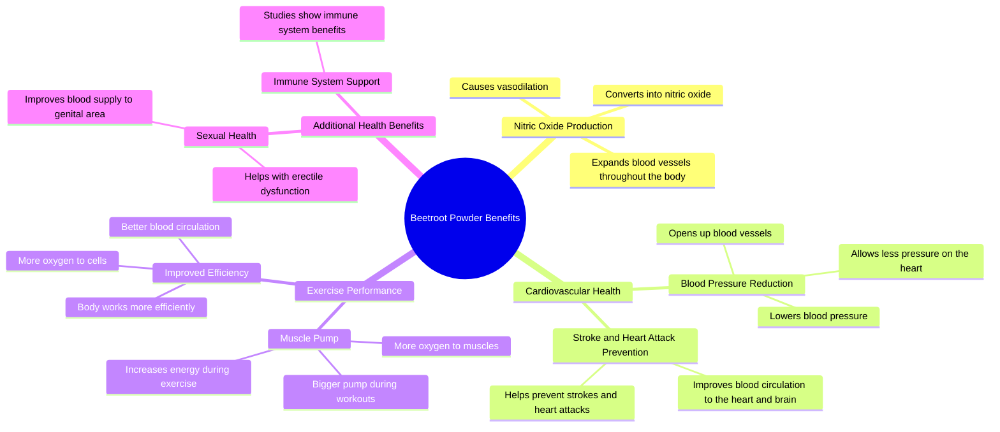

# Beetroot Powder Benefits: Nitric Oxide, Pumps & Blood Pre...

> 🌐 **Read this in:** **English** · [中文](../../zh-CN/2026-07/tiktok-transcript-all-the-benefits-of-beet-root-fyp-beetroot-beetrootpowder-me-8fd2.md)

> **Creator:** [@trainwithjk](https://www.tiktok.com/@trainwithjk) · **Views:** 544.3K · **Posted:** 2026-07-30 · **Niche:** fitness
>
> **TL;DR:** Starts with a scientific mechanism that promises a tangible fitness result, hooking gym enthusiasts immediately.

[Watch original video →](https://www.tiktok.com/@trainwithjk/video/7167214449760193835?is_from_webapp=1&sender_device=pc&web_id=7652559874152564254)

## Why This Went Viral

## Hook (first 3 seconds)
- **Verbatim opening line:** "Beetroot powder converts into nitric oxide which causes vasodilation the more oxygen you get to your muscles the bigger pump and oxygen is life"
- **Hook pattern type:** Bold claim + science trigger + immediate benefit ("bigger pump")
- **Why it stops scrolling:** It front-loads a physiological mechanism (nitric oxide → vasodilation) that sounds authoritative, then instantly ties it to a gym-culture payoff ("bigger pump") — this hooks both science-curious viewers and fitness-obsessed ones in one breath.

## Emotional Rhythm
- **Beat 1 — Curiosity (0–3s):** "Beetroot powder converts into nitric oxide..." — sounds like a secret science hack.
- **Beat 2 — Tension (3–8s):** "It can actually lower blood pressure... for the men that struggle with things like erectile dysfunction" — pivots to a vulnerable, high-stakes topic.
- **Beat 3 — Relief/Resonance (8–14s):** "More blood circulation means better health... opening up those blood vessels allowing less pressure on your heart" — explains the mechanism simply, feels like a solution.
- **Beat 4 — Escalation (14–20s):** "One of the ways you can help prevent a stroke or a heart attack" — raises stakes to life-or-death.
- **Beat 5 — Twist/Climax (20–24s):** "I'm just now realizing I've never gone into depth about beetroot powder" — meta moment that humanizes the creator and signals value.
- **Climax moment:** The erectile dysfunction mention — it's taboo, relatable, and instantly widens the audience beyond gym bros.

## Keyword Density
| Word/Phrase | Count (approx.) | Reach vs. Pull |
|-------------|-----------------|----------------|
| "oxygen" | 5 | **Algorithmic reach** — high-search-volume health keyword |
| "blood circulation / blood vessels" | 4 | **Emotional pull** — implies vitality, youth, prevention |
| "beetroot powder" | 3 | **Niche keyword** — targets supplement buyers |
| "nitric oxide" | 2 | **Algorithmic reach** — trending biohacking term |
| "heart attack / stroke" | 2 | **Emotional pull** — fear-based urgency |
| "muscles / pump" | 2 | **Algorithmic reach** — fitness audience |
| "erectile dysfunction" | 1 | **Emotional pull** — high-engagement taboo topic |

## Why It Spreads
1. **Taboo bridge:** "Erectile dysfunction" is rarely said in fitness shorts — it shatters the algorithm's content boundaries, driving comments and shares from men who feel seen.
2. **Stacked benefit ladder:** The video moves from pump → energy → blood pressure → heart attack prevention → immune system → ED — each step widens the audience (gym, health, aging, men's health).
3. **Meta vulnerability:** "I'm just now realizing I've never gone into depth" — this self-aware line feels like a confession, increasing trust and prompting viewers to save the video for later.
4. **Science-as-authority:** "Nitric oxide causes vasodilation" sounds like a doctor's explanation, making the video feel credible enough to share without fact-checking.
5. **Comment-bait structure:** The ED mention + "follow for more health tips" + open-ended benefits create natural comment hooks ("Does it really work?" "What brand do you use?").

## What You Can Steal
1. **Lead with a mechanism, not a claim.** Start with "X converts into Y which causes Z" — it sounds like insider knowledge and builds instant authority.
2. **Bridge to a taboo topic early.** After the first benefit, pivot to a vulnerable audience (ED, brain fog, aging) — it spikes engagement and expands reach beyond your core niche.
3. **End with a meta realization.** Saying "I just realized I've never explained this" makes the video feel like a gift, not a sales pitch — viewers save it as a reference.

## Mind Map

## Full Transcript (Generated by [TokTranscript](https://toktranscript.com/?utm_source=github&utm_medium=breakdown&utm_campaign=tool_attribution))

> 📝 Transcripts on this page are auto-generated and show the first 60%. Want to transcribe any TikTok in 30 seconds and get the full version? [Try TokTranscript free →](https://toktranscript.com/?utm_source=github&utm_medium=breakdown&utm_campaign=transcript_cta)

beetroot powder converts into nitric oxide which causes vasodilation the more oxygen you get to your muscles the bigger pump and oxygen is life it can actually lower blood pressure follow for more health tips the more efficiently your body is going to be able to work and for the men that struggle with things like erectile dysfunction as the more oxygen your cells get for all my gym bros and muscle mommies and more blood circulation means better health or the expansion of blood vessels throughout the entire body by opening up those blood vessels allowing less pressure on your heart it's also gonna help create your

*[Read the full transcript on TokTranscript →](https://toktranscript.com/plaza/tiktok-transcript-all-the-benefits-of-beet-root-fyp-beetroot-beetrootpowder-me-8fd2?utm_source=github&utm_medium=breakdown&utm_campaign=transcript_full)*

## Browse More

- All [fitness](../../by-niche/en/fitness.md) breakdowns
- All [Science-Backed Benefit Tease](../../by-pattern/en/hook-science-backed-benefit-tease.md) examples

## Video Info

| | |
|---|---|
| Creator | [@trainwithjk](https://www.tiktok.com/@trainwithjk) |
| Original video | [https://www.tiktok.com/@trainwithjk/video/7167214449760193835?is_from_webapp=1&sender_device=pc&web_id=7652559874152564254](https://www.tiktok.com/@trainwithjk/video/7167214449760193835?is_from_webapp=1&sender_device=pc&web_id=7652559874152564254) |
| Original title | All the benefits of beet root  #fyp #beetroot #beetrootpowder #menshe... |
| Views | 544.3K (544300) |
| Posted | 2026-07-30 |
| Duration | 0s |
| Niche | `fitness` |
| Hook pattern | `Science-Backed Benefit Tease` |
| Original language | `en` |
| Available languages | en, zh-CN |
| Generated | 2026-07-31 by [TokTranscript](https://toktranscript.com/) |

---

*This breakdown is for educational analysis under fair use. Original video © [@trainwithjk](https://www.tiktok.com/@trainwithjk). All transcripts are auto-generated and may contain errors.*

*Want to analyze your own TikToks like this? [try this transcription tool →](https://toktranscript.com/viral-breakdown?utm_source=github&utm_medium=breakdown&utm_campaign=footer_cta)*