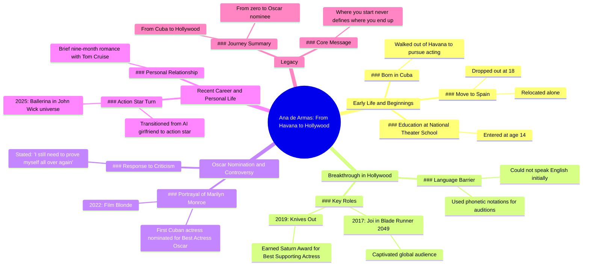

# Ana de Armas Through the Years

> 🌐 **Read this in:** **English** · [中文](../../zh-CN/2026-07/tiktok-transcript-ana-de-armas-through-the-years-anadearmas-fyp-foryou-through-c66a.md)

> **Creator:** [@chronos085](https://www.tiktok.com/@chronos085) · **Views:** 2.7M · **Posted:** 2026-07-14 · **Niche:** entertainment
>
> **TL;DR:** Immediately establishes a relatable, aspirational figure with a clear underdog narrative.

[Watch original video →](https://vt.tiktok.com/ZSXhcD681/)

## Why This Went Viral

## Hook (first 3 seconds)
- **Verbatim opening:** "She is Ana de Armas, the Cuban girl who walked out of Havana and became one of Hollywood's most mesmerizing new generation screen goddesses."
- **Hook pattern:** Bold claim + identity contrast ("Cuban girl" vs. "Hollywood screen goddess")
- **Why it stops scroll:** Immediately establishes a dramatic underdog narrative with a specific, unfamiliar origin (Havana) and a high-status outcome (Hollywood goddess). The contrast creates instant curiosity — how did she get from there to here?

## Emotional Rhythm
- **Beat 1 – Curiosity:** "Cuban girl who walked out of Havana…" — sets up a journey
- **Beat 2 – Tension:** "Couldn't speak a word of English… phonetic notations" — obstacle + grit
- **Beat 3 – Payoff:** "Blade Runner 2049 made the whole world fall for those eyes" — first success hit
- **Beat 4 – Escalation:** "Knives Out… Saturn Award" — validation
- **Beat 5 – Peak climax:** "First Cuban actress ever nominated for a Best Actress Oscar" — historic achievement
- **Beat 6 – Vulnerability dip:** "I still need to prove myself all over again" — humanizes, creates resonance
- **Beat 7 – Comeback:** "Stormed back with Ballerina… action star" — redemption arc
- **Beat 8 – Final resolve:** "Where you start never defines where you end up" — emotional closure
- **Climax moment:** The Oscar nomination reveal — it's the highest-stakes, most historic milestone

## Keyword Density
| Word/Phrase | Frequency | Driver |
|---|---|---|
| "Cuban" | 3x | Algorithmic reach (identity + geography tag) |
| "Hollywood" | 3x | Algorithmic reach (industry authority) |
| "Oscar" / "nominated" | 2x | Algorithmic reach (prestige signal) |
| "prove" / "proved" | 2x | Emotional pull (underdog narrative) |
| "first" | 2x | Emotional pull (uniqueness, historic) |
| "zero" | 1x | Emotional pull (contrast with "Oscar nominee") |
| "alone" | 1x | Emotional pull (vulnerability, relatability) |
| "stormed back" | 1x | Emotional pull (comeback drama) |

## Why It Spreads
1. **Underdog-to-icon arc is universally shareable** — "She couldn't speak a word of English" → "Oscar nominee." This structure works across cultures because it triggers aspirational emotion. Viewers tag friends who need motivation.
2. **Specific, surprising milestones create "wow" moments** — "First Cuban actress ever nominated for a Best Actress Oscar" is a fact that feels like a discovery. People share to signal they know something cool.
3. **Vulnerability + comeback = emotional retention** — The line "I still need to prove myself all over again" after the Oscar nod makes the story human. It prevents the video from feeling like a puff piece. Viewers comment their own struggles.
4. **Name-dropping high-recognition IP** — "Blade Runner 2049," "Knives Out," "John Wick," "Tom Cruise" — each triggers a micro-memory for viewers, making the video feel packed with value. People share because they recognize multiple touchpoints.
5. **Closing line is a quotable mantra** — "Where you start never defines where you end up" is a shareable, text-overlay-ready line. It works as a standalone caption for Instagram, TikTok, or Twitter reposts.

## What You Can Steal
1. **Open with an identity contrast in the first 3 words** — "She is [Name], the [humble origin] who became [high-status outcome]." This pattern works for any person or brand story. It instantly signals a transformation arc.
2. **Insert a vulnerability line right after the biggest win** — After the Oscar nomination reveal, add a quote like "I still need to prove myself." This prevents the video from feeling like a highlight reel and triggers deeper emotional investment.
3. **End with a universal, one-sentence mantra** — Close with a line that can stand alone as a graphic quote. It increases the chance of repurposing, saves, and shares. Test: "Where you start never defines where you end up" is 9 words — aim for under 12.

## Mind Map

## Full Transcript (Generated by [TokTranscript](https://toktranscript.com/?utm_source=github&utm_medium=breakdown&utm_campaign=tool_attribution))

> 📝 Transcripts on this page are auto-generated and show the first 60%. Want to transcribe any TikTok in 30 seconds and get the full version? [Try TokTranscript free →](https://toktranscript.com/?utm_source=github&utm_medium=breakdown&utm_campaign=transcript_cta)

She is Ana de Armas, the Cuban girl who walked out of Havana and became one of Hollywood's most mesmerizing new generation screen goddesses. At 14, she entered Cuba's National Theater School. At 18, she dropped out and moved to Spain alone. When she set her sights on Hollywood, she couldn't speak a word of English, but she marked every single line of dialogue with phonetic notations before every audition. In 2017, her role is joy in Blade Runner 2049 made the whole world fall for those eyes. In 2019, knives out put her on the map and earned her a Saturn Award for best supporting actress. In 2022, as a Cuban born actress, she brought Marilyn Monroe back to life on the big screen.

*[Read the full transcript on TokTranscript →](https://toktranscript.com/plaza/tiktok-transcript-ana-de-armas-through-the-years-anadearmas-fyp-foryou-through-c66a?utm_source=github&utm_medium=breakdown&utm_campaign=transcript_full)*

## Browse More

- All [entertainment](../../by-niche/en/entertainment.md) breakdowns
- All [Identity Reveal + Underdog Origin](../../by-pattern/en/hook-identity-reveal-underdog-origin.md) examples

## Video Info

| | |
|---|---|
| Creator | [@chronos085](https://www.tiktok.com/@chronos085) |
| Original video | [https://vt.tiktok.com/ZSXhcD681/](https://vt.tiktok.com/ZSXhcD681/) |
| Original title | Ana de Armas through the years #anadearmas #fyp #foryou #throughtheye... |
| Views | 2.7M (2700000) |
| Posted | 2026-07-14 |
| Duration | 0s |
| Niche | `entertainment` |
| Hook pattern | `Identity Reveal + Underdog Origin` |
| Original language | `en` |
| Available languages | en, zh-CN |
| Generated | 2026-07-15 by [TokTranscript](https://toktranscript.com/) |

---

*This breakdown is for educational analysis under fair use. Original video © [@chronos085](https://www.tiktok.com/@chronos085). All transcripts are auto-generated and may contain errors.*

*Want to analyze your own TikToks like this? [TokTranscript.com →](https://toktranscript.com/viral-breakdown?utm_source=github&utm_medium=breakdown&utm_campaign=footer_cta)*