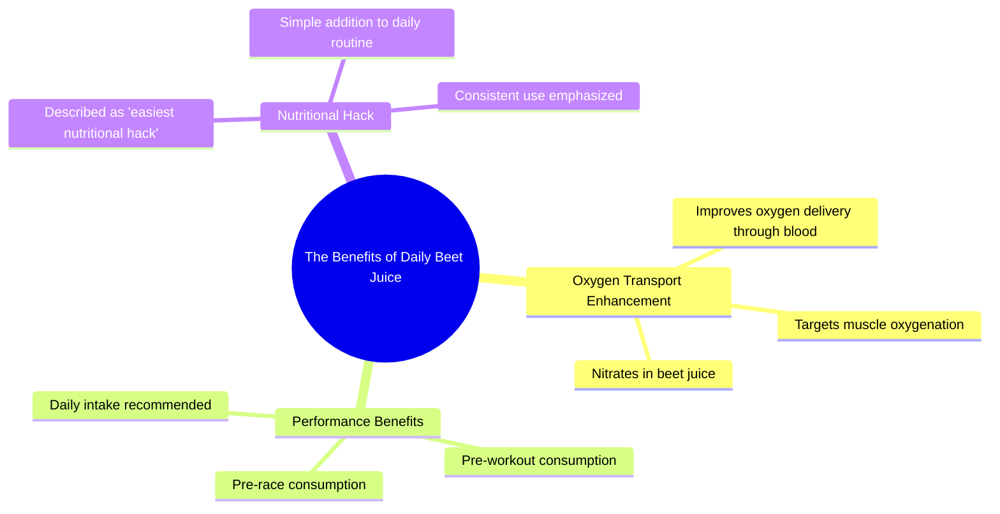

# Beet Juice: The Easiest Performance Boost Before Workouts

> 🌐 **Read this in:** **English** · [中文](../../zh-CN/2026-07/tiktok-transcript-beet-juice-is-the-simplest-performance-boost-you-can-add-bef-85f1.md)

> **Creator:** [@postrunhigh](https://www.tiktok.com/@postrunhigh) · **Views:** 969.1K · **Posted:** 2026-07-30 · **Niche:** fitness
>
> **TL;DR:** Starts with a surprising personal habit then poses a question to hook curiosity.

[Watch original video →](https://www.tiktok.com/@postrunhigh/video/7579356281593433358?is_from_webapp=1&sender_device=pc&web_id=7652559874152564254)

## Why This Went Viral

## Hook (first 3 seconds)
- **Verbatim opening line:** "I do drink beet juice every day."
- **Hook pattern:** Bold claim / personal confession
- **Why it stops scroll:** The speaker opens with a definitive, unqualified personal habit ("I do drink beet juice every day") that sounds like a secret or a confession. It creates immediate curiosity: *Why would anyone do that? What’s the payoff?* The blunt, confident delivery makes you feel you're about to learn a hidden shortcut.

## Emotional Rhythm
1. **Curiosity** – "What does beet juice do?" (rhetorical question, sets up the reveal)
2. **Tension** – "So beet juice has nitrates in it that help you carry oxygen..." (technical explanation builds suspense)
3. **Relief / Reward** – "Hundred percent like, that is, like, easiest nutritional hack." (climax: the payoff is simple, powerful, and validated)
4. **Urgency** – "Drink beet juice before your races and your workouts. Do it every day." (call to action, creates a sense of must-do)
5. **Resonance** – "Hundred percent." (final affirmation, makes the advice feel unshakeable)
- **Climax moment:** The phrase "easiest nutritional hack" – it reframes a complex physiological process into a one-sentence life hack.

## Keyword Density
- **beet juice** (3x) – core product; drives searchability and niche interest (fitness, health)
- **hundred percent** (2x) – emotional anchor; signals certainty and authority
- **hack** (1x) – high-algorithmic reach keyword (viral "life hack" pattern)
- **nitrates** (1x) – scientific credibility; attracts algorithm for "health/performance" queries
- **oxygen / blood / muscles** (3x) – physiological terms; drive organic search from fitness/endurance audience
- **every day** (1x) – frequency trigger; makes the advice feel like a habit, not a one-off

**Algorithmic reach drivers:** "hack," "beet juice," "nitrates," "oxygen."  
**Emotional pull drivers:** "hundred percent," "easiest," "every day."

## Why It Spreads
1. **The "secret shortcut" pattern** – The speaker presents a simple, counterintuitive habit as a "hack." People love feeling they've discovered an edge. The line *"easiest nutritional hack"* is the viral hook that gets shared in captions and comments.
2. **High authority with low friction** – The speaker uses scientific language ("nitrates," "carry oxygen through the blood") to sound credible, but delivers it in a 15-second clip. No jargon, no fluff. This makes the advice feel both trustworthy and instantly actionable.
3. **Repetition of certainty** – "Hundred percent" appears twice. In short-form video, repeated affirmations act as memory anchors. Viewers leave feeling they've been given a definitive answer, which drives shares ("I saw this guy say beet juice works – 100% true").
4. **The "do it every day" call to action** – The final line *"Do it every day"* turns a tip into a habit. This creates a mental script viewers can immediately adopt, which fuels organic UGC (user-generated content) like "I tried beet juice for a week" follow-ups.
5. **Low commitment, high payoff** – The video is 15 seconds long. The advice costs nothing (beet juice is cheap). The promise is huge (better performance). This risk/reward ratio is perfect for viral spread – viewers feel they have nothing to lose by trying it.

## What You Can Steal
1. **Open with a personal habit, not a fact.** Instead of "Studies show X," say "I do X every day." This creates instant curiosity and positions you as a credible insider.
2. **Use the "hundred percent" double-tap.** Repeat a short, absolute affirmation at the start and end of your hook. It signals unshakeable confidence and makes your advice feel definitive.
3. **Front-load the "hack" label.** Call your tip a "hack" in the first 10 seconds. The word itself triggers algorithmic reach and viewer expectation of a quick, valuable shortcut. Then back it up with one simple scientific sentence.

## Mind Map

## Full Transcript (Generated by [TokTranscript.com](https://toktranscript.com/?utm_source=github&utm_medium=breakdown&utm_campaign=tool_attribution))

> 📝 Transcripts on this page are auto-generated and show the first 60%. Want to transcribe any TikTok in 30 seconds and get the full version? [Try TokTranscript free →](https://toktranscript.com/?utm_source=github&utm_medium=breakdown&utm_campaign=transcript_cta)

I do drink beet juice every day. What does beet juice do? So beet juice, uh, has nitrates in it that help you carry oxygen through the blood, so to the muscles.

*[Read the full transcript on TokTranscript →](https://toktranscript.com/plaza/tiktok-transcript-beet-juice-is-the-simplest-performance-boost-you-can-add-bef-85f1?utm_source=github&utm_medium=breakdown&utm_campaign=transcript_full)*

## Browse More

- All [fitness](../../by-niche/en/fitness.md) breakdowns
- All [Personal confession + curiosity gap](../../by-pattern/en/hook-personal-confession-curiosity-gap.md) examples

## Video Info

| | |
|---|---|
| Creator | [@postrunhigh](https://www.tiktok.com/@postrunhigh) |
| Original video | [https://www.tiktok.com/@postrunhigh/video/7579356281593433358?is_from_webapp=1&sender_device=pc&web_id=7652559874152564254](https://www.tiktok.com/@postrunhigh/video/7579356281593433358?is_from_webapp=1&sender_device=pc&web_id=7652559874152564254) |
| Original title | Beet juice is the simplest performance boost you can add before worko... |
| Views | 969.1K (969100) |
| Posted | 2026-07-30 |
| Duration | 0s |
| Niche | `fitness` |
| Hook pattern | `Personal confession + curiosity gap` |
| Original language | `en` |
| Available languages | en, zh-CN |
| Generated | 2026-07-31 by [TokTranscript](https://toktranscript.com/) |

---

*This breakdown is for educational analysis under fair use. Original video © [@postrunhigh](https://www.tiktok.com/@postrunhigh). All transcripts are auto-generated and may contain errors.*

*Want to analyze your own TikToks like this? [analyze your own TikToks →](https://toktranscript.com/viral-breakdown?utm_source=github&utm_medium=breakdown&utm_campaign=footer_cta)*