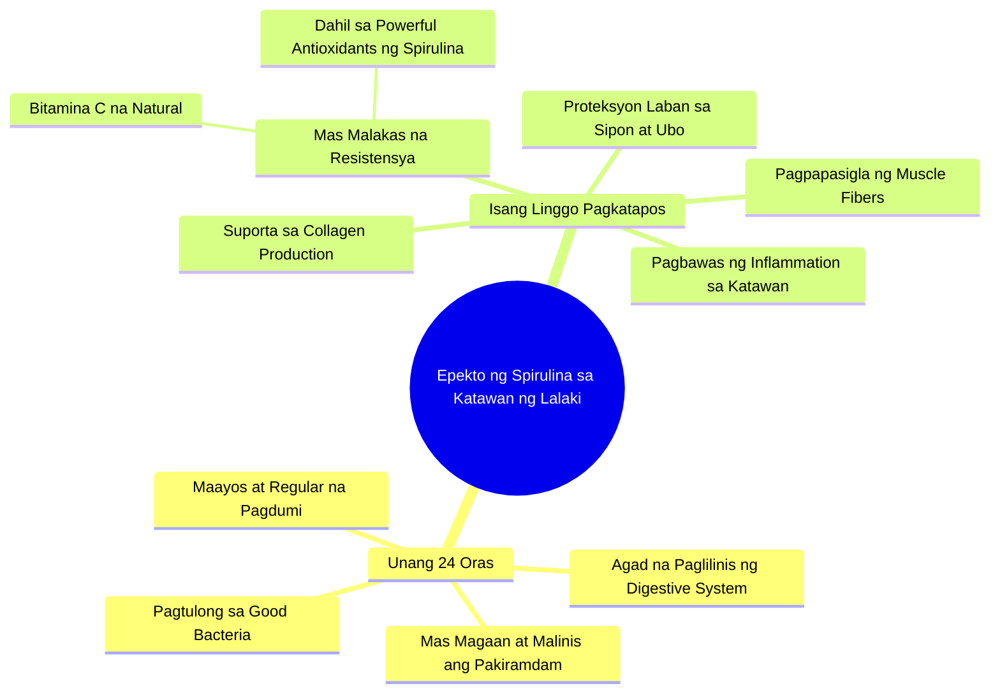

# Spirulina Benefits for Men and Digestion

> 🌐 **Read this in:** **English** · [中文](../../zh-CN/2026-07/tiktok-transcript-benefits-ng-spirulina-sa-lalaki-at-bakit-maganda-ito-sa-dige-86bc.md)

> **Creator:** [@healthyph](https://www.tiktok.com/@healthyph) · **Views:** 442.5K · **Posted:** 2026-07-29 · **Niche:** fitness
>
> **TL;DR:** It creates immediate curiosity about a specific bodily transformation within a short timeframe.

[Watch original video →](https://www.tiktok.com/@healthyph/video/7585086871026273556?shop_region=PH&shop_id=7495310222761495027)

## Why This Went Viral

## Hook (first 3 seconds)
- **Verbatim:** "When the man drinks spirulina, this is how he might feel in his body"
- **Pattern:** Scene + Curiosity (doesn't yet reveal what will happen, but draws you in to imagine the effect)
- **Why you stop:** Used "you" perspective and "this is how" — feels like a personal experiment. Not a generic "benefits of spirulina," but "this is how YOU will feel." Instant relevance.

## Emotional Rhythm
- **Curiosity (0–3s):** What will I feel in my body?
- **Anticipation (3–5s):** "In just 24 hours" — there's a timeline, a promise
- **Micro-relief (5–10s):** "Lighter and cleaner" — positive outcome, relieved it's not negative
- **Trust-building (10–15s):** "Good bacteria, digestion, regular observations" — sounds scientific yet simple
- **Surprise + Tension (15–20s):** "Simple cough won't go away" — suddenly a threat, a problem
- **Resolution (20–25s):** "Collagen, revitalize muscle fibers, reduce inflammation" — solution to the problem
- **Climax:** "Follow for more" — CTA with social proof (if you liked this, there's more)

## Keyword Density
| Keyword | Frequency | Purpose |
|---------|-----------|---------|
| **Spirulina** | 3x | Algorithmic (product name, searchable) |
| **Body** | 4x | Emotional (personal, relatable) |
| **Clean / lighter** | 2x | Emotional (aspirational, positive) |
| **Energy** | 2x | Algorithmic + Emotional (high search volume) |
| **Collagen** | 1x | Algorithmic (trending keyword) |
| **Inflammation** | 1x | Algorithmic (health niche) |
| **24 hours / week** | 2x | Emotional (urgency, progress) |
| **Good bacteria** | 1x | Emotional (trust, science-y) |

**Algorithmic drivers:** spirulina, collagen, inflammation, energy — all have high search volume in the health niche.
**Emotional pull:** body, clean, lighter, energy — all positive transformation words.

## Why It Spreads
1. **Promise of fast results** — "In just 24 hours" + "After a week" = the effect has a timeline. Not vague. Easy to share because it feels like "try this and see in 1 day."
2. **Problem → Solution pattern** — "Simple cough won't go away" → "Spirulina fixes that." Used fear of illness to frame the product as a solution. Classic pain point.
3. **Personalized language** — "This is how *he* might feel" but it feels like you're being addressed. Used "his body" so it's not too salesy yet still relatable.
4. **Social proof CTA** — "Follow for more if you like this type" — not "buy now," but "follow." Lower barrier, higher engagement.
5. **Micro-education style** — Not just benefits, but explanation (good bacteria, antioxidants, Vitamin C). Feels like teaching, not selling. More trustworthy.

## What You Can Steal
1. **Use the "In just X hours/days" formula** — Attach a specific timeline to the result. Not "effective," but "24 hours." More believable, more shareable.
2. **Problem-first, solution-second** — Start with a common problem (cough, low energy, inflammation) before introducing the product. More relatable.
3. **Use "Follow for more" instead of "Buy now"** — Lower resistance, higher chance of engagement. If you want to go viral, engagement > sales at the start.

## Mind Map

## Full Transcript (Generated by [TokTranscript.com](https://toktranscript.com/?utm_source=github&utm_medium=breakdown&utm_campaign=tool_attribution))

> 📝 Transcripts on this page are auto-generated and show the first 60%. Want to transcribe any TikTok in 30 seconds and get the full version? [Try TokTranscript free →](https://toktranscript.com/?utm_source=github&utm_medium=breakdown&utm_campaign=transcript_cta)

When the man drinks spirulina This is how he might feel in his body In just twenty Four hours will notice that the lighter and cleaner Because it helps to clean immediately The digestion and trick The good Bacteria for Smooth and help with Regular observations and for Natural Energy After a week More male resistance is stronger thanks to Powerful Antioxidants of Spir

*[Read the full transcript on TokTranscript →](https://toktranscript.com/plaza/tiktok-transcript-benefits-ng-spirulina-sa-lalaki-at-bakit-maganda-ito-sa-dige-86bc?utm_source=github&utm_medium=breakdown&utm_campaign=transcript_full)*

## Browse More

- All [fitness](../../by-niche/en/fitness.md) breakdowns
- All [Curiosity gap + time promise](../../by-pattern/en/hook-curiosity-gap-time-promise.md) examples

## Video Info

| | |
|---|---|
| Creator | [@healthyph](https://www.tiktok.com/@healthyph) |
| Original video | [https://www.tiktok.com/@healthyph/video/7585086871026273556?shop_region=PH&shop_id=7495310222761495027](https://www.tiktok.com/@healthyph/video/7585086871026273556?shop_region=PH&shop_id=7495310222761495027) |
| Original title | benefits ng spirulina sa lalaki at bakit maganda ito sa digestion. #n... |
| Views | 442.5K (442500) |
| Posted | 2026-07-29 |
| Duration | 0s |
| Niche | `fitness` |
| Hook pattern | `Curiosity gap + time promise` |
| Original language | `tl` (this page translated by AI) |
| Available languages | en, zh-CN |
| Generated | 2026-07-30 by [TokTranscript](https://toktranscript.com/) |

---

*This breakdown is for educational analysis under fair use. Original video © [@healthyph](https://www.tiktok.com/@healthyph). All transcripts are auto-generated and may contain errors.*

*Want to analyze your own TikToks like this? [free TikTok transcript generator →](https://toktranscript.com/viral-breakdown?utm_source=github&utm_medium=breakdown&utm_campaign=footer_cta)*