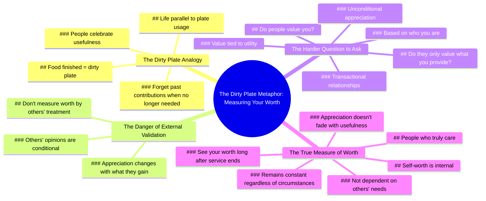

# Best Motivational Speech: Life Lesson on Self-Worth

> 🌐 **Read this in:** **English** · [中文](../../zh-CN/2026-07/tiktok-transcript-best-motivational-speech-life-lesson-must-watch-foryou-foryo-2145.md)

> **Creator:** [@relationmotivation786](https://www.tiktok.com/@relationmotivation786) · **Views:** 1.5M · **Posted:** 2026-07-04 · **Niche:** other
>
> **TL;DR:** Uses a relatable, vivid metaphor to immediately draw viewers into a deeper reflection on worth.

[Watch original video →](https://vm.tiktok.com/ZNRKM29Ny/)

## Why This Went Viral

## Hook (first 3 seconds)
- **Verbatim:** "When the food is finished, they call it a dirty plate."
- **Hook pattern:** Contrast / Metaphor (dirty plate vs. human worth)
- **Why it stops scrolling:** The metaphor is instantly relatable, slightly jarring, and sets up a universal truth about transactional relationships. It makes viewers pause to decode the analogy.

## Emotional Rhythm
1. **Curiosity** (0–3s) – "Dirty plate" metaphor triggers a "what does this mean?" reflex.
2. **Recognition** (4–8s) – "People celebrate you when you're useful" lands as a painful, familiar truth.
3. **Tension** (9–12s) – "Their appreciation often changes with what they can get from you" sharpens the sting.
4. **Reflection** (13–16s) – "Ask yourself a harder question" shifts from external blame to internal accountability.
5. **Climax** (17–19s) – "Do people value you, or do they only value what you provide?" – the core emotional punch.
6. **Resolution / Relief** (20–24s) – "People who truly care... will still see your worth long after" offers a soft landing and hope.

## Keyword Density
- **"Value / valuable"** (4×) – Algorithmic reach (high-engagement self-help keyword) + emotional pull (identity threat).
- **"Worth"** (2×) – Emotional pull (self-esteem trigger); moderate algorithmic weight.
- **"Useful / provide / serve"** (3×) – Emotional pull (fear of being used); low algorithmic weight.
- **"People"** (3×) – Algorithmic reach (broad, high-volume term).
- **"You / your"** (6×) – Algorithmic reach (personalization drives watch time) + emotional pull (direct address).
- **"Care / truly care"** (2×) – Emotional pull (contrast with transactional love); low algorithmic weight but high retention.

## Why It Spreads
1. **Universal painful truth + metaphor** – "Dirty plate" is a sticky, visual analogy that immediately resonates with anyone who's felt used. It's shareable because it names a taboo feeling without being preachy.
2. **Direct second-person address** – "You" and "your" appear 6 times, making every viewer feel personally spoken to. This increases watch time and comment engagement ("this is about my ex/boss/friend").
3. **Emotional rollercoaster with a soft landing** – The script goes from uncomfortable truth → tension → hard question → relief. This pattern maximizes retention (viewers stay for the resolution) and increases shares (people want to give friends the "hope" ending).
4. **Call to internal action, not external blame** – "Ask yourself a harder question" avoids victimhood and positions the creator as wise, not bitter. This makes the video feel like therapy, not ranting, broadening shareability across demographics.
5. **Pacing and pause** – The verbal stumble ("uh") at 17s adds authenticity. A polished read would feel scripted; the slight hesitation makes the hard question feel genuinely vulnerable, increasing trust and emotional connection.

## What You Can Steal
1. **Lead with a sticky metaphor, not a thesis statement.** Open with a concrete, everyday image (dirty plate, empty chair, closed door) that viewers must decode. The cognitive gap creates curiosity and buys you 3–5 extra seconds of attention.
2. **End every emotional beat with a question, not a statement.** "Do people value you, or do they only value what you provide?" forces internal engagement. Viewers who answer silently are more likely to comment or share.
3. **Build a "truth → tension → relief" arc in under 30 seconds.** Start with a painful observation, escalate to a hard question, then resolve with a hopeful frame. This pattern mirrors successful therapy content and keeps viewers watching to the end (boosting algorithm signal).

## Mind Map

## Full Transcript (Generated by [free TikTok transcript generator](https://toktranscript.com/?utm_source=github&utm_medium=breakdown&utm_campaign=tool_attribution))

> 📝 Transcripts on this page are auto-generated and show the first 60%. Want to transcribe any TikTok in 30 seconds and get the full version? [Try TokTranscript free →](https://toktranscript.com/?utm_source=github&utm_medium=breakdown&utm_campaign=transcript_cta)

When the food is finished, they call it a dirty plate. That's life. People celebrate you when you're useful and forget everything you gave once they no longer need you. That's why you should never measure your worth by how others treat you. Their appreciation often changes with what they can get from you.

*[Read the full transcript on TokTranscript →](https://toktranscript.com/plaza/tiktok-transcript-best-motivational-speech-life-lesson-must-watch-foryou-foryo-2145?utm_source=github&utm_medium=breakdown&utm_campaign=transcript_full)*

## Browse More

- All [other](../../by-niche/en/other.md) breakdowns
- All [Metaphorical hook](../../by-pattern/en/hook-metaphorical-hook.md) examples

## Video Info

| | |
|---|---|
| Creator | [@relationmotivation786](https://www.tiktok.com/@relationmotivation786) |
| Original video | [https://vm.tiktok.com/ZNRKM29Ny/](https://vm.tiktok.com/ZNRKM29Ny/) |
| Original title | Best Motivational Speech. Life Lesson, Must Watch. #foryou #foryoupag... |
| Views | 1.5M (1500000) |
| Posted | 2026-07-04 |
| Duration | 0s |
| Niche | `other` |
| Hook pattern | `Metaphorical hook` |
| Original language | `en` |
| Available languages | en, zh-CN |
| Generated | 2026-07-07 by [TokTranscript](https://toktranscript.com/) |

---

*This breakdown is for educational analysis under fair use. Original video © [@relationmotivation786](https://www.tiktok.com/@relationmotivation786). All transcripts are auto-generated and may contain errors.*

*Want to analyze your own TikToks like this? [TokTranscript.com →](https://toktranscript.com/viral-breakdown?utm_source=github&utm_medium=breakdown&utm_campaign=footer_cta)*