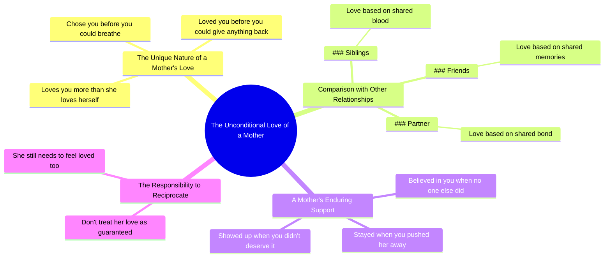

# Your Mom Loves You More Than Herself

> 🌐 **Read this in:** **English** · [中文](../../zh-CN/2026-07/tiktok-transcript-best-motivational-speech-life-lesson-must-watch-foryou-foryo-b176.md)

> **Creator:** [@successmotivation454](https://www.tiktok.com/@successmotivation454) · **Views:** 1.9M · **Posted:** 2026-07-16 · **Niche:** other
>
> **TL;DR:** Contrasts unconditional maternal love with other relationships, creating immediate emotional resonance.

[Watch original video →](https://www.tiktok.com/t/ZTS3rU21u/)

## Why This Went Viral

## Hook (first 3 seconds)
- **What happens verbatim:** "Your mom is the only person in your life who loves you more than she loves herself."
- **Hook pattern:** Bold claim + contrast (mom vs. everyone else)
- **Why it stops scrolling:** It starts with a universal, emotionally charged truth that immediately challenges the viewer's assumptions. The word "only" creates a scarcity effect, making the viewer feel they must watch to confirm or deny the claim. The contrast between "loves you more than she loves herself" and the implied selfishness of other relationships is jarring and relatable.

## Emotional Rhythm
- **Beats:** Curiosity (hook) → Validation (siblings/friends/partner lines) → Escalating tension (the "but" – "Yeah, but your mom") → Emotional payoff (chose, loved, stayed, showed up) → Guilt/shame ("don't treat that love like it's guaranteed") → Call to action ("needs to feel loved, too")
- **Suspense/Resonance:** The "Yeah, but" pivot creates a micro-twist. The viewer thinks they know the pattern (listing relationships), then the script flips to a deeper, more vulnerable truth.
- **Climax:** "She believed in you when no one else did." This is the peak emotional punch – it reframes the entire narrative from "she gave you stuff" to "she was your only ally in isolation."

## Keyword Density
- **mom / mother** (7x) – Emotional anchor, drives both reach and resonance.
- **loves / loved / love** (6x) – Core emotional verb, high algorithmic sentiment signal.
- **you / your** (14x) – Direct address, creates intimacy and personalization.
- **she / her** (10x) – Reinforces the subject, keeps focus on the mother.
- **chose / choose** (2x) – High-impact verb, implies agency and sacrifice.
- **deserve / deserved** (2x) – Triggers guilt/shame, a powerful emotional driver.
- **guaranteed** (1x) – Scarcity word, triggers fear of loss.
- **Algorithmic reach:** "mom," "love," "you" – high-volume, high-engagement keywords.
- **Emotional pull:** "chose," "deserved," "guaranteed" – trigger deep-seated guilt and gratitude.

## Why It Spreads
1. **Universal, low-barrier emotional trigger.** "Your mom" is a near-universal experience. The script doesn't require a specific backstory – it works for anyone with a mother figure. *Concrete line: "Your mom is the only person in your life who loves you more than she loves herself."*
2. **Guilt as a viral engine.** The video makes the viewer feel like they're not doing enough for their mom. Guilt is a high-intensity emotion that drives sharing (to prove you're a good child) and commenting (to defend or confess). *Concrete line: "So don't treat that love like it's guaranteed."*
3. **Pattern interrupt + emotional escalation.** The "Yeah, but" pivot breaks the expected list format, creating a mini-surprise that keeps retention high. The escalation from "loves you" to "chose you" to "believed in you when no one else did" builds a crescendo. *Concrete line: "She believed in you when no one else did."*
4. **Call to action embedded in emotion.** The final line ("needs to feel loved, too") is not a direct "like and share" but a subtle nudge to act (call your mom, text her). This drives real-world behavior, which viewers often then post about, creating a second wave of content. *Concrete line: "The woman who loves you so much still needs to feel loved, too."*

## What You Can Steal
1. **Start with a bold, universal claim that creates a "me vs. them" contrast.** Use "only" or "no one else" to create scarcity and immediately hook the viewer. *Example: "Your best friend is the only person who will tell you the truth when everyone else is lying."*
2. **Use the "Yeah, but" pivot to break a predictable pattern.** List 2-3 things, then flip the script with a "but" or "yeah, but" to deliver a deeper, more vulnerable truth. This keeps retention high and creates a micro-twist. *Example: "Your boss gives you feedback. Your coach gives you drills. Yeah, but your mentor gives you permission to fail."*
3. **End with a guilt-adjacent call to action that feels like a favor.** Instead of "like and subscribe," frame the CTA as a reminder to do something good (call someone, send a text, express gratitude). This drives real-world action and organic sharing. *Example: "So don't wait for a special day to tell them. They need to hear it today."*

## Mind Map

## Full Transcript (Generated by [free TikTok transcript generator](https://toktranscript.com/?utm_source=github&utm_medium=breakdown&utm_campaign=tool_attribution))

> 📝 Transcripts on this page are auto-generated and show the first 60%. Want to transcribe any TikTok in 30 seconds and get the full version? [Try TokTranscript free →](https://toktranscript.com/?utm_source=github&utm_medium=breakdown&utm_campaign=transcript_cta)

Your mom is the only person in your life who loves you more than she loves herself. Your siblings love you because you share blood. Your friends because you share memories. Your partner because you share a bond. Yeah, but your mom. She chose you before you could breathe. She loved you before you could give anything back.

*[Read the full transcript on TokTranscript →](https://toktranscript.com/plaza/tiktok-transcript-best-motivational-speech-life-lesson-must-watch-foryou-foryo-b176?utm_source=github&utm_medium=breakdown&utm_campaign=transcript_full)*

## Browse More

- All [other](../../by-niche/en/other.md) breakdowns
- All [Contrast/Comparison](../../by-pattern/en/hook-contrast-comparison.md) examples

## Video Info

| | |
|---|---|
| Creator | [@successmotivation454](https://www.tiktok.com/@successmotivation454) |
| Original video | [https://www.tiktok.com/t/ZTS3rU21u/](https://www.tiktok.com/t/ZTS3rU21u/) |
| Original title | Best Motivational Speech. Life Lesson, Must Watch. #foryou #foryoupag... |
| Views | 1.9M (1900000) |
| Posted | 2026-07-16 |
| Duration | 0s |
| Niche | `other` |
| Hook pattern | `Contrast/Comparison` |
| Original language | `en` |
| Available languages | en, zh-CN |
| Generated | 2026-07-17 by [TokTranscript](https://toktranscript.com/) |

---

*This breakdown is for educational analysis under fair use. Original video © [@successmotivation454](https://www.tiktok.com/@successmotivation454). All transcripts are auto-generated and may contain errors.*

*Want to analyze your own TikToks like this? [free TikTok transcript generator →](https://toktranscript.com/viral-breakdown?utm_source=github&utm_medium=breakdown&utm_campaign=footer_cta)*