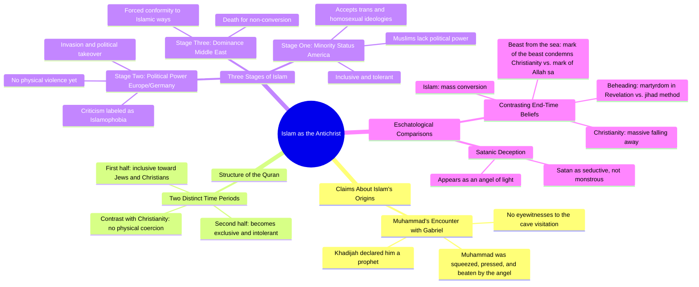

# Christian Evangelist Claims Islam Is the Antichrist

> 🌐 **Read this in:** **English** · [中文](../../zh-CN/2026-07/tiktok-transcript-christian-evangelist-believes-islam-is-the-antichrist-christ-c875.md)

> **Creator:** [@mindknowledgepower](https://www.tiktok.com/@mindknowledgepower) · **Views:** 1.6M · **Posted:** 2026-07-13 · **Niche:** other
>
> **TL;DR:** Opens with a provocative, absolute statement that immediately grabs attention and sparks debate.

[Watch original video →](https://www.tiktok.com/t/ZTSnh12oS/)

## Why This Went Viral

## Hook (first 3 seconds)
- **Verbatim opening line:** "I believe Islam is the Antichrist."
- **Hook pattern:** Bold claim + religious controversy
- **Why it stops scrolling:** It's a high-stakes, taboo accusation framed as personal belief. The word "Antichrist" triggers immediate emotional reaction (outrage, curiosity, or agreement) from both Christian and Muslim viewers. No one scrolls past a claim that directly challenges a major world religion.

## Emotional Rhythm
- **Beat 1 – Shock/Outrage (0–5s):** "Islam is the Antichrist" – viewer's guard goes up.
- **Beat 2 – Curiosity (5–15s):** "According to the Hadiths… no eyewitnesses" – offers pseudo-historical "evidence," creating a sense of insider knowledge.
- **Beat 3 – Tension/Risk (15–30s):** "Three stages of Islam… America is in stage one" – builds a conspiracy framework with escalating stakes.
- **Beat 4 – Resonance/Validation (30–45s):** "If I went to the Gaza Strip as a gay man… I'd be in the street" – uses a concrete, visceral example to land an emotional gut punch.
- **Beat 5 – Climax (45s–end):** "The number one way you kill people in jihad is through beheading… Satan can appear as an angel of light" – ties everything into a dark, apocalyptic conclusion. The "beheading" parallel is the climax.
- **Beat 6 – Lingering Unease:** Ends without resolution, leaving the viewer unsettled and more likely to comment or rewatch.

## Keyword Density
| Keyword/Phrase | Count (approx.) | Function |
|---|---|---|
| Islam / Muslim / Quran / Hadith | 10+ | Algorithmic reach (high-search religious terms) |
| Antichrist / Satan / angel of light | 4 | Emotional pull (fear, religious identity) |
| Stage one / stage two / stage three | 5 | Structural framing (creates a "system" that feels credible) |
| Kill / beheading / physically hurt | 4 | Emotional pull (violence, threat) |
| America / Germany / Europe / Middle East | 4 | Algorithmic reach (geopolitical keywords) |
| Inclusive / exclusive / tolerate | 3 | Emotional pull (us-vs-them, cultural anxiety) |

**Why it drives reach:** "Islam," "Muslim," "America," and "Quran" are high-volume search terms. **Why it drives emotion:** "Antichrist," "beheading," and "Satan" trigger fear and outrage, which fuel comments and shares.

## Why It Spreads
1. **Controversy-as-bait:** The opening line is a grenade. "I believe Islam is the Antichrist" guarantees engagement from both defenders and attackers. Every comment (positive or negative) boosts the algorithm.
2. **False equivalence + pattern recognition:** The speaker draws parallels between Islamic and Christian eschatology (beast from the sea, mark of the beast, beheading). This feels like a "hidden truth" to viewers who already distrust Islam, making them feel smart for "catching" the pattern.
3. **Escalating stakes (three-stage framework):** "Stage one → stage two → stage three" turns a complex topic into a simple, scary timeline. It creates urgency: *"America is in stage one, and if you don't act, you'll end up like Europe or the Middle East."* This is a classic fear-based viral structure.
4. **Concrete, violent imagery:** "Beheading in the street" and "kill you if you don't convert" are visceral. They bypass rational analysis and land directly in the viewer's amygdala. This makes the video memorable and shareable.
5. **Religious identity trigger:** The video explicitly pits "Christians" against "Muslims." Viewers who identify as Christian feel validated; those who identify as Muslim feel attacked. Both share it to their respective in-groups as a rallying cry or a warning.

## What You Can Steal
1. **Open with a taboo, personal claim.** Don't say "Some people think X." Say "I believe X." The personal ownership makes it harder to dismiss and invites debate. (e.g., "I believe the mainstream media is a cult.")
2. **Use a numbered escalation structure.** "Stage one, stage two, stage three" or "Phase A, Phase B, Phase C" creates a sense of inevitability and urgency. It's a simple mental model that viewers can repeat to others.
3. **End with a dark, unresolved parallel.** Don't wrap it up neatly. Leave the viewer with a chilling comparison (e.g., "Satan appears as an angel of light") that forces them to sit in discomfort. That discomfort drives them to comment, share, or rewatch to "make sense" of it.

## Mind Map

## Full Transcript (Generated by [the tool we used to generate this](https://toktranscript.com/?utm_source=github&utm_medium=breakdown&utm_campaign=tool_attribution))

> 📝 Transcripts on this page are auto-generated and show the first 60%. Want to transcribe any TikTok in 30 seconds and get the full version? [Try TokTranscript free →](https://toktranscript.com/?utm_source=github&utm_medium=breakdown&utm_campaign=transcript_cta)

I believe Islam is the Antichrist. According to the Hadiths, Muhammad was visited by the angel Gabriel, and he is squeezed and he is pressed and beaten by this angel. And it's laughable to think that they're claiming an angel visited him in a cave. No eyewitnesses to this. He goes back home to his wife, Khadijah. She's like, oh, you're a prophet sent from God. And so there we have the birth of Islam. Now, if you read the Quran, you'll notice that it's written in two different time periods. The first half of the Quran feels very inclusive. Jews and Christians are people of the But as you continue to read the book of Islam, it becomes less inclusive and more exclusive. Isn't that Christianity? Well, in a sense, but not in the sense that we're going to physically you over it. So this is how it starts, right? There's three stages of Islam. Here's the first stage. America's in the first stage right now. They're inclusive. You have Muslims who are okay with trans and homosexual ideologies. But if I went to the Gaza Strip as a gay man and I went in the street and said, I am gay before I could finish that sentence, I'd be in the street. But here in America, the Muslims are okay with it. They're tolerating it. Why? Because they're the minority right now. Stage two is what's happening in Germany and in Europe. They've invaded that country and basically taken political power. And no, if you say something that you disagree with the Muslims, they're not gonna physically hurt you, but they're gonna call you an Islamophobe.

*[Read the full transcript on TokTranscript →](https://toktranscript.com/plaza/tiktok-transcript-christian-evangelist-believes-islam-is-the-antichrist-christ-c875?utm_source=github&utm_medium=breakdown&utm_campaign=transcript_full)*

## Browse More

- All [other](../../by-niche/en/other.md) breakdowns
- All [Shocking Claim](../../by-pattern/en/hook-shocking-claim.md) examples

## Video Info

| | |
|---|---|
| Creator | [@mindknowledgepower](https://www.tiktok.com/@mindknowledgepower) |
| Original video | [https://www.tiktok.com/t/ZTSnh12oS/](https://www.tiktok.com/t/ZTSnh12oS/) |
| Original title | Christian Evangelist believes Islam is the Antichrist #christianity #... |
| Views | 1.6M (1600000) |
| Posted | 2026-07-13 |
| Duration | 0s |
| Niche | `other` |
| Hook pattern | `Shocking Claim` |
| Original language | `en` |
| Available languages | en, zh-CN |
| Generated | 2026-07-15 by [TokTranscript](https://toktranscript.com/) |

---

*This breakdown is for educational analysis under fair use. Original video © [@mindknowledgepower](https://www.tiktok.com/@mindknowledgepower). All transcripts are auto-generated and may contain errors.*

*Want to analyze your own TikToks like this? [free TikTok transcript generator →](https://toktranscript.com/viral-breakdown?utm_source=github&utm_medium=breakdown&utm_campaign=footer_cta)*