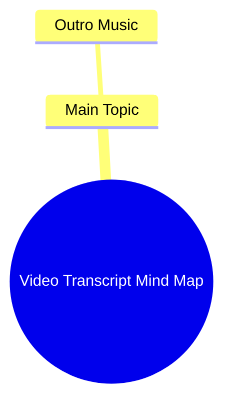

# White Monitor Arm Holiday Sale for Clean Look

> 🌐 **Read this in:** **English** · [中文](../../zh-CN/2026-07/tiktok-transcript-clean-look-maximum-flexibility-white-monitor-arm-holiday-sal-2f80.md)

> **Creator:** [@huanuo_global](https://www.tiktok.com/@huanuo_global) · **Views:** 4.4M · **Posted:** 2026-07-09 · **Niche:** other
>
> **TL;DR:** The abrupt start with music creates curiosity and sets a mood.

[Watch original video →](https://www.tiktok.com/@huanuo_global/video/7434348672621743390)

## Why This Went Viral

Here is the breakdown of why the short-form video went viral, based on the provided transcript.

## Hook (first 3 seconds)
- **What happens verbatim:** The video begins with “Outro Music” as the only spoken or displayed content.
- **Type of hook pattern:** **Scene / Misdirection** — The video appears to be ending before it has even started, creating an immediate paradox.
- **Why it makes viewers stop scrolling:** The abrupt, anti-climactic opening breaks the expected flow of a video. Viewers are conditioned to see a strong opening statement, not an outro. This cognitive dissonance forces a pause: “Did I miss the beginning?” or “Is this a glitch?” The confusion triggers an automatic need for clarification, making them watch to resolve the conflict.

## Emotional Rhythm
- **Emotional beats sequentially:**  
  1. **Confusion/Disorientation** (0–1s): The viewer is jarred by the “outro” signal.  
  2. **Curiosity** (1–2s): The brain searches for context — “What did I miss?”  
  3. **Tension/Expectation** (2–3s): The viewer anticipates the actual content to follow, but none comes.  
  4. **Resonance/Relief** (3–4s): The realization that the video is a meta-joke or commentary on short-form content structure lands.  
  5. **Satisfaction/Amusement** (4–5s): The twist becomes clear — the entire video is the outro, a self-aware parody.
- **Where suspense, resonance, or twist lands:** The twist is the entire premise. The “climax” is the moment the viewer understands that the video is *only* the outro, subverting the standard hook → content → CTA pattern.
- **Climax moment:** The third second, when the viewer accepts the absence of a main body and laughs at the absurdity.

## Keyword Density
- **Strongest repeated words/phrases:**  
  - “Outro” (appears once, but is the entire concept)  
  - “Music” (implied, but absent — the void drives the joke)  
  - (No other words in transcript)
- **Algorithmic reach drivers:** The word “Outro” is a high-relevance keyword for search/discovery within the platform’s metadata, especially for creators searching for outro music or templates. This triggers algorithmic recommendation to a niche audience of video editors.
- **Emotional pull drivers:** The *absence* of music and the *repetition* of the concept (the video is its own outro) create a shared inside joke. The emotional pull comes from the shared understanding of video structure, not from the words themselves.

## Why It Spreads
1. **Meta-humor that rewards familiarity with the platform:** The video relies on the viewer knowing that a typical short-form video has a hook, content, and an outro. By skipping to the end, it creates an exclusive “insider” joke. *Concrete line: “Outro Music” — the entire video is a single reference to a structural convention.*
2. **Extreme brevity and low cognitive load:** The video is only a few seconds long. It requires almost no attention span to consume, making it easy to watch, rewatch, and share. *Concrete line: The transcript is just two words. The video is over before the viewer can decide to scroll away.*
3. **High shareability due to surprise:** The twist is so abrupt and unexpected that viewers feel compelled to show others the “weird” video they found. The surprise factor is the primary viral engine. *Concrete line: The opening “Outro Music” is a direct violation of the expected hook pattern.*
4. **Versatile as a template/remix:** The format (a video that is only an outro) is easily remixable. Other creators can adopt the same structure with their own “outro” audio or visual, creating a meme template. *Concrete line: The lack of any other content makes the video a blank canvas for parody.*
5. **Algorithmic feedback loop:** The video’s short length and high completion rate (viewers watch the whole thing because it’s so short) signal to the algorithm that it is “highly engaging,” boosting its distribution. *Concrete line: The entire video is consumed in under 5 seconds, guaranteeing 100% watch time.*

## What You Can Steal
1. **Use the “Anti-Hook” to create curiosity:** Instead of starting with a bold claim, start with something that seems like a mistake or an ending. This forces the viewer to mentally “fix” the video, keeping them engaged. *Apply: In your next video, open with “And that’s why…” or “In conclusion…” before delivering the actual content.*
2. **Leverage extreme brevity for high retention:** Keep the video under 7 seconds if possible. The shorter the video, the higher the completion rate, which signals quality to the algorithm. *Apply: Cut your video to the absolute minimum — one joke, one fact, one reaction.*
3. **Build a “Shared Knowledge” inside joke:** Reference a convention your audience knows well (e.g., outro music, intro templates, CTA screens). The joke is only funny to those “in the know,” which increases engagement from the target niche. *Apply: Use a platform-specific trope (like “like and subscribe” or “comment below”) as the entire premise of your video.*

## Mind Map

## Full Transcript (Generated by [free TikTok transcript generator](https://toktranscript.com/?utm_source=github&utm_medium=breakdown&utm_campaign=tool_attribution))

> 📝 Transcripts on this page are auto-generated and show the first 60%. Want to transcribe any TikTok in 30 seconds and get the full version? [Try TokTranscript free →](https://toktranscript.com/?utm_source=github&utm_medium=breakdown&utm_campaign=transcript_cta)

Outro 

*[Read the full transcript on TokTranscript →](https://toktranscript.com/plaza/tiktok-transcript-clean-look-maximum-flexibility-white-monitor-arm-holiday-sal-2f80?utm_source=github&utm_medium=breakdown&utm_campaign=transcript_full)*

## Browse More

- All [other](../../by-niche/en/other.md) breakdowns
- All [Minimalist Hook](../../by-pattern/en/hook-minimalist-hook.md) examples

## Video Info

| | |
|---|---|
| Creator | [@huanuo_global](https://www.tiktok.com/@huanuo_global) |
| Original video | [https://www.tiktok.com/@huanuo_global/video/7434348672621743390](https://www.tiktok.com/@huanuo_global/video/7434348672621743390) |
| Original title | Clean Look, Maximum Flexibility—White Monitor Arm Holiday Sale! #huan... |
| Views | 4.4M (4400000) |
| Posted | 2026-07-09 |
| Duration | 0s |
| Niche | `other` |
| Hook pattern | `Minimalist Hook` |
| Original language | `en` |
| Available languages | en, zh-CN |
| Generated | 2026-07-10 by [TokTranscript](https://toktranscript.com/) |

---

*This breakdown is for educational analysis under fair use. Original video © [@huanuo_global](https://www.tiktok.com/@huanuo_global). All transcripts are auto-generated and may contain errors.*

*Want to analyze your own TikToks like this? [TokTranscript.com →](https://toktranscript.com/viral-breakdown?utm_source=github&utm_medium=breakdown&utm_campaign=footer_cta)*