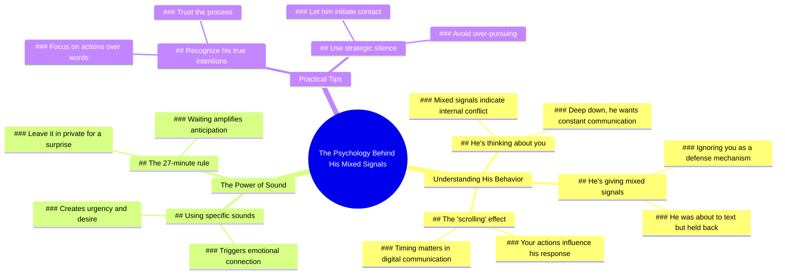

# Get Your Free Private Reading Now

> 🌐 **Read this in:** **English** · [中文](../../zh-CN/2026-07/tiktok-transcript-click-the-link-in-my-bio-for-free-private-reading-mainfest-p-5783.md)

> **Creator:** [@psychic_angeline](https://www.tiktok.com/@psychic_angeline) · **Views:** 5.8M · **Posted:** 2026-07-05 · **Niche:** other
>
> **TL;DR:** Immediately grabs attention by speaking directly to the viewer with a confident, personal claim.

[Watch original video →](https://www.tiktok.com/t/ZP8GfAfFq/)

## Why This Went Viral

## Hook (first 3 seconds)
- **Verbatim opening line:** "You're the one he was meant to be."
- **Hook pattern:** Bold claim + personalization (direct "you" address)
- **Why it stops scrolling:** The claim is emotionally charged and impossible to verify, creating immediate curiosity. It feels like a secret being whispered directly to the viewer, exploiting the universal desire to feel chosen or special. The phrase "meant to be" taps into fate/destiny, a high-stakes emotional trigger.

## Emotional Rhythm
- **Beat 1 – Intrigue (0–3s):** "You're the one he was meant to be." → flatters the viewer, plants a seed of validation.
- **Beat 2 – Tension (3–8s):** "He's giving you mixed signals and he's ignoring you." → introduces pain point (rejection, confusion), creates emotional friction.
- **Beat 3 – False Hope (8–12s):** "Deep down, he wants to talk to you non stop." → offers a comforting narrative, hooks the viewer's wishful thinking.
- **Beat 4 – Action Urgency (12–18s):** "He was about to text you, but you scrolled. Trust me, he's going to want to be with you like crazy when you use that sound." → introduces a specific, low-effort action (using a sound) with a high-reward promise.
- **Beat 5 – Climax / Mystery (18–22s):** "If you leave it in private, in 27 minutes, you'll get a huge surprise." → creates a countdown (27 min) and a vague reward, triggering FOMO and superstition.
- **Climax moment:** The 27-minute countdown. It's the final push that turns passive viewing into active engagement (saving, sharing, commenting).

## Keyword Density
| Keyword / Phrase | Count (approx.) | Driver |
|---|---|---|
| "you" / "your" | 8+ | **Algorithmic + Emotional** – high personalization boosts watch time and engagement; also triggers mirror neurons (viewer sees self). |
| "he" / "him" | 5+ | **Emotional** – creates a third-party target for the viewer's feelings; drives narrative tension. |
| "meant to be" | 1 (but implied) | **Emotional** – fate/destiny language triggers romantic fantasy. |
| "text" / "talk" | 3 | **Algorithmic** – high-search-volume keywords for relationship advice content. |
| "trust me" | 1 | **Emotional** – builds false authority; lowers skepticism. |
| "sound" | 1 | **Algorithmic** – directly references a trending audio, which the platform rewards. |
| "27 minutes" | 1 | **Emotional + Algorithmic** – specific numbers increase perceived credibility; also a "magic number" that feels mystical. |
| "surprise" | 1 | **Emotional** – triggers dopamine anticipation loops. |

**Algorithmic reach drivers:** "you," "text," "sound" – these are high-volume search and trend terms.  
**Emotional pull drivers:** "meant to be," "trust me," "surprise," "27 minutes" – these create emotional investment and superstition.

## Why It Spreads
1. **Exploits the "desire for validation" loop** – The opening line ("You're the one he was meant to be") directly addresses a universal insecurity: *"Am I special to him?"* Viewers who feel ignored or confused are emotionally primed to believe the promise.  
   - *Transcript evidence:* "He's giving you mixed signals and he's ignoring you."

2. **Creates a superstition-driven call to action** – The 27-minute countdown and "leave it in private" instruction mimic a ritual or spell. This triggers a psychological compulsion: viewers save or share the video because "what if it works?"  
   - *Transcript evidence:* "If you leave it in private, in 27 minutes, you'll get a huge surprise."

3. **Low friction, high reward action** – The only action needed is to "use that sound" (a simple platform-native action) and wait. This lowers the barrier to engagement while promising a huge payoff.  
   - *Transcript evidence:* "He's going to want to be with you like crazy when you use that sound."

4. **FOMO + temporal urgency** – The exact time frame (27 minutes) creates a ticking clock. Viewers feel they must act immediately or miss the "surprise." This drives shares and saves (algorithmic signals).  
   - *Transcript evidence:* "in 27 minutes, you'll get a huge surprise."

5. **Emotional rollercoaster with a "happy ending"** – The video takes the viewer from pain (mixed signals, ignored) → hope (he wants to talk) → reward (he'll be crazy for you). This emotional arc is highly shareable because it offers a solution to a common problem.  
   - *Transcript evidence:* "He's giving you mixed signals" → "He's going to want to be with you like crazy."

## What You Can Steal
1. **Open with a personalized, unverifiable claim** – Use "You are the one…" or "This is exactly what’s happening to you right now." It hooks because the viewer can't disprove it and wants it to be true.  
   - *Example:* "You're the person they're thinking about at this exact moment."

2. **Insert a specific, mystical time frame** – Numbers like "27 minutes," "3 days," or "11:11" trigger superstition and urgency. Pair it with a vague reward ("huge surprise") to maximize engagement.  
   - *Example:* "If you screenshot this in the next 9 seconds, something incredible happens."

3. **Use "trust me" as a false authority bridge** – This phrase lowers skepticism and creates an illusion of insider knowledge. Place it right before the action step.  
   - *Example:* "Trust me, when you post this, they'll reach out within 24 hours."

## Mind Map

## Full Transcript (Generated by [TokTranscript.com](https://toktranscript.com/?utm_source=github&utm_medium=breakdown&utm_campaign=tool_attribution))

> 📝 Transcripts on this page are auto-generated and show the first 60%. Want to transcribe any TikTok in 30 seconds and get the full version? [Try TokTranscript free →](https://toktranscript.com/?utm_source=github&utm_medium=breakdown&utm_campaign=transcript_cta)

You're the one he was meant to be. He's thinking about you right now. He's giving you mixed signals and he's ignoring you. But deep down, he wants to talk to you non stop. He was about to text you, but you scrolled.

*[Read the full transcript on TokTranscript →](https://toktranscript.com/plaza/tiktok-transcript-click-the-link-in-my-bio-for-free-private-reading-mainfest-p-5783?utm_source=github&utm_medium=breakdown&utm_campaign=transcript_full)*

## Browse More

- All [other](../../by-niche/en/other.md) breakdowns
- All [Direct address + certainty](../../by-pattern/en/hook-direct-address-certainty.md) examples

## Video Info

| | |
|---|---|
| Creator | [@psychic_angeline](https://www.tiktok.com/@psychic_angeline) |
| Original video | [https://www.tiktok.com/t/ZP8GfAfFq/](https://www.tiktok.com/t/ZP8GfAfFq/) |
| Original title | click the link in my bio for FREE private reading #mainfest #psychict... |
| Views | 5.8M (5800000) |
| Posted | 2026-07-05 |
| Duration | 0s |
| Niche | `other` |
| Hook pattern | `Direct address + certainty` |
| Original language | `en` |
| Available languages | en, zh-CN |
| Generated | 2026-07-06 by [TokTranscript](https://toktranscript.com/) |

---

*This breakdown is for educational analysis under fair use. Original video © [@psychic_angeline](https://www.tiktok.com/@psychic_angeline). All transcripts are auto-generated and may contain errors.*

*Want to analyze your own TikToks like this? [analyze your own TikToks →](https://toktranscript.com/viral-breakdown?utm_source=github&utm_medium=breakdown&utm_campaign=footer_cta)*