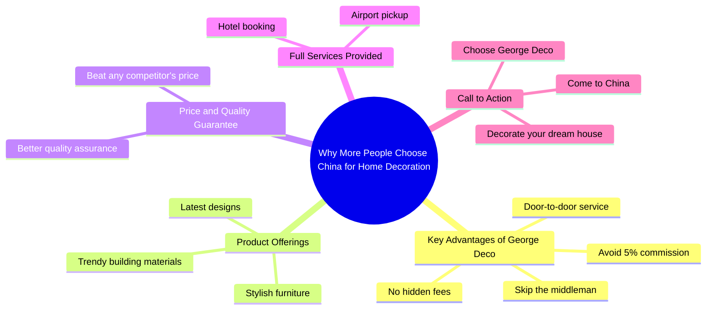

# Skip the Middleman: Build Your Dream House in China

> 🌐 **Read this in:** **English** · [中文](../../zh-CN/2026-07/tiktok-transcript-come-to-china-to-build-your-dream-house-renovation-decoratio-2787.md)

> **Creator:** [@rogerwu_georgedeco](https://www.tiktok.com/@rogerwu_georgedeco) · **Views:** 587.5K · **Posted:** 2026-07-20 · **Niche:** other
>
> **TL;DR:** The hook opens with a trending question that sparks curiosity, then immediately lists concrete financial benefits to hook viewers.

[Watch original video →](https://www.tiktok.com/@rogerwu_georgedeco/video/7496153850345180438)

## Why This Went Viral

## Hook (first 3 seconds)
- **Verbatim opening line:** "Why more and more people like come to China to decorate their home?"
- **Hook pattern:** Question + trend-based curiosity
- **Why it stops scroll:** It poses a counterintuitive question (decorating a home in China from abroad) that triggers curiosity, especially for cost-conscious homeowners or expats. The phrasing "more and more people" implies social proof and a growing trend, making viewers wonder if they're missing out.

## Emotional Rhythm
- **Beat 1 – Curiosity (0–3s):** The opening question creates a knowledge gap: "Why would anyone do that?"
- **Beat 2 – Relief/Value (3–7s):** "Skip the middleman, avoid the 5% commission" – solves a pain point (high costs, hidden fees).
- **Beat 3 – Desire/Trust (7–12s):** "Latest designs, trendy building materials, stylish furniture" – paints a picture of quality and aspiration.
- **Beat 4 – Tension/Challenge (12–15s):** "Get any price from other companies… George Deco will beat it with better quality" – creates a competitive challenge, building suspense.
- **Beat 5 – Reward/Closure (15–20s):** "Full services including airport pickup and hotel booking" – removes friction and risk, ending with a clear call-to-action.
- **Climax moment:** The price-beating promise ("beat it with better quality") – this is the emotional peak where skepticism turns into potential trust.

## Keyword Density
| Keyword/Phrase | Frequency (approx.) | Driver |
|----------------|---------------------|--------|
| China | 2 | Algorithmic (geographic targeting, travel/home decor niches) |
| decorate | 2 | Emotional (aspiration, dream home) |
| middleman | 1 | Emotional (frustration, cost-saving) |
| commission | 1 | Emotional (pain point) |
| hidden fees | 1 | Emotional (trust, transparency) |
| quality | 2 | Algorithmic + Emotional (searchable, aspirational) |
| door to door service | 1 | Algorithmic (service keyword) |
| dream house | 1 | Emotional (high resonance, visual trigger) |

- **Algorithmic drivers:** "China," "decorate," "quality" – these are high-search-volume terms in home decor and travel niches.
- **Emotional pull:** "middleman," "hidden fees," "dream house" – these trigger pain points and aspirations, increasing watch time and shares.

## Why It Spreads
1. **Pain-point framing in the first line** – "Why more and more people come to China to decorate" immediately taps into a common frustration (high costs, middlemen) and offers a solution. This is a classic "problem-solution" viral pattern.
2. **Social proof + scarcity** – "More and more people" implies a growing trend, making viewers feel they might be left behind. The phrase "beat it with better quality" creates a competitive challenge that feels exclusive and urgent.
3. **Low-friction, high-trust promise** – "Door to door service," "airport pickup," "hotel booking" – these remove all logistical barriers, making a risky international purchase feel safe. This reduces the "fear of unknown" that kills conversions.
4. **Direct call-to-action with emotional reward** – "If you want to decorate your dream house, you must come to China" – ties the action to a deep emotional goal (dream house), not just a transaction. This increases shareability because "dream house" is a universal aspiration.

## What You Can Steal
1. **Lead with a counterintuitive question** – Start your video with a question that challenges a common assumption (e.g., "Why are people flying to another country to save money?"). This forces a pause and builds curiosity.
2. **Stack pain-point removers in the first 10 seconds** – List 2–3 specific frictions you eliminate (e.g., "skip the middleman, avoid fees, no hidden costs"). This hooks viewers who are actively searching for solutions.
3. **End with a "dream" visual + clear action** – Pair your CTA with an emotionally charged word like "dream house" or "dream vacation." Then give a single, unambiguous next step ("come to China," "click the link," "DM me"). This increases conversion and shareability.

## Mind Map

## Full Transcript (Generated by [TokTranscript](https://toktranscript.com/?utm_source=github&utm_medium=breakdown&utm_campaign=tool_attribution))

> 📝 Transcripts on this page are auto-generated and show the first 60%. Want to transcribe any TikTok in 30 seconds and get the full version? [Try TokTranscript free →](https://toktranscript.com/?utm_source=github&utm_medium=breakdown&utm_campaign=transcript_cta)

Why more and more people like come to China to decorate their home? Because at George Deco you can skip the middleman, avoid the 5% commission and enjoy our door to door service with no hidden fees. Here you will find the latest designs, trendy building materials and stylish furniture.

*[Read the full transcript on TokTranscript →](https://toktranscript.com/plaza/tiktok-transcript-come-to-china-to-build-your-dream-house-renovation-decoratio-2787?utm_source=github&utm_medium=breakdown&utm_campaign=transcript_full)*

## Browse More

- All [other](../../by-niche/en/other.md) breakdowns
- All [Curiosity Gap + Benefit Stacking](../../by-pattern/en/hook-curiosity-gap-benefit-stacking.md) examples

## Video Info

| | |
|---|---|
| Creator | [@rogerwu_georgedeco](https://www.tiktok.com/@rogerwu_georgedeco) |
| Original video | [https://www.tiktok.com/@rogerwu_georgedeco/video/7496153850345180438](https://www.tiktok.com/@rogerwu_georgedeco/video/7496153850345180438) |
| Original title | Come to China to build your dream house! #renovation #decoration #one... |
| Views | 587.5K (587500) |
| Posted | 2026-07-20 |
| Duration | 0s |
| Niche | `other` |
| Hook pattern | `Curiosity Gap + Benefit Stacking` |
| Original language | `en` |
| Available languages | en, zh-CN |
| Generated | 2026-07-23 by [TokTranscript](https://toktranscript.com/) |

---

*This breakdown is for educational analysis under fair use. Original video © [@rogerwu_georgedeco](https://www.tiktok.com/@rogerwu_georgedeco). All transcripts are auto-generated and may contain errors.*

*Want to analyze your own TikToks like this? [try this transcription tool →](https://toktranscript.com/viral-breakdown?utm_source=github&utm_medium=breakdown&utm_campaign=footer_cta)*