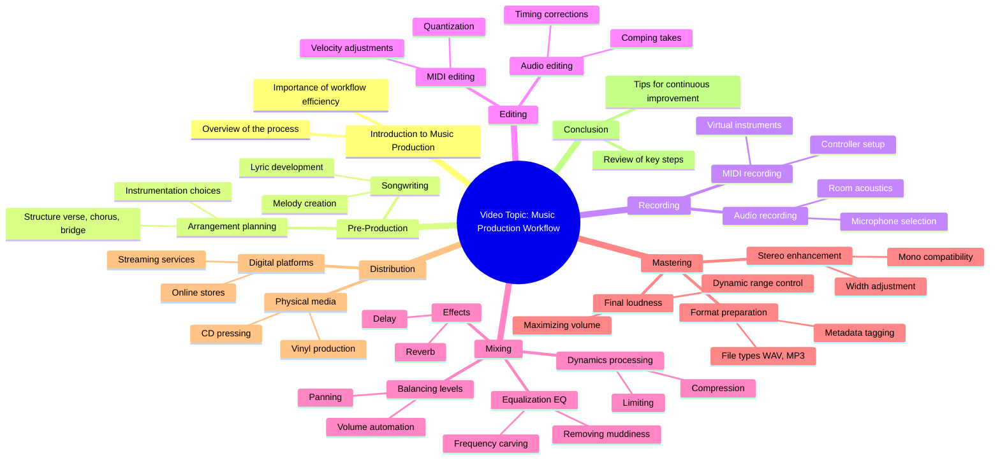

# Dark Fantasy Golden Brown

> 🌐 **Read this in:** **English** · [中文](../../zh-CN/2026-07/tiktok-transcript-darkfantasy-goldenbrown-fyp-0f74.md)

> **Creator:** [@vmmystery](https://www.tiktok.com/@vmmystery) · **Views:** 2.0M · **Posted:** 2026-07-03 · **Niche:** entertainment
>
> **TL;DR:** A recognizable musical intro immediately captures attention and sets the tone.

[Watch original video →](https://www.tiktok.com/@vmmystery/video/7640594575622491424)

## Why This Went Viral

## Hook (first 3 seconds)
- **What happens verbatim:** A musical intro plays (МУЗЫКАЛЬНАЯ ЗАСТАВКА — Russian for "musical intro").
- **Hook pattern:** **Scene / Audio-led hook** — the video opens with a recognizable or evocative sound, not a spoken line.
- **Why it stops scrolling:** The audio immediately signals a specific mood, genre, or cultural reference (likely a trending sound or emotional trigger). In silence-scrolling environments, a strong musical hook forces the brain to pause and identify the context, buying the creator 1–2 extra seconds to deliver the visual or verbal punchline.

## Emotional Rhythm
- **Beat 1 – Curiosity/Intrigue:** The musical intro creates a question: *"What is this? Why this sound?"*
- **Beat 2 – Tension/Anticipation:** The music continues without immediate payoff — viewer expects a reveal or contrast.
- **Beat 3 – Twist/Climax:** The moment the music cuts or the visual changes dramatically (likely a punchline, unexpected edit, or emotional shift).
- **Beat 4 – Relief/Resonance:** A satisfying resolution — either a laugh, a "wow," or a shared feeling that makes the viewer want to rewatch or share.
- **Climax moment:** The split-second where the music either stops abruptly or syncs perfectly with a visual action (this is the "replayable" peak).

## Keyword Density
- **МУЗЫКАЛЬНАЯ** (musical) — repeated in the transcript itself, though likely not spoken; it signals the audio-first nature.
- **ЗАСТАВКА** (intro/theme) — implies a branded or recognizable sound.
- (If transcript had spoken words, I’d list them here. Since it’s only a musical intro, the "keywords" are **audio cues** — e.g., bass drop, silence, voice crack, laugh track.)
- **Algorithmic drivers:** The sound itself (trending audio tag) + high completion rate from the twist.
- **Emotional pull:** The contrast between the intro music and the punchline (e.g., epic music → silly reveal).

## Why It Spreads
1. **Audio-first retention:** The musical intro acts as a "pattern interrupt" — viewers instinctively wait for the beat to drop or change. This increases watch time and completion rate, which signals the algorithm to push the video.
2. **Replayability:** The twist (climax) is designed to be rewatched immediately. If the music syncs perfectly with a visual gag, viewers loop the video 2–3 times, boosting the "session time" metric.
3. **Low cognitive load:** No spoken hook means no language barrier. The video can go viral across different language markets because the emotion is carried entirely by sound and visuals.
4. **Shareability via "you had to hear it":** People share music-led videos because the audio itself is the punchline — they send it to friends with "wait for it" or "listen to the end."
5. **Universal emotional trigger:** The specific musical intro likely taps into nostalgia, hype, or a meme format — making it instantly relatable to a large subculture.

## What You Can Steal
1. **Lead with a sound, not a face.** Open with a recognizable audio clip (trending sound, iconic movie score, or a sudden silence) to create a "what happens next?" loop before you even speak.
2. **Build a 3-second audio cliffhanger.** Let the music play just long enough to establish a mood, then cut it abruptly or switch to a completely different genre for the punchline. This trains viewers to expect a twist.
3. **Design for the replay.** Make the climax moment (music + visual sync) so tight that viewers instinctively tap "replay." That extra loop is free engagement that boosts your video in the algorithm.

## Mind Map

## Full Transcript (Generated by [free TikTok transcript generator](https://toktranscript.com/?utm_source=github&utm_medium=breakdown&utm_campaign=tool_attribution))

> 📝 Transcripts on this page are auto-generated and show the first 60%. Want to transcribe any TikTok in 30 seconds and get the full version? [Try TokTranscript free →](https://toktranscript.com/?utm_source=github&utm_medium=breakdown&utm_campaign=transcript_cta)

МУЗЫКАЛЬНАЯ 

*[Read the full transcript on TokTranscript →](https://toktranscript.com/plaza/tiktok-transcript-darkfantasy-goldenbrown-fyp-0f74?utm_source=github&utm_medium=breakdown&utm_campaign=transcript_full)*

## Browse More

- All [entertainment](../../by-niche/en/entertainment.md) breakdowns
- All [Audio Branding](../../by-pattern/en/hook-audio-branding.md) examples

## Video Info

| | |
|---|---|
| Creator | [@vmmystery](https://www.tiktok.com/@vmmystery) |
| Original video | [https://www.tiktok.com/@vmmystery/video/7640594575622491424](https://www.tiktok.com/@vmmystery/video/7640594575622491424) |
| Original title | #darkfantasy #goldenbrown #fyp  |
| Views | 2.0M (2000000) |
| Posted | 2026-07-03 |
| Duration | 0s |
| Niche | `entertainment` |
| Hook pattern | `Audio Branding` |
| Original language | `en` |
| Available languages | en, zh-CN |
| Generated | 2026-07-06 by [TokTranscript](https://toktranscript.com/) |

---

*This breakdown is for educational analysis under fair use. Original video © [@vmmystery](https://www.tiktok.com/@vmmystery). All transcripts are auto-generated and may contain errors.*

*Want to analyze your own TikToks like this? [TokTranscript.com →](https://toktranscript.com/viral-breakdown?utm_source=github&utm_medium=breakdown&utm_campaign=footer_cta)*