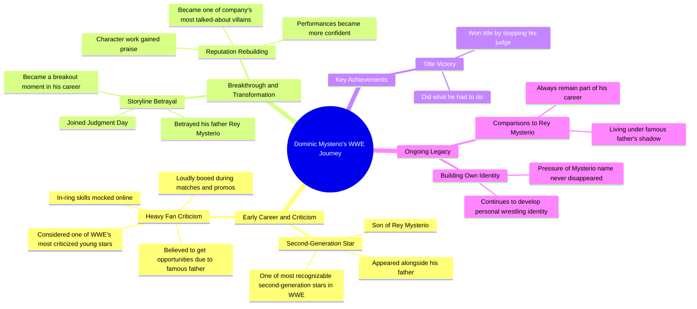

# Dominik Mysterio Betrays His Father Rey to Join Judgment Day

> 🌐 **Read this in:** **English** · [中文](../../zh-CN/2026-07/tiktok-transcript-dominik-mysterio-was-the-son-of-a-wrestling-legend-who-enter-34e1.md)

> **Creator:** [@eliakoteasmovie](https://www.tiktok.com/@eliakoteasmovie) · **Views:** 1.6M · **Posted:** 2026-07-01 · **Niche:** entertainment
>
> **TL;DR:** Opens with a direct question to engage viewers, then immediately presents a shocking event to hook curiosity.

[Watch original video →](https://www.tiktok.com/t/ZP8GhqyTh/)

## Why This Went Viral

## Hook (first 3 seconds)
- **Verbatim opening line:** "Do you remember Dominic Mysterio?"
- **Hook pattern:** Question + Name-drop (nostalgia bait)
- **Why it stops scrolling:** It weaponizes FOMO. By asking "Do you remember," it forces viewers to mentally search their memory. The specific name "Dominic Mysterio" targets both wrestling fans (who instantly engage) and casuals (who feel left out and click to catch up). It’s a low-effort, high-engagement trigger.

## Emotional Rhythm
- **Beat 1 – Curiosity:** "Do you remember Dominic Mysterio?" → Brain starts searching.
- **Beat 2 – Validation:** "Dominic Mysterio tonight did what he had to do..." → Confirms the viewer is in the right place.
- **Beat 3 – Tension:** "Fans heavily criticized him... mocked online... booed during matches." → Creates sympathy/underdog tension.
- **Beat 4 – Turn/Resonance:** "Slowly rebuilt his reputation... performances became more confident." → Emotional payoff. Relief and admiration.
- **Beat 5 – Twist/Climax:** "Comparisons to Rey Mysterio will always remain part of his career." → Bittersweet resolution. Leaves a lingering emotional note, not a clean happy ending.
- **Why it works:** The rhythm mirrors a classic hero’s journey (fall → struggle → rise → unresolved legacy) compressed into 60 seconds. The twist at the end prevents it from feeling like a generic "he got good" story.

## Keyword Density
- **Dominic Mysterio** – 9 mentions. Drives algorithmic reach (name recognition = search volume).
- **Father / Rey Mysterio** – 4 mentions. Emotional pull (legacy, comparison, family pressure).
- **Criticized / Mocked / Booed** – 3 mentions. Emotional pull (underdog tension, relatability).
- **Rebuilt / Confident / Praise** – 3 mentions. Emotional pull (redemption arc).
- **WWE** – 2 mentions. Algorithmic reach (brand keyword).
- **Second-generation / Legacy** – 2 mentions. Emotional pull (identity conflict).

**Why it works:** The heavy repetition of "Dominic Mysterio" signals high relevance to the platform’s recommendation algorithm (especially for wrestling fans). The emotional keywords ("criticized," "rebuilt") trigger human empathy, keeping viewers watching past the hook.

## Why It Spreads
1. **The "Do you remember" hook exploits nostalgia + FOMO.** It’s a low-commitment question that forces mental engagement. *Transcript line: "Do you remember Dominic Mysterio?"* → Viewers feel compelled to prove they do, or learn if they don’t.

2. **The underdog-to-redemption arc is universally relatable.** It’s not just a wrestling story; it’s a "hated kid of a famous dad turns it around" story. *Transcript line: "Many believed he only got opportunities because of his famous father... crowds loudly booed him."* → Anyone who’s been dismissed or underestimated feels this.

3. **The bittersweet ending creates a "comment bait" loop.** The final line ("comparisons to Rey Mysterio will always remain part of his career") is not a happy ending. It’s a debate starter. *Transcript line: "Comparisons to Rey Mysterio will always remain part of his career."* → Viewers comment: "He’s better than Rey now" or "He’ll never escape his dad’s shadow." That drives algorithmic engagement.

4. **High-density name repetition boosts discoverability.** The algorithm sees "Dominic Mysterio" 9 times → it tags the video for every wrestling-related search. *Transcript line: "Dominic Mysterio... Dominic Mysterio... Dominic Mysterio..."* → Simple SEO for short-form.

5. **It bridges two audience segments: hardcore fans and casuals.** Hardcore fans get the deep lore (Judgment Day, Rey Mysterio legacy). Casuals get a clean, emotional story with no insider knowledge required. *Transcript line: "If you watch WWE in the 20 twenties, you absolutely remember him."* → That inclusive language widens the potential share pool.

## What You Can Steal
1. **Start with a "memory check" question.** Instead of "Here’s why X is famous," ask "Do you remember X?" It forces mental participation and lowers the bar for engagement. Works for any niche (sports, music, movies, tech).

2. **Use a 3-act emotional structure: Fall → Struggle → Unresolved Legacy.** Don’t give a clean "and then everything was perfect" ending. Leave a subtle tension (e.g., "but the comparisons will always remain"). That sparks comments.

3. **Repeat the subject’s name 8–10 times in under 60 seconds.** It’s not redundant; it’s algorithmic fuel. The platform’s recommendation system will surface the video to anyone who searches or engages with that name. Works for any person-driven story (athlete, influencer, historical figure).

## Mind Map

## Full Transcript (Generated by [TokTranscript.com](https://toktranscript.com/?utm_source=github&utm_medium=breakdown&utm_campaign=tool_attribution))

> 📝 Transcripts on this page are auto-generated and show the first 60%. Want to transcribe any TikTok in 30 seconds and get the full version? [Try TokTranscript free →](https://toktranscript.com/?utm_source=github&utm_medium=breakdown&utm_campaign=transcript_cta)

Do you remember Dominic Mysterio? Dominic Mysterio tonight did what he had to do and he won the title by stopping his judge. Dominic was one of the most recognizable second generation stars in WWE, appearing alongside his father Rey Mysterio. His storyline betrayal in the Judgment Day be came a breakout moment. If you watch WWE in the 20 twenties, you absolutely remember him. You also might remember that fans heavily criticized him early in his career. Many believed he only got opportunities because of his famous father. His in ring skills were constantly mocked online and crowds loudly booed him during matches and promos.

*[Read the full transcript on TokTranscript →](https://toktranscript.com/plaza/tiktok-transcript-dominik-mysterio-was-the-son-of-a-wrestling-legend-who-enter-34e1?utm_source=github&utm_medium=breakdown&utm_campaign=transcript_full)*

## Browse More

- All [entertainment](../../by-niche/en/entertainment.md) breakdowns
- All [Rhetorical Question + Surprising Action](../../by-pattern/en/hook-rhetorical-question-surprising-action.md) examples

## Video Info

| | |
|---|---|
| Creator | [@eliakoteasmovie](https://www.tiktok.com/@eliakoteasmovie) |
| Original video | [https://www.tiktok.com/t/ZP8GhqyTh/](https://www.tiktok.com/t/ZP8GhqyTh/) |
| Original title | Dominik Mysterio was the son of a wrestling legend who entered WWE wi... |
| Views | 1.6M (1600000) |
| Posted | 2026-07-01 |
| Duration | 0s |
| Niche | `entertainment` |
| Hook pattern | `Rhetorical Question + Surprising Action` |
| Original language | `en` |
| Available languages | en, zh-CN |
| Generated | 2026-07-02 by [TokTranscript](https://toktranscript.com/) |

---

*This breakdown is for educational analysis under fair use. Original video © [@eliakoteasmovie](https://www.tiktok.com/@eliakoteasmovie). All transcripts are auto-generated and may contain errors.*

*Want to analyze your own TikToks like this? [TokTranscript →](https://toktranscript.com/viral-breakdown?utm_source=github&utm_medium=breakdown&utm_campaign=footer_cta)*