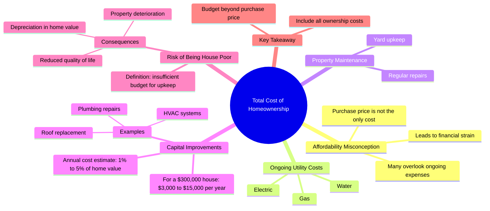

# Avoid Being House Poor: Real Estate Upkeep Costs

> 🌐 **Read this in:** **English** · [中文](../../zh-CN/2026-07/tiktok-transcript-don-t-be-house-poor-glenndabaker-realestate-atlantarealestat-077f.md)

> **Creator:** [@glenndabaker](https://www.tiktok.com/@glenndabaker) · **Views:** 2.8M · **Posted:** 2026-07-10 · **Niche:** finance
>
> **TL;DR:** Debunks a common assumption to immediately engage viewers who may be misinformed.

[Watch original video →](https://vt.tiktok.com/ZSXdyaYsj/)

## Why This Went Viral

## Hook (first 3 seconds)
- **Verbatim opening line:** "A lot of people think that if you can afford a house that's X number of dollars, you're good to go."
- **Hook pattern:** Contrast / Myth-Busting (presents a common belief, then immediately signals it's wrong)
- **Why it stops scrolling:** It directly challenges a widespread assumption about homeownership. The phrase "what most people don't realize" triggers a knowledge gap — viewers feel they might be missing critical information, so they keep watching to avoid a costly mistake.

## Emotional Rhythm
1. **Curiosity** (0–3s): "A lot of people think…" — sets up a familiar belief.
2. **Tension** (3–8s): "What most people don't realize is… the total cost to own is what kills you." — introduces a hidden threat.
3. **Anxiety** (8–18s): Concrete numbers ($3,000–$15,000/year) and specific disasters (HVAC, roof, plumbing) create financial dread.
4. **Relief / Clarity** (18–25s): "If you don't calculate that… you become house poor." — names the problem, giving viewers a label for their fear.
5. **Urgency** (25–30s): "Don't think that the purchase price is…" — cuts off mid-sentence, leaving a cliffhanger that forces a re-watch or comment.
- **Climax moment:** "You become house poor" — the emotional peak where abstract risk becomes a tangible identity.

## Keyword Density
- **"house"** (8x) — algorithmic anchor for real estate content.
- **"capital improvements"** (3x) — niche phrase that signals expertise, drives searchability.
- **"afford" / "affordable"** (3x) — high-volume search term, emotional trigger for financial anxiety.
- **"cost to own"** (2x) — unique phrase that differentiates from generic "buying a house" content.
- **"house poor"** (2x) — sticky, memorable term that viewers will repeat/share.
- **"depreciate"** (1x) — high-emotion word that contradicts the "home as investment" myth.

**Algorithmic drivers:** "house," "afford," "cost" — broad search terms.  
**Emotional pull:** "house poor," "kills you," "depreciate" — fear and urgency.

## Why It Spreads
1. **The "Hidden Cost" Revelation** — The video exposes a universal blind spot. Line: "What most people don't realize is the upkeep… is what kills you." This makes viewers feel smart for learning it, and compelled to share with friends who might be house-hunting.
2. **Specific Scary Numbers** — "$3,000 to $15,000 a year" is concrete enough to feel real, vague enough to apply to anyone. Line: "You need to have between $3,000 and $15,000 a year…" — this precision creates authority and shareable data.
3. **The "House Poor" Label** — A sticky, self-diagnostic term. Line: "You become house poor." Viewers immediately ask themselves "Am I house poor?" and tag friends who might be. This drives comments and shares.
4. **Cliffhanger Ending** — The video cuts off mid-sentence: "Don't think that the purchase price is…" This forces viewers to comment "Finish the sentence!" or re-watch, boosting retention and engagement metrics.
5. **Universal Relevance** — Almost every adult either owns a home or wants to. The video targets a massive demographic with a specific fear, making it relatable across age and income brackets.

## What You Can Steal
1. **Start with a "You're Wrong" Pattern** — Open by stating a common belief, then immediately contradict it. Formula: "A lot of people think [X], but what they don't realize is [Y]." This creates instant curiosity and authority.
2. **Use a Concrete Dollar Range** — Instead of saying "it's expensive," give a specific, scary number range ($3,000–$15,000). Rounded numbers feel researched, and the spread covers multiple scenarios, making it applicable to more viewers.
3. **Invent a Sticky Label** — Coin a memorable term ("house poor") that viewers can use to diagnose themselves or others. This turns your video into a cultural reference that gets repeated in real conversations, driving viral spread.

## Mind Map

## Full Transcript (Generated by [try this transcription tool](https://toktranscript.com/?utm_source=github&utm_medium=breakdown&utm_campaign=tool_attribution))

> 📝 Transcripts on this page are auto-generated and show the first 60%. Want to transcribe any TikTok in 30 seconds and get the full version? [Try TokTranscript free →](https://toktranscript.com/?utm_source=github&utm_medium=breakdown&utm_campaign=transcript_cta)

A lot of people think that if you can afford a house that's X number of dollars, you're good to go. What most people don't realize is the upkeep and the total cost to own is what kills you on real estate. Let's say that you can afford a $300,000 house. You need to keep in mind, you've still got to have gas, electric, water. You've got to keep up the yard. You've also got capital improvements. And you can be assured that you're probably going to spend somewhere between 1% and 5% per year on capital improvements.

*[Read the full transcript on TokTranscript →](https://toktranscript.com/plaza/tiktok-transcript-don-t-be-house-poor-glenndabaker-realestate-atlantarealestat-077f?utm_source=github&utm_medium=breakdown&utm_campaign=transcript_full)*

## Browse More

- All [finance](../../by-niche/en/finance.md) breakdowns
- All [Myth vs. Reality](../../by-pattern/en/hook-myth-vs-reality.md) examples

## Video Info

| | |
|---|---|
| Creator | [@glenndabaker](https://www.tiktok.com/@glenndabaker) |
| Original video | [https://vt.tiktok.com/ZSXdyaYsj/](https://vt.tiktok.com/ZSXdyaYsj/) |
| Original title | Don’t be house poor! #GlenndaBaker #RealEstate #AtlantaRealEstate #Re... |
| Views | 2.8M (2800000) |
| Posted | 2026-07-10 |
| Duration | 0s |
| Niche | `finance` |
| Hook pattern | `Myth vs. Reality` |
| Original language | `en` |
| Available languages | en, zh-CN |
| Generated | 2026-07-11 by [TokTranscript](https://toktranscript.com/) |

---

*This breakdown is for educational analysis under fair use. Original video © [@glenndabaker](https://www.tiktok.com/@glenndabaker). All transcripts are auto-generated and may contain errors.*

*Want to analyze your own TikToks like this? [the tool we used to generate this →](https://toktranscript.com/viral-breakdown?utm_source=github&utm_medium=breakdown&utm_campaign=footer_cta)*