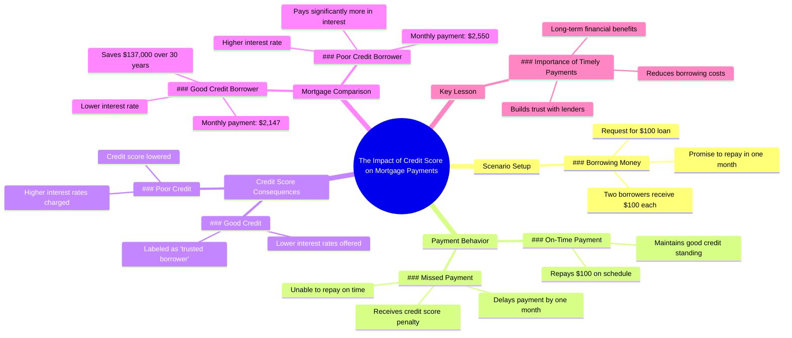

# Don't Let This Mistake Cost You Your Credit Score

> 🌐 **Read this in:** **English** · [中文](../../zh-CN/2026-07/tiktok-transcript-dont-let-this-mistake-cost-you-personalfinance-interest-cred-104b.md)

> **Creator:** [@humphreytalks](https://www.tiktok.com/@humphreytalks) · **Views:** 5.2M · **Posted:** 2026-07-16 · **Niche:** finance
>
> **TL;DR:** Opens with a relatable, high-stakes request that instantly engages viewers.

[Watch original video →](https://vt.tiktok.com/ZSXDRNeT9/)

## Why This Went Viral

## Hook (first 3 seconds)
- **Verbatim opening line:** "Can I borrow $100? I'll pay you back in a month."
- **Hook pattern:** Scene + direct question (with immediate escalation: "wait can I also get that too")
- **Why it stops scroll:** It opens with a relatable, uncomfortable social situation (lending money) that almost everyone has experienced, then immediately introduces conflict by having a second person jump in. The tension is instant and familiar.

## Emotional Rhythm
- **Curiosity** (0–3s): "Will he get paid back?"
- **Tension** (3–10s): "One month later" — first person can't pay. Credit score drops.
- **Anticipation** (10–15s): "One year later" — time jump sets up a comparison.
- **Suspense** (15–25s): Two people ask for the same mortgage. Different answers.
- **Revelation** (25–30s): "He is a trusted borrower" — the twist explains the difference.
- **Resentment → Relief** (30–40s): The punished borrower realizes his mistake. The lesson lands.
- **Climax moment:** "I'm gonna pay $137,000 less in interest" — the concrete number makes the abstract concept of credit scores painfully real.

## Keyword Density
- **"payment"** (6x) — drives algorithmic relevance (financial content)
- **"credit score"** (2x) — high-search-volume financial term
- **"interest"** (3x) — emotional pull (shows cost of bad behavior)
- **"mortgage"** (3x) — aspirational life goal, broad audience
- **"trusted borrower"** (2x) — branded concept, creates a category people want to belong to
- **"month"** (4x) — creates time pressure, urgency
- **"lower" / "less"** (3x) — negative framing that triggers loss aversion
- **"$137,000"** — specific, shocking number that drives shareability

## Why It Spreads
1. **Universal pain point + specific number** — "I'm gonna pay $137,000 less in interest" is a jaw-dropping stat that makes people want to share it as a warning or a win. The number is concrete enough to be memorable, big enough to be shocking.
2. **Character-driven lesson** — The video doesn't lecture. It uses two characters (the responsible borrower vs. the irresponsible one) to show cause and effect. Viewers self-identify with one and feel the lesson emotionally, not intellectually.
3. **Time compression creates stakes** — "One month later" / "One year later" skips the boring middle and jumps straight to consequences. This keeps retention high because every scene delivers a payoff.
4. **Relatable social friction** — The opening "can I borrow $100" is a scene everyone has been in. It hooks people who have lent or borrowed money, which is nearly everyone.
5. **Reversal of expectations** — The viewer expects both to get the same mortgage rate. The twist ("his payment is so much lower") creates a "wait, what?" moment that forces rewatching and sharing.

## What You Can Steal
1. **The "before/after with a twist" structure** — Show two characters starting in the same place, then diverge their outcomes. The twist (different mortgage rates) is the engine. Apply this to any topic: two people start the same diet, same investment, same habit — one does one thing differently, and the result is dramatically different.
2. **Anchor a shocking number to a relatable scenario** — "$137,000 less in interest" works because it's attached to buying a house (a universal dream). Pick one big, specific number and tie it to something your audience already wants.
3. **Use "time stamps" as scene transitions** — "One month later" / "One year later" creates instant narrative momentum without setup. In a 40-second video, every second must earn its place. Time jumps let you skip explanations and go straight to consequences.

## Mind Map

## Full Transcript (Generated by [analyze your own TikToks](https://toktranscript.com/?utm_source=github&utm_medium=breakdown&utm_campaign=tool_attribution))

> 📝 Transcripts on this page are auto-generated and show the first 60%. Want to transcribe any TikTok in 30 seconds and get the full version? [Try TokTranscript free →](https://toktranscript.com/?utm_source=github&utm_medium=breakdown&utm_campaign=transcript_cta)

can I borrow $100 I'll pay you back in a month wait can I also get that too sure here's 100 bucks for both of you one month later I can't pay that $100 back just yet I'm gonna miss this payment here's my payment thanks to the man in the hat we're gonna lower your credit score since you missed the payment one year later I'd like to buy a house can you tell me what my monthly payments gonna be on a 30 year mortgage twenty five fifty a month which includes interest I'd like that same mortgage how much for me twenty one forty seven 

*[Read the full transcript on TokTranscript →](https://toktranscript.com/plaza/tiktok-transcript-dont-let-this-mistake-cost-you-personalfinance-interest-cred-104b?utm_source=github&utm_medium=breakdown&utm_campaign=transcript_full)*

## Browse More

- All [finance](../../by-niche/en/finance.md) breakdowns
- All [Hypothetical scenario with immediate stakes](../../by-pattern/en/hook-hypothetical-scenario-with-immediate-stakes.md) examples

## Video Info

| | |
|---|---|
| Creator | [@humphreytalks](https://www.tiktok.com/@humphreytalks) |
| Original video | [https://vt.tiktok.com/ZSXDRNeT9/](https://vt.tiktok.com/ZSXDRNeT9/) |
| Original title | Dont let this mistake cost you! #personalfinance #interest #credit (i... |
| Views | 5.2M (5200000) |
| Posted | 2026-07-16 |
| Duration | 0s |
| Niche | `finance` |
| Hook pattern | `Hypothetical scenario with immediate stakes` |
| Original language | `en` |
| Available languages | en, zh-CN |
| Generated | 2026-07-17 by [TokTranscript](https://toktranscript.com/) |

---

*This breakdown is for educational analysis under fair use. Original video © [@humphreytalks](https://www.tiktok.com/@humphreytalks). All transcripts are auto-generated and may contain errors.*

*Want to analyze your own TikToks like this? [TokTranscript →](https://toktranscript.com/viral-breakdown?utm_source=github&utm_medium=breakdown&utm_campaign=footer_cta)*