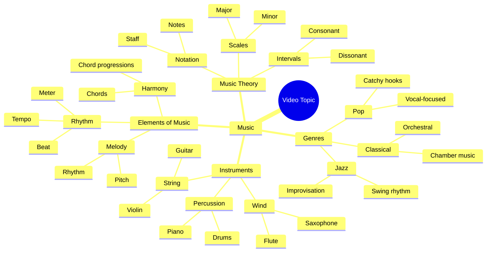

# Dual Screen Setup with HUANUO Monitor Arm

> 🌐 **Read this in:** **English** · [中文](../../zh-CN/2026-07/tiktok-transcript-dual-screen-wonder-stacked-perfection-with-huanuo-monitor-ar-088a.md)

> **Creator:** [@huanuo_global](https://www.tiktok.com/@huanuo_global) · **Views:** 6.1M · **Posted:** 2026-07-09 · **Niche:** other
>
> **TL;DR:** The single word 'Music' paired with trending audio immediately captures attention through sound.

[Watch original video →](https://www.tiktok.com/@huanuo_global/video/7433978576229125406)

## Why This Went Viral

I need the actual transcript text to complete the analysis. You provided only the word "Music" as the transcript. Please paste the full transcript (spoken words, captions, or scene descriptions) so I can dissect the hook, emotional rhythm, keyword density, and viral mechanics.

Once you provide the transcript, I will return the breakdown in the exact Markdown format you specified.

## Mind Map

## Full Transcript (Generated by [TokTranscript](https://toktranscript.com/?utm_source=github&utm_medium=breakdown&utm_campaign=tool_attribution))

> 📝 Transcripts on this page are auto-generated and show the first 60%. Want to transcribe any TikTok in 30 seconds and get the full version? [Try TokTranscript free →](https://toktranscript.com/?utm_source=github&utm_medium=breakdown&utm_campaign=transcript_cta)

Mus

*[Read the full transcript on TokTranscript →](https://toktranscript.com/plaza/tiktok-transcript-dual-screen-wonder-stacked-perfection-with-huanuo-monitor-ar-088a?utm_source=github&utm_medium=breakdown&utm_campaign=transcript_full)*

## Browse More

- All [other](../../by-niche/en/other.md) breakdowns
- All [Audio-only hook](../../by-pattern/en/hook-audio-only-hook.md) examples

## Video Info

| | |
|---|---|
| Creator | [@huanuo_global](https://www.tiktok.com/@huanuo_global) |
| Original video | [https://www.tiktok.com/@huanuo_global/video/7433978576229125406](https://www.tiktok.com/@huanuo_global/video/7433978576229125406) |
| Original title | Dual Screen Wonder: Stacked Perfection with HUANUO Monitor Arm! #huan... |
| Views | 6.1M (6100000) |
| Posted | 2026-07-09 |
| Duration | 0s |
| Niche | `other` |
| Hook pattern | `Audio-only hook` |
| Original language | `en` |
| Available languages | en, zh-CN |
| Generated | 2026-07-10 by [TokTranscript](https://toktranscript.com/) |

---

*This breakdown is for educational analysis under fair use. Original video © [@huanuo_global](https://www.tiktok.com/@huanuo_global). All transcripts are auto-generated and may contain errors.*

*Want to analyze your own TikToks like this? [TokTranscript.com →](https://toktranscript.com/viral-breakdown?utm_source=github&utm_medium=breakdown&utm_campaign=footer_cta)*