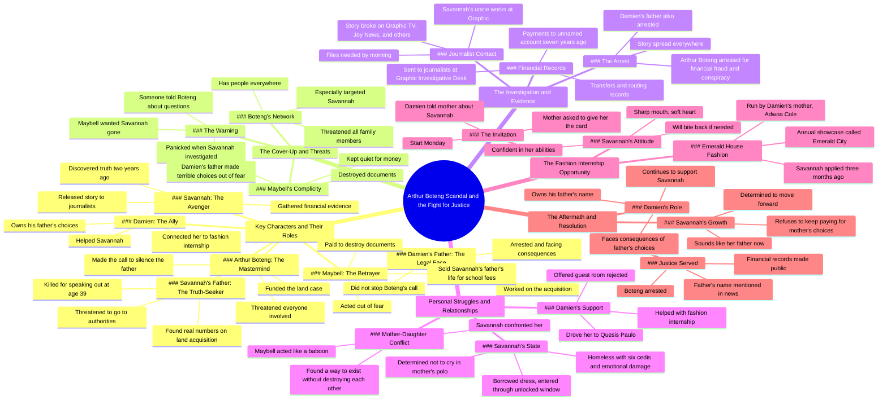

# Fine Girl, No Filter  Sharp Mouth, Soft Heart  #tiktok #africtalesdai...

> 🌐 **Read this in:** **English** · [中文](../../zh-CN/2026-07/tiktok-transcript-fine-girl-no-filter-sharp-mouth-soft-heart-tiktok-africtales-1bd4.md)

> **Creator:** [@africtalesdaily](https://www.tiktok.com/@africtalesdaily) · **Views:** 266.3K · **Posted:** 2026-07-23 · **Niche:** entertainment
>
> **TL;DR:** Opens with a cryptic statement that immediately demands explanation, hooking viewers into the unfolding conspiracy.

[Watch original video →](https://vm.tiktok.com/ZGd9Eheoc/)

## Why This Went Viral

## Hook (first 3 seconds)
- **Verbatim:** "Arthur Boteng isn't just a name in that photo."
- **Pattern:** Bold claim + mystery (introduces a hidden antagonist with a specific accusation)
- **Why it stops scrolling:** The line immediately signals a conspiracy—someone is more than they appear—creating instant curiosity about the identity and stakes. The direct address ("that photo") implies a visual context, pulling viewers into a narrative puzzle.

## Emotional Rhythm
- **Beats:** Curiosity (who is Boteng?) → Tension (land case, threat to expose) → Anger (betrayal by mother) → Fear (threats to family) → Relief (plan to expose) → Pride (father's sacrifice) → Hope (fashion internship offer) → Triumph (arrest, confrontation, acceptance)
- **Suspense/Twist:** The revelation that the mother was paid to destroy documents ("She sold my father's life for school fees") is a devastating emotional pivot.
- **Climax:** "Arthur Boteng was arrested this morning." This is the payoff—justice is served, validating the protagonist's fight.

## Keyword Density
- **Strongest words/phrases:** "father" (10+), "truth" (4), "scared" (3), "arrested" (2), "Boteng" (6), "money" (3), "choice" (3), "house" (5), "fashion" (2), "subscribed" (1, but high impact at end)
- **Algorithmic reach:** "arrested," "financial fraud," "conspiracy" trigger news/true crime interest; "fashion internship," "subscribed" hook lifestyle/creator audiences.
- **Emotional pull:** "father," "scared," "truth," "choice" drive empathy and moral outrage—key for shares.

## Why It Spreads
1. **Moral outrage + justice arc:** The transcript builds a clear villain (Boteng) and a corrupt system, then delivers a satisfying arrest. Viewers share to signal alignment with justice. Concrete line: "Arthur Boteng was arrested this morning."
2. **Emotional whiplash:** From betrayal ("She sold my father's life") to empowerment ("I'm not going to keep paying for what you did either") to humor ("I have six saddies and emotional damage"). This keeps retention high.
3. **Relatable underdog story:** A homeless protagonist with "emotional damage" lands a fashion internship through wit and resilience. The line "I'm homeless, Damien. I have six saddies" is shareable as a meme.
4. **Cliffhanger + call to action:** The final monologue breaks the fourth wall ("y'all are obsessed with Savannah and the show") and directly asks for subscription. This turns passive viewers into active fans.
5. **High-stakes dialogue:** Every exchange is dense with conflict and character. Lines like "Sharp mouth, soft heart. This is your fault" are quotable and meme-worthy, driving organic reach.

## What You Can Steal
1. **Open with a secret, not a summary.** Start with a specific, accusatory line ("Arthur Boteng isn't just a name") that implies hidden information. This forces viewers to stay for the explanation.
2. **Layer emotional beats in 30-second cycles.** Alternate between tension (betrayal, fear) and relief (plan, humor). Example: after the heavy "father died for truth," pivot to "I'm not sleeping in a billionaire's house" for comic relief.
3. **End with a direct, playful ask.** Break the fourth wall to acknowledge the audience's investment, then turn it into a subscription prompt. The line "y'all will sit under my comments at 2:00am writing paragraphs... yet you have not subscribed" is cheeky and effective.

## Mind Map

## Full Transcript (Generated by [free TikTok transcript generator](https://toktranscript.com/?utm_source=github&utm_medium=breakdown&utm_campaign=tool_attribution))

> 📝 Transcripts on this page are auto-generated and show the first 60%. Want to transcribe any TikTok in 30 seconds and get the full version? [Try TokTranscript free →](https://toktranscript.com/?utm_source=github&utm_medium=breakdown&utm_campaign=transcript_cta)

Arthur Boteng isn't just a name in that photo. Then tell me what he is. He's the man who funded the land case. Your father was working on the whole acquisition. Your father found the real numbers and threatened to go to authorities. So Damien's father was just the legal face. Boteng was the actual money. When your father threatened to expose it all, Boteng made the call. Damien's father didn't stop it. And Maybell, he paid her, told her if she destroyed the documents and kept quiet, would be taken care of. House, school fees, everything. She sold my father's life for school fees. Your mother acts like a baboon. And you knew? I found out two years ago. I was going through her things and I've been scared every day since. Why did your crooked mouth didn't tell me? Because Bo Tang told mom that if anyone talked, anyone at all, it wouldn't just be your father. He threatened you. He threatened all of us, including you, especially you because you're his daughter. Mom got a call this afternoon. Someone told her you've been asking questions around the neighborhood. She panicked. She wanted you gone before you found anything. Someone told her Boatin has people everywhere. Savannah, are you okay? I need you to send everything you have, the financial transfers, the routing records, everything tonight to who? Do you know? Any journalists, real ones, not bloggers. My uncle works at the graphic investigative desk. Call him Right now, Savannah, if we release this without proper Damien, his name is Arthur Botten. He's has 7 years. My guess he, I'll call him now when the story breaks and it will break. You need to talk to them. I'm scared. I know, but shut up for now. So was my father. He talked anyway. Nina, the necklace, you put it in my bag. Yes. If you ever do it again, I'll sell you. Don't do it again. My uncle answered he wants the files by morning. Send them already forwarding them now. Are you okay? You keep asking me that. You keep not answering. My father died for the truth and in about 12 hours, the whole of Akra is going to know it. So no, I'm not okay. But I will be. Where are you sleeping tonight, Quessis Paulo. I have a standing arrangement with his mother's bread loaf. I have 14 guest rooms. I'm not. I'm not sleeping in a billionaire's house, Damien. Why not? Because I'll wake up comfortable and lose my personality and sarcasm. My audience need it. Let me at least drive you to quesas. Fine. Savannah, if this house is on fire, just let me burn. Ataboe 10 was arrested this morning. What? It's everywhere. Graphic TV three join news. They're saying financial fraud conspiracy. Savannah, they mention your father's name. Damien message they got in was arrested. So it's true your father won the Savannah say something. He was 39 years Old. He was 39 and he did the right thing and it cost him everything. Okay. Okay. We're not crying in your mother's polo at 7:00am in a borrowed dress. That's where I draw the line. You just cried. I released. Moisture is different. You didn't have to come. I know. How's your father cooperating? His lawyers are working on a deal. He'll face consequences. But he made a terrible choice. He has to own it. And you, I have to own his name while he does. That's not fair. No, but neither was what happened to your father. So what happens now with the case, with any of it? I was hoping you'd tell me. I'm homeless, Damien. I have six saddies and emotional damage.

*[Read the full transcript on TokTranscript →](https://toktranscript.com/plaza/tiktok-transcript-fine-girl-no-filter-sharp-mouth-soft-heart-tiktok-africtales-1bd4?utm_source=github&utm_medium=breakdown&utm_campaign=transcript_full)*

## Browse More

- All [entertainment](../../by-niche/en/entertainment.md) breakdowns
- All [Mystery Reveal](../../by-pattern/en/hook-mystery-reveal.md) examples

## Video Info

| | |
|---|---|
| Creator | [@africtalesdaily](https://www.tiktok.com/@africtalesdaily) |
| Original video | [https://vm.tiktok.com/ZGd9Eheoc/](https://vm.tiktok.com/ZGd9Eheoc/) |
| Original title | Fine Girl, No Filter  Sharp Mouth, Soft Heart  #tiktok #africtalesdai... |
| Views | 266.3K (266300) |
| Posted | 2026-07-23 |
| Duration | 0s |
| Niche | `entertainment` |
| Hook pattern | `Mystery Reveal` |
| Original language | `en` |
| Available languages | en, zh-CN |
| Generated | 2026-07-25 by [TokTranscript](https://toktranscript.com/) |

---

*This breakdown is for educational analysis under fair use. Original video © [@africtalesdaily](https://www.tiktok.com/@africtalesdaily). All transcripts are auto-generated and may contain errors.*

*Want to analyze your own TikToks like this? [TokTranscript →](https://toktranscript.com/viral-breakdown?utm_source=github&utm_medium=breakdown&utm_campaign=footer_cta)*