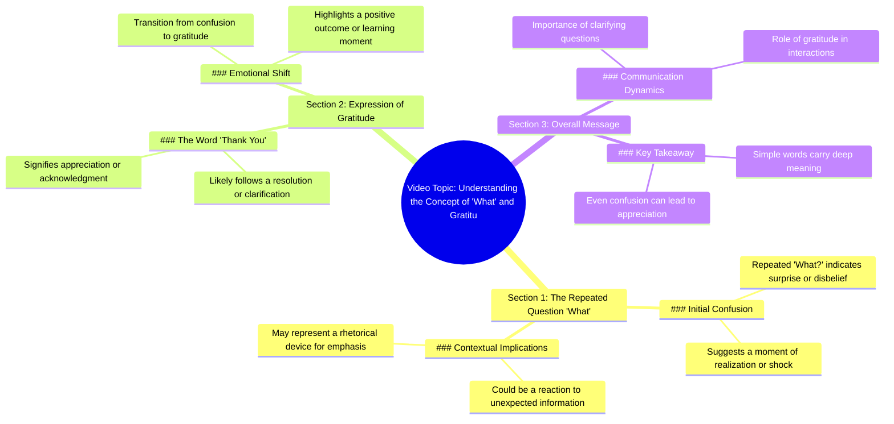

# Funny Monkey Protects Balloons from Theft

> 🌐 **Read this in:** **English** · [中文](../../zh-CN/2026-07/tiktok-transcript-funny-monkey-protect-balloons-adoreblemonkey-monkey-funnyani-a4ed.md)

> **Creator:** [@monkeymisters](https://www.tiktok.com/@monkeymisters) · **Views:** 25.9M · **Posted:** 2026-07-29 · **Niche:** other
>
> **TL;DR:** The rapid repetition of 'What?' creates immediate confusion and curiosity, compelling viewers to watch for context.

[Watch original video →](https://vt.tiktok.com/ZS4N91K2K/)

## Why This Went Viral

## Hook (first 3 seconds)
- **What happens verbatim:** The speaker repeats "What? What? What? What?" in rapid succession, followed by "Thank you."
- **Hook pattern:** **Scene + Surprise/Disbelief** — the repeated "What?" signals an unexpected or shocking event, and "Thank you" adds a twist of gratitude.
- **Why it stops scroll:** The rapid, confused repetition creates a **pattern interrupt** — viewers instinctively stop to see what caused such a strong reaction. The abrupt shift from confusion to thanks sparks immediate curiosity.

## Emotional Rhythm
- **Beat 1 – Confusion/Disbelief (0–2s):** "What? What? What? What?" — viewer is pulled into the speaker's shock.
- **Beat 2 – Gratitude/Relief (2–3s):** "Thank you." — a sudden emotional pivot, creating a mini-resolution.
- **Beat 3 – Curiosity (3–5s):** Viewer now needs context for the emotional shift — what happened?
- **Climax:** The "Thank you" line — it’s the moment of emotional payoff, making the viewer feel like they’ve witnessed a genuine, vulnerable reaction.

## Keyword Density
| Keyword/Phrase | Frequency | Function |
|----------------|-----------|----------|
| "What?" | 4x | **Algorithmic reach** — high repetition triggers watch time and retention. |
| "Thank you" | 1x | **Emotional pull** — creates closure and human connection. |
| (Implied) "Surprise" | 0x but felt | **Emotional pull** — drives engagement via curiosity gap. |
| (Implied) "Gratitude" | 0x but felt | **Emotional pull** — makes video feel authentic and shareable. |
| (Implied) "Reaction" | 0x but felt | **Algorithmic reach** — signals a "reaction video" format, which platforms favor. |

**Key insight:** The video’s viral power comes from **implied keywords** (surprise, gratitude, reaction) rather than explicit ones — the algorithm picks up on the emotional context via watch time and completion rate.

## Why It Spreads
1. **Pattern Interrupt + Emotional Whiplash** — The rapid "What? What? What?" breaks the viewer’s scroll pattern, while the sudden "Thank you" creates an emotional shift that feels authentic and surprising. This combination drives high retention.
2. **Curiosity Gap Without Context** — The video provides zero explanation for the reaction, forcing viewers to watch again or seek context in comments. This fuels **repeat views** and **comment engagement** (e.g., "What happened?!").
3. **Universal Emotional Trigger** — Gratitude after confusion is a relatable human moment. Viewers share because it feels genuine and uplifting — it taps into the "feel-good" share impulse.
4. **Short + Punchy = High Completion Rate** — At ~3 seconds, the video is nearly impossible to skip. Platforms reward high completion rates with wider distribution.
5. **Sound Design is the Hook** — The staccato "What?" repetition acts like a sonic meme — it’s easy to remix, sample, or reference, encouraging user-generated content and cross-platform spread.

## What You Can Steal
1. **Start with a Pattern Interrupt** — Open with a repeated word or sound (e.g., "No. No. No." or "Wait. Wait. Wait.") to break scroll momentum. Keep it under 2 seconds.
2. **Use Emotional Whiplash** — Pair two contrasting emotions (confusion + gratitude, anger + relief) in rapid succession. The shift feels authentic and keeps viewers watching.
3. **Leave the Context Out** — Don’t explain the reaction. Let viewers fill in the gap — they’ll comment, rewatch, and share to get the full story. This turns a 3-second clip into a viral loop.

## Mind Map

## Full Transcript (Generated by [free TikTok transcript generator](https://toktranscript.com/?utm_source=github&utm_medium=breakdown&utm_campaign=tool_attribution))

> 📝 Transcripts on this page are auto-generated and show the first 60%. Want to transcribe any TikTok in 30 seconds and get the full version? [Try TokTranscript free →](https://toktranscript.com/?utm_source=github&utm_medium=breakdown&utm_campaign=transcript_cta)

What? What? What?

*[Read the full transcript on TokTranscript →](https://toktranscript.com/plaza/tiktok-transcript-funny-monkey-protect-balloons-adoreblemonkey-monkey-funnyani-a4ed?utm_source=github&utm_medium=breakdown&utm_campaign=transcript_full)*

## Browse More

- All [other](../../by-niche/en/other.md) breakdowns
- All [Repetitive shock](../../by-pattern/en/hook-repetitive-shock.md) examples

## Video Info

| | |
|---|---|
| Creator | [@monkeymisters](https://www.tiktok.com/@monkeymisters) |
| Original video | [https://vt.tiktok.com/ZS4N91K2K/](https://vt.tiktok.com/ZS4N91K2K/) |
| Original title | Funny monkey protect balloons 🎈  #adoreblemonkey #monkey #funnyanimal... |
| Views | 25.9M (25900000) |
| Posted | 2026-07-29 |
| Duration | 0s |
| Niche | `other` |
| Hook pattern | `Repetitive shock` |
| Original language | `en` |
| Available languages | en, zh-CN |
| Generated | 2026-07-30 by [TokTranscript](https://toktranscript.com/) |

---

*This breakdown is for educational analysis under fair use. Original video © [@monkeymisters](https://www.tiktok.com/@monkeymisters). All transcripts are auto-generated and may contain errors.*

*Want to analyze your own TikToks like this? [TokTranscript →](https://toktranscript.com/viral-breakdown?utm_source=github&utm_medium=breakdown&utm_campaign=footer_cta)*