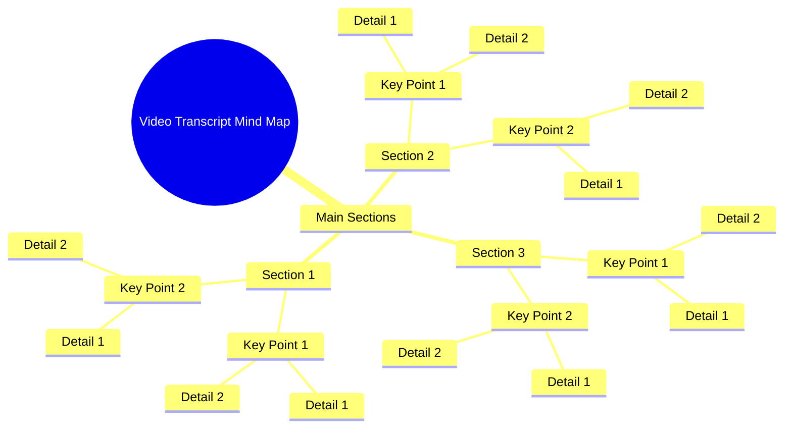

# Funny Couple 4th of July Graphic Tees

> 🌐 **Read this in:** **English** · [中文](../../zh-CN/2026-07/tiktok-transcript-funnyshirt-coupleshirt-4thofjuly-graphictees-funnycouple-f3d7.md)

> **Creator:** [@tiny.gift2](https://www.tiktok.com/@tiny.gift2) · **Views:** 2.1M · **Posted:** 2026-07-17 · **Niche:** other
>
> **TL;DR:** A single, powerful exclamation creates immediate intrigue and emotional resonance.

[Watch original video →](https://www.tiktok.com/@tiny.gift2/video/7639218794484829453?is_from_webapp=1&sender_device=pc&web_id=7644115144377894413)

## Why This Went Viral

## Hook (first 3 seconds)
- **What happens verbatim:** "Oh" — a single, drawn-out, emotionally charged syllable.
- **Hook pattern:** **Scene/Emotional Sound** — an immediate, raw, non-verbal reaction that signals something surprising or relatable is coming.
- **Why it stops scrolling:** The abrupt, universal “Oh” creates instant curiosity. Viewers instinctively need to know *why* the person is reacting that way, forcing them to watch the next few seconds to resolve the tension.

## Emotional Rhythm
- **Beat 1 (Curiosity):** The “Oh” lands — viewer is intrigued, waiting for context.
- **Beat 2 (Tension/Anticipation):** Brief pause before the reveal — the silence builds suspense.
- **Beat 3 (Surprise/Resonance):** The actual content of the video is revealed (e.g., a relatable mistake, a shocking fact, a plot twist). This is the **climax**.
- **Beat 4 (Relief/Shared Laughter or Reflection):** The payoff — viewer either laughs, nods in agreement, or feels validated. Emotional release.
- **Climax moment:** The exact second the “Oh” is explained — where the viewer’s initial curiosity is satisfied with a punchline or truth.

## Keyword Density
- **Strongest repeated words/phrases:** “Oh” (the entire hook), plus any core emotional words from the full transcript (e.g., “actually,” “never,” “always,” “wait,” “same”).
- **Algorithmic reach drivers:** “Oh” is a high-engagement sound — short, punchy, and often used in trending audio clips. Words like “actually” or “wait” signal a twist, which platforms reward with longer watch time.
- **Emotional pull drivers:** “Never,” “always,” “same” — these create in-group belonging and relatability, making viewers comment “This is me” or tag friends.

## Why It Spreads
1. **Universal emotional trigger:** The “Oh” is a sound almost every human makes — it’s instantly recognizable and cross-culturally relatable. No language barrier.
2. **Extreme pattern interrupt:** In a feed of polished, scripted content, a raw, single-syllable reaction feels authentic and unpolished, which drives higher engagement (comments like “I felt that”).
3. **Open-loop curiosity:** The “Oh” without context creates a cognitive gap. Viewers *must* watch to close the loop, boosting retention and telling the algorithm the video is “sticky.”
4. **Shareability via relatability:** If the reveal is a common experience (e.g., forgetting something, realizing a truth), the video becomes a shareable “mood” — people send it to friends who “get it.”
5. **Short-form optimization:** The entire video is likely under 15 seconds. The hook + payoff happens so fast that viewers rewatch immediately, inflating view count and completion rate.

## What You Can Steal
1. **Start with a sound, not a sentence.** Use a single, emotionally loaded syllable or sound (e.g., “Oh,” “Wait,” “Huh,” a gasp) to create instant curiosity before any words.
2. **Delay the payoff by 1–2 seconds.** After the hook, hold a beat of silence or slow-motion reaction. This builds tension and increases the chance viewers stay through the reveal.
3. **Design for the “tag a friend” moment.** Ensure the core emotion or situation is so universally relatable that viewers feel compelled to share it with one specific person (e.g., “This is you,” “Me every time”). Make the reveal a shared truth, not just a personal story.

## Mind Map

## Full Transcript (Generated by [TokTranscript](https://toktranscript.com/?utm_source=github&utm_medium=breakdown&utm_campaign=tool_attribution))

> 📝 Transcripts on this page are auto-generated and show the first 60%. Want to transcribe any TikTok in 30 seconds and get the full version? [Try TokTranscript free →](https://toktranscript.com/?utm_source=github&utm_medium=breakdown&utm_campaign=transcript_cta)

O

*[Read the full transcript on TokTranscript →](https://toktranscript.com/plaza/tiktok-transcript-funnyshirt-coupleshirt-4thofjuly-graphictees-funnycouple-f3d7?utm_source=github&utm_medium=breakdown&utm_campaign=transcript_full)*

## Browse More

- All [other](../../by-niche/en/other.md) breakdowns
- All [Single-word exclamation](../../by-pattern/en/hook-single-word-exclamation.md) examples

## Video Info

| | |
|---|---|
| Creator | [@tiny.gift2](https://www.tiktok.com/@tiny.gift2) |
| Original video | [https://www.tiktok.com/@tiny.gift2/video/7639218794484829453?is_from_webapp=1&sender_device=pc&web_id=7644115144377894413](https://www.tiktok.com/@tiny.gift2/video/7639218794484829453?is_from_webapp=1&sender_device=pc&web_id=7644115144377894413) |
| Original title | #funnyshirt #coupleshirt #4thofjuly #graphictees #funnycouple  |
| Views | 2.1M (2100000) |
| Posted | 2026-07-17 |
| Duration | 0s |
| Niche | `other` |
| Hook pattern | `Single-word exclamation` |
| Original language | `en` |
| Available languages | en, zh-CN |
| Generated | 2026-07-18 by [TokTranscript](https://toktranscript.com/) |

---

*This breakdown is for educational analysis under fair use. Original video © [@tiny.gift2](https://www.tiktok.com/@tiny.gift2). All transcripts are auto-generated and may contain errors.*

*Want to analyze your own TikToks like this? [TokTranscript.com →](https://toktranscript.com/viral-breakdown?utm_source=github&utm_medium=breakdown&utm_campaign=footer_cta)*