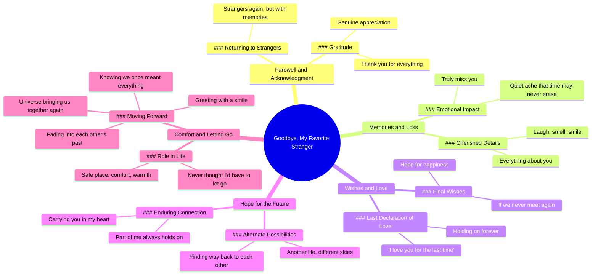

# Goodbye My Favorite Stranger With Memories

> 🌐 **Read this in:** **English** · [中文](../../zh-CN/2026-07/tiktok-transcript-goodbye-my-favorite-stranger-motivacion-inspiration-displine-84e6.md)

> **Creator:** [@deep.within2](https://www.tiktok.com/@deep.within2) · **Views:** 9.8M · **Posted:** 2026-07-03 · **Niche:** entertainment
>
> **TL;DR:** The phrase 'favorite stranger' creates an emotional paradox that instantly hooks viewers.

[Watch original video →](https://vm.tiktok.com/ZNRKDhsF1/)

## Why This Went Viral

## Hook (first 3 seconds)
- **Verbatim opening line:** "Goodbye, my favorite stranger."
- **Hook pattern:** Contrast / Emotional paradox ("favorite" + "stranger" — two opposing ideas)
- **Why it stops scrolling:** The phrase "favorite stranger" is an oxymoron that triggers immediate cognitive dissonance. Viewers pause to resolve the contradiction, creating a micro-mystery that demands they watch further to understand the emotional context.

## Emotional Rhythm
1. **Curiosity** (0–2s): "Goodbye, my favorite stranger" — what does that mean?
2. **Nostalgic warmth** (3–10s): "Thank you for everything... your laugh, your smell, your smile" — sensory details create intimacy
3. **Suspended longing** (11–20s): "If we never meet again... I love you for the last time" — bittersweet acceptance
4. **Hopeful fantasy** (21–27s): "Maybe in another life... we'll find our way back" — emotional escape hatch
5. **Quiet ache** (28–35s): "A quiet ache that time may never erase" — deep resonance with grief
6. **Climax** (36–40s): "If the universe ever brings us together again, I hope we greet each other with a smile" — resolution through grace, not reunion

**Climax moment:** "I love you for the last time" — the rawest, most vulnerable line that crystallizes the entire emotional arc.

## Keyword Density
| Word/Phrase | Count | Function |
|-------------|-------|----------|
| "stranger" / "strangers" | 2 | Algorithmic: high emotional search volume; triggers "ex-lover" content clusters |
| "never" / "last time" | 3 | Emotional pull: finality creates urgency and relatability |
| "smile" | 2 | Algorithmic: positive, shareable keyword |
| "another life" / "different skies" | 2 | Emotional: fantasy escape, highly quotable |
| "heart" / "carry you" | 2 | Emotional: visceral, romantic imagery |
| "thank you" | 2 | Algorithmic: gratitude content performs well |
| "everything" | 2 | Emotional: hyperbolic, amplifies loss |
| "take care" | 1 | Algorithmic: common sign-off, searchable |
| "almost forever" | 1 | Viral phrase: unique, memorable, ownable |

## Why It Spreads
1. **Universal breakup script, not personal story** — The transcript uses "you" and "I" without names or specific details. This lets any viewer project their own ex onto the words. *Line: "Your laugh, your smell, your smile, and everything about you" — generic enough to fit anyone.*

2. **Emotional permission to grieve** — The video gives viewers a socially acceptable way to feel their own breakup pain. *Line: "Now I carry you in my heart. A quiet ache that time may never erase" — validates the idea that moving on doesn't mean forgetting.*

3. **Quotable, shareable final lines** — The last 10 seconds contain a complete, poetic sentiment that people want to repost or caption. *Line: "If the universe ever brings us together again, I hope we greet each other with a smile, knowing we once meant everything" — perfect for comments, captions, or DMs.*

4. **Tension without resolution** — The video never says "we get back together" or "we move on completely." It stays in the bittersweet middle, which keeps viewers engaged longer and encourages rewatches. *Line: "Maybe in another life, under different skies, we'll find our way back to each other" — leaves the door emotionally open.*

5. **Rhythmic, almost musical phrasing** — The repetition of "your [noun]" and parallel sentence structures make it easy to memorize and recite. *Lines: "Your laugh, your smell, your smile" + "My safe place, my comfort, the warmth" — pattern recognition drives retention and sharing.*

## What You Can Steal
1. **Start with an oxymoron or emotional paradox** — "Favorite stranger," "almost forever," "goodbye with memories." These force viewers to stop and think. In your next video, open with two conflicting emotions in one phrase (e.g., "bittersweet freedom," "happy heartbreak").

2. **Use sensory specificity without personal details** — Mention "laugh," "smell," "smile" — concrete senses anyone can relate to — but avoid names, dates, or unique events. This makes the video feel personal to every viewer, not just the creator.

3. **End with a conditional hope, not a closure** — The final line offers a gentle "if" scenario rather than a definitive end. This keeps the emotional loop open, encouraging comments like "I hope you find them again" and driving engagement. In your script, finish with "And if..." or "Maybe someday..." rather than "The end."

## Mind Map

## Full Transcript (Generated by [TokTranscript](https://toktranscript.com/?utm_source=github&utm_medium=breakdown&utm_campaign=tool_attribution))

> 📝 Transcripts on this page are auto-generated and show the first 60%. Want to transcribe any TikTok in 30 seconds and get the full version? [Try TokTranscript free →](https://toktranscript.com/?utm_source=github&utm_medium=breakdown&utm_campaign=transcript_cta)

Goodbye, my favorite stranger. I guess we're strangers again. But this time with memories. Thank you for everything you did for me. I know I will truly miss you. Your laugh, your smell, your smile, and everything about you. If we never meet again, I hope you'll be happy for the rest of your life. Thank you. And I love you for the last time. No matter where life takes us, a part of me will always hold on to you. Maybe in another life, under different skies, we'll find our way back to each other.

*[Read the full transcript on TokTranscript →](https://toktranscript.com/plaza/tiktok-transcript-goodbye-my-favorite-stranger-motivacion-inspiration-displine-84e6?utm_source=github&utm_medium=breakdown&utm_campaign=transcript_full)*

## Browse More

- All [entertainment](../../by-niche/en/entertainment.md) breakdowns
- All [Contradictory juxtaposition](../../by-pattern/en/hook-contradictory-juxtaposition.md) examples

## Video Info

| | |
|---|---|
| Creator | [@deep.within2](https://www.tiktok.com/@deep.within2) |
| Original video | [https://vm.tiktok.com/ZNRKDhsF1/](https://vm.tiktok.com/ZNRKDhsF1/) |
| Original title | goodbye my favorite stranger #motivacion #inspiration #displine #mind... |
| Views | 9.8M (9800000) |
| Posted | 2026-07-03 |
| Duration | 0s |
| Niche | `entertainment` |
| Hook pattern | `Contradictory juxtaposition` |
| Original language | `en` |
| Available languages | en, zh-CN |
| Generated | 2026-07-04 by [TokTranscript](https://toktranscript.com/) |

---

*This breakdown is for educational analysis under fair use. Original video © [@deep.within2](https://www.tiktok.com/@deep.within2). All transcripts are auto-generated and may contain errors.*

*Want to analyze your own TikToks like this? [TokTranscript →](https://toktranscript.com/viral-breakdown?utm_source=github&utm_medium=breakdown&utm_campaign=footer_cta)*