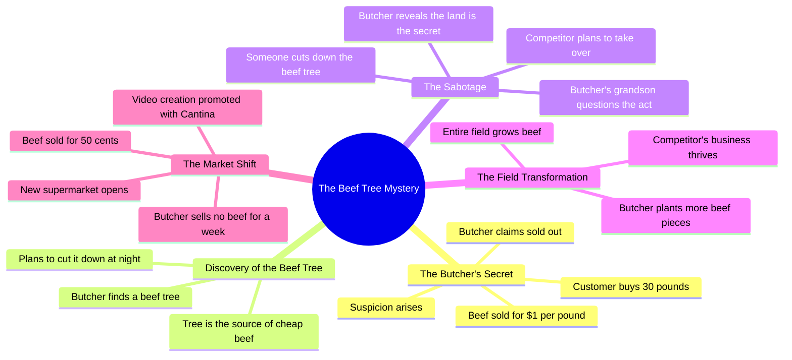

# Man Destroys Beef Tree to Ruin Rival

> 🌐 **Read this in:** **English** · [中文](../../zh-CN/2026-07/tiktok-transcript-he-destroyed-the-beef-tree-to-ruin-his-rival-madewithcantina-329a.md)

> **Creator:** [@nightzai0](https://www.tiktok.com/@nightzai0) · **Views:** 926.8K · **Posted:** 2026-07-14 · **Niche:** entertainment
>
> **TL;DR:** A skeptical question paired with an absurdly low price immediately grabs attention and sets up the mystery.

[Watch original video →](https://www.tiktok.com/t/ZP8GngKGT/)

## Why This Went Viral

## Hook (first 3 seconds)
- **What happens verbatim**: "Excuse me, is your sign correct? Beef for only $1 a pound!"
- **Hook pattern**: **Contrast** (implausibly low price vs. real-world expectation) + **Question** (challenges the sign's accuracy)
- **Why it stops scrolling**: The price is absurdly low ($1/lb beef is impossible), creating instant cognitive dissonance. Viewers must watch to see if it's a scam, a mistake, or a joke — curiosity is triggered immediately.

## Emotional Rhythm
- **Beat 1 – Curiosity**: "Is your sign correct?" → Viewer leans in.
- **Beat 2 – Suspense**: "I'll take 30 pounds… Sold out already?" → Tension builds.
- **Beat 3 – Twist**: "A beef tree!" → Absurd reveal, surprise.
- **Beat 4 – Suspense escalates**: "I am cutting that tree down tonight!" → Villainous intent.
- **Beat 5 – Comedy/Relief**: "Beef tree? Hahaha!" → Laughter breaks tension.
- **Beat 6 – Moral climax**: "The tree was never the secret. The land is the land." → Wisdom lands.
- **Beat 7 – Final twist**: "A new supermarket opened… selling beef for just 50 cents." → Irony completes the loop.
- **Climax moment**: "The tree was never the secret. The land is the land." — This is the emotional peak: a lesson about greed vs. sustainability.

## Keyword Density
- **Beef** (12x) – Drives **algorithmic reach** (high search volume, product category)
- **Tree** (7x) – **Emotional pull** (absurd, memorable visual)
- **Secret** (4x) – **Curiosity driver** (hooks viewers into "what's the secret?")
- **Sell / sold** (5x) – **Conflict driver** (business tension)
- **Dollar / cents** (3x) – **Value anchor** (price contrast)
- **Land** (3x) – **Thematic anchor** (moral lesson)
- **Impossible / wicked** (2x each) – **Emotional intensity** (hyperbole)

## Why It Spreads
1. **Absurd premise + low price triggers immediate shareability** – "$1 beef" is so unrealistic that viewers tag friends with "lol this is insane." The price is a universal attention magnet.
2. **Moral fable structure (greed vs. sustainability) creates resonance** – "The tree was never the secret. The land is the land." This line is quotable, memorable, and fits a timeless narrative pattern (parable). Viewers share because it feels "deep."
3. **Twist on twist keeps retention high** – First twist (beef tree), second twist (cutting it down), third twist (whole field grows beef), final twist (50-cent supermarket). Each turn resets curiosity, preventing drop-off.
4. **Villain archetype (the greedy butcher) makes rooting easy** – "I am cutting that tree down tonight!" is a clear antagonist move. Viewers want to see him fail, driving emotional investment.
5. **Irony as a payoff** – The greedy butcher’s plan backfires (new supermarket undercuts him). This is a satisfying, shareable "karma" moment that fits short-form video’s love for justice.

## What You Can Steal
1. **Start with an impossible price or claim** – Use a number so absurd it forces a double-take ($1 beef, free pizza, 99% off). This is the cheapest way to stop a scroll.
2. **Use a "moral fable" structure** – Tell a story where greed is punished and wisdom wins. End with a one-line lesson that feels profound (even if simple). This makes the video feel "worth sharing."
3. **Layer twists every 10–15 seconds** – Don't reveal the full story at once. Each twist should re-engage the viewer. The beef tree → field of beef → 50-cent supermarket is a perfect triple-twist arc.

## Mind Map

## Full Transcript (Generated by [TokTranscript](https://toktranscript.com/?utm_source=github&utm_medium=breakdown&utm_campaign=tool_attribution))

> 📝 Transcripts on this page are auto-generated and show the first 60%. Want to transcribe any TikTok in 30 seconds and get the full version? [Try TokTranscript free →](https://toktranscript.com/?utm_source=github&utm_medium=breakdown&utm_campaign=transcript_cta)

Excuse me, is your sign correct? Beef for only $1 a pound! Yes ma'am, $1 a pound! Buy as much as you'd like. Wow! I'll take 30 pounds, please. Sold out already? That's impossible! Nobody can sell beef that cheap and stay in business. Tomorrow I'm gonna find out his secret. A beef tree! Oh! I am cutting that tree down tonight! Nighty night! Beef tree? Hahaha! Who could have really done this to us? Why would somebody really do this wicked act? How will I now sell more meat, my grandson? The tree was never the secret. The land is the land. Perfect! His business is finished.

*[Read the full transcript on TokTranscript →](https://toktranscript.com/plaza/tiktok-transcript-he-destroyed-the-beef-tree-to-ruin-his-rival-madewithcantina-329a?utm_source=github&utm_medium=breakdown&utm_campaign=transcript_full)*

## Browse More

- All [entertainment](../../by-niche/en/entertainment.md) breakdowns
- All [Question + Incredible Claim](../../by-pattern/en/hook-question-incredible-claim.md) examples

## Video Info

| | |
|---|---|
| Creator | [@nightzai0](https://www.tiktok.com/@nightzai0) |
| Original video | [https://www.tiktok.com/t/ZP8GngKGT/](https://www.tiktok.com/t/ZP8GngKGT/) |
| Original title | He destroyed the beef tree to ruin his rival #madewithcantina #emotio... |
| Views | 926.8K (926800) |
| Posted | 2026-07-14 |
| Duration | 0s |
| Niche | `entertainment` |
| Hook pattern | `Question + Incredible Claim` |
| Original language | `en` |
| Available languages | en, zh-CN |
| Generated | 2026-07-17 by [TokTranscript](https://toktranscript.com/) |

---

*This breakdown is for educational analysis under fair use. Original video © [@nightzai0](https://www.tiktok.com/@nightzai0). All transcripts are auto-generated and may contain errors.*

*Want to analyze your own TikToks like this? [free TikTok transcript generator →](https://toktranscript.com/viral-breakdown?utm_source=github&utm_medium=breakdown&utm_campaign=footer_cta)*