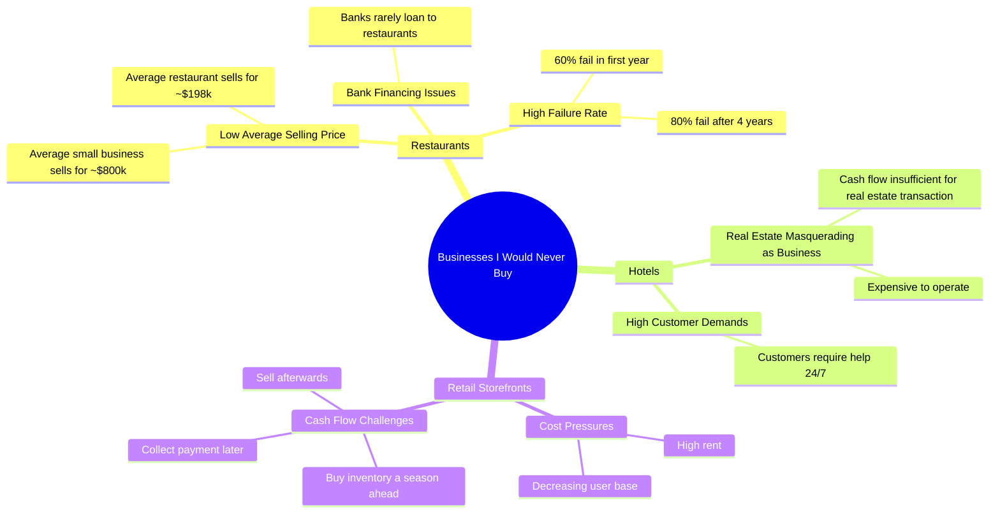

# The 3 Worst Businesses to Buy According to an Expert

> 🌐 **Read this in:** **English** · [中文](../../zh-CN/2026-07/tiktok-transcript-here-are-the-3-worst-businesses-you-could-ever-buy-because-i-b7ad.md)

> **Creator:** [@realcodiesanchez](https://www.tiktok.com/@realcodiesanchez) · **Views:** 12.4M · **Posted:** 2026-07-01 · **Niche:** finance
>
> **TL;DR:** The hook immediately challenges conventional wisdom by listing businesses to avoid, creating curiosity and tension.

[Watch original video →](https://www.tiktok.com/@realcodiesanchez/video/7231635464380370219?lang=en)

## Why This Went Viral

## Hook (first 3 seconds)
- **Verbatim opening line:** "3. Businesses I would never buy. Number one restaurants."
- **Hook pattern:** Bold claim + list format ("3 businesses") + immediate specificity ("restaurants")
- **Why it stops scroll:** The phrase "would never buy" creates instant contrarian authority. Viewers expect generic business advice, but this is a definitive, opinionated rejection. The list structure promises a quick, digestible payoff — low cognitive load, high curiosity.

## Emotional Rhythm
- **Beats:** Authority → Curiosity → Shock → Validation → Tension → Relief → Agreement
  - **0–3s:** Authority ("I would never buy" — positions creator as expert with strong opinions)
  - **3–10s:** Curiosity + Shock ("60% fail first year, 80% after 4" — hard numbers create disbelief)
  - **10–15s:** Validation ("No wonder banks don't loan" — confirms viewer's suspicion)
  - **15–25s:** Tension ("Hotels... cash flow ain't enough" — introduces complexity)
  - **25–30s:** Relief ("Is to pass" — punchy dismissal releases tension)
  - **30–end:** Agreement ("Not a great business" — final confirmation of thesis)
- **Climax:** The hotel "masquerading" line — it reframes an entire industry with a single, memorable metaphor. This is the clip's emotional peak.

## Keyword Density
- **"Business(es)"** — 6x. Core topic; drives algorithmic categorization.
- **"Restaurant(s)"** — 4x. First example; high search volume, relatable pain point.
- **"Money" / "making money"** — 4x. Directly taps into financial anxiety; drives emotional pull.
- **"Fail" / "failure"** — 3x. High emotional charge; triggers fear of loss.
- **"Real estate"** — 2x. Shifts frame from "business" to "asset class"; signals sophistication.
- **"Average"** — 2x. Anchors claims in data; builds credibility.
- **"Numbers don't lie"** — 1x. Powerful phrase that acts as a trust seal for the entire argument.

## Why It Spreads
1. **Contrarian authority triggers debate.** "Businesses I would never buy" invites argument. Restaurant owners, hoteliers, and retailers will comment to defend their industries — generating engagement. The line "Hotels are not businesses, they're real estate masquerading as a business" is specifically designed to provoke.
2. **Hard numbers create shareable proof.** "Average restaurant sells for 198k vs 800k for small business" and "60% fail in first year" are quotable statistics. Viewers share to look informed. The numbers act as social currency — "Did you know restaurants are that bad?"
3. **Pattern interrupt with "masquerading."** That single word reframes an entire industry. It's unexpected, memorable, and easily quoted. People share the *concept*, not just the data. This line is the viral seed.
4. **Three-act structure fits short attention spans.** Three examples, each with a clear punchline. No rambling. The "is to pass" dismissal at the end of hotels is a rhythm reset that keeps viewers watching for the next beat.
5. **Relatable pain point for entrepreneurs.** Anyone who has considered buying a restaurant, hotel, or retail store sees themselves in the warning. The video preempts regret, making it highly shareable among aspiring business owners.

## What You Can Steal
1. **Lead with a numbered contrarian list.** "3 things I'd never [verb]" creates instant structure and curiosity. Pick a topic where you have a strong, unpopular opinion — then back it with data. The list format guarantees completion.
2. **Use one "reframe" word per segment.** Pick a single word or phrase that redefines the category ("masquerading," "not a business," "awesome at one thing"). This becomes the shareable takeaway. Test it: if someone can quote your line, it's working.
3. **Anchor every claim with a specific number.** Vague opinions don't spread. Hard numbers ("60% fail," "198k vs 800k") create authority and shareability. If you don't have the stat, find it — or don't make the claim. The numbers are the proof that makes the opinion viral.

## Mind Map

## Full Transcript (Generated by [try this transcription tool](https://toktranscript.com/?utm_source=github&utm_medium=breakdown&utm_campaign=tool_attribution))

> 📝 Transcripts on this page are auto-generated and show the first 60%. Want to transcribe any TikTok in 30 seconds and get the full version? [Try TokTranscript free →](https://toktranscript.com/?utm_source=github&utm_medium=breakdown&utm_campaign=transcript_cta)

3. Businesses I would never buy. Number one restaurants. They ain't for making money. The numbers don't lie. The average small business in the US sells for around 800 k. The average restaurant 198 k. Because 60% fail in the first year, 80% after 4. No wonder banks don't loan to restaurants. Number 2 hotels. Hotels are not businesses. They're real estate with a lot of parts masquerading as a business. Cash flow ain't enough to cover the real estate transaction. Think about these things.

*[Read the full transcript on TokTranscript →](https://toktranscript.com/plaza/tiktok-transcript-here-are-the-3-worst-businesses-you-could-ever-buy-because-i-b7ad?utm_source=github&utm_medium=breakdown&utm_campaign=transcript_full)*

## Browse More

- All [finance](../../by-niche/en/finance.md) breakdowns
- All [Listicle with contrarian premise](../../by-pattern/en/hook-listicle-with-contrarian-premise.md) examples

## Video Info

| | |
|---|---|
| Creator | [@realcodiesanchez](https://www.tiktok.com/@realcodiesanchez) |
| Original video | [https://www.tiktok.com/@realcodiesanchez/video/7231635464380370219?lang=en](https://www.tiktok.com/@realcodiesanchez/video/7231635464380370219?lang=en) |
| Original title | Here are the 3 worst businesses you could ever buy… Because I want yo... |
| Views | 12.4M (12400000) |
| Posted | 2026-07-01 |
| Duration | 0s |
| Niche | `finance` |
| Hook pattern | `Listicle with contrarian premise` |
| Original language | `en` |
| Available languages | en, zh-CN |
| Generated | 2026-07-02 by [TokTranscript](https://toktranscript.com/) |

---

*This breakdown is for educational analysis under fair use. Original video © [@realcodiesanchez](https://www.tiktok.com/@realcodiesanchez). All transcripts are auto-generated and may contain errors.*

*Want to analyze your own TikToks like this? [TokTranscript.com →](https://toktranscript.com/viral-breakdown?utm_source=github&utm_medium=breakdown&utm_campaign=footer_cta)*