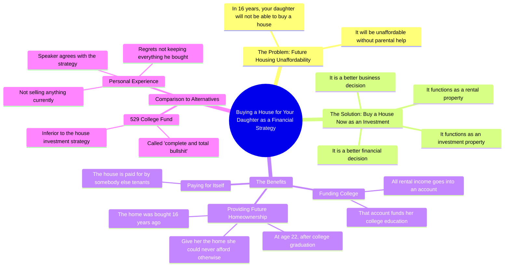

# Buying Your Kid a House Funds Their College

> 🌐 **Read this in:** **English** · [中文](../../zh-CN/2026-07/tiktok-transcript-how-buying-your-kid-a-house-will-pay-for-their-college-glenn-63b3.md)

> **Creator:** [@glenndabaker](https://www.tiktok.com/@glenndabaker) · **Views:** 5.7M · **Posted:** 2026-07-20 · **Niche:** finance
>
> **TL;DR:** Creates urgency by projecting a bleak future for a loved one, immediately grabbing attention.

[Watch original video →](https://vt.tiktok.com/ZSXXrrN1C/)

## Why This Went Viral

## Hook (first 3 seconds)
- **Verbatim opening line:** "In 16 years your daughter will not be able to buy a house"
- **Hook pattern:** Bold claim + time-bomb (specific future date + scarcity)
- **Why it stops scrolling:** It creates immediate, visceral fear about a child's future. The specificity ("16 years") makes it feel like a prophecy, not generic advice. Parents can't scroll past a threat to their kid.

## Emotional Rhythm
- **Beat 1 – Fear/Scarcity:** "will not be able to buy a house" → triggers parental anxiety
- **Beat 2 – Tension/Urgency:** "unless you help her" → creates a burden of action
- **Beat 3 – Intellectual Curiosity:** "better business decision" → reframes problem as opportunity
- **Beat 4 – Relief/Clarity:** "house is being paid for by somebody else" → solves the money problem
- **Beat 5 – Emotional Payoff:** "here sweetheart, here is the home" → visualizes a happy future
- **Beat 6 – Contrarian Confidence:** "529... complete and total bullshit" → triggers agreement or outrage
- **Climax moment:** "I'm telling you right now... that is the best thing you can do for your children" — the definitive, no-hesitation declaration that seals the argument

## Keyword Density
| Keyword/Phrase | Frequency | Function |
|---|---|---|
| "buy a house" | 4x | Core problem — high search volume, triggers real estate algorithm |
| "16 years" | 2x | Specific timeline — creates urgency, repeatable mental anchor |
| "investment property" | 2x | Financial keyword — drives algorithmic categorization |
| "best financial decision" | 2x | Emotional authority — signals expertise, triggers trust |
| "college" / "529" | 3x | High-intent parent search term — algorithmic reach |
| "bullshit" | 1x | Contrarian punch — drives engagement via disagreement |
| "I'm telling you right now" | 2x | Verbal emphasis — creates rhythm for retention |

**Algorithmic reach drivers:** "buy a house," "college," "investment property" — high-volume search terms in personal finance/parenting.
**Emotional pull drivers:** "16 years," "bullshit," "sweetheart" — these create resonance, outrage, or warmth.

## Why It Spreads
1. **Generational fear + specific timeline:** "In 16 years your daughter will not be able to buy a house" — this is a time-locked threat. Parents immediately calculate their own child's age. It's personal, not abstract.
2. **Contrarian take on sacred cow:** Calling a 529 plan "complete and total bullshit" is a firecracker. Half the audience agrees (engagement via validation), half disagrees (engagement via argument). Both comment.
3. **Concrete, visual payoff:** "Here sweetheart, here is the home" — this is a 5-second movie scene in the viewer's head. It turns a dry financial argument into an emotional gift-giving moment. Shareable because it feels like a secret life hack.
4. **Authority without selling:** "I'm not selling anything" — this is a trust bomb. In a space full of grifters, this line makes the advice feel pure. It also invites the audience to self-identify as "smart" for listening.
5. **Rhythmic repetition:** "I'm telling you right now" said twice — this creates a hypnotic cadence. The viewer feels like they're being let in on a secret, not lectured. Retention spikes on the second repetition.

## What You Can Steal
1. **Open with a specific, personal threat:** Don't say "housing is expensive." Say "In 16 years your daughter will not be able to buy a house." Pick a concrete number (age, years, dollars) and tie it to a loved one. This makes generic advice feel urgent and personal.
2. **Kill a sacred cow with confidence:** Pick one widely accepted "good advice" (529 plans, 401(k)s, college degrees) and call it "bullshit" — but only if you can replace it with a better, specific alternative. The outrage drives comments; the solution drives saves.
3. **Paint the 10-second movie:** After the logic, give the emotional ending. "Here sweetheart, here is the home" — that's 10 words that make the entire argument feel like a gift. Every viral video needs one moment where the viewer can *see* the outcome. Write that line first, then build the argument backward.

## Mind Map

## Full Transcript (Generated by [TokTranscript.com](https://toktranscript.com/?utm_source=github&utm_medium=breakdown&utm_campaign=tool_attribution))

> 📝 Transcripts on this page are auto-generated and show the first 60%. Want to transcribe any TikTok in 30 seconds and get the full version? [Try TokTranscript free →](https://toktranscript.com/?utm_source=github&utm_medium=breakdown&utm_campaign=transcript_cta)

in 16 years your daughter will not be able to buy a house it will not be affordable for her to buy a house unless you help her I would argue that it is a better business decision it is a better financial decision for you to buy a house for her it's an investment property it's a rental property all of the money that comes from that goes into an account and that is her college number one and number 2 that house is being paid for by somebody else so then when she is 22 years old graduated from college you can say here sweetheart here is the home that you will never ever have been able to afford if I had not bought it fo

*[Read the full transcript on TokTranscript →](https://toktranscript.com/plaza/tiktok-transcript-how-buying-your-kid-a-house-will-pay-for-their-college-glenn-63b3?utm_source=github&utm_medium=breakdown&utm_campaign=transcript_full)*

## Browse More

- All [finance](../../by-niche/en/finance.md) breakdowns
- All [Future Shock + Emotional Stake](../../by-pattern/en/hook-future-shock-emotional-stake.md) examples

## Video Info

| | |
|---|---|
| Creator | [@glenndabaker](https://www.tiktok.com/@glenndabaker) |
| Original video | [https://vt.tiktok.com/ZSXXrrN1C/](https://vt.tiktok.com/ZSXXrrN1C/) |
| Original title | How buying your kid a house will pay for their college! #GlenndaBaker... |
| Views | 5.7M (5700000) |
| Posted | 2026-07-20 |
| Duration | 0s |
| Niche | `finance` |
| Hook pattern | `Future Shock + Emotional Stake` |
| Original language | `en` |
| Available languages | en, zh-CN |
| Generated | 2026-07-21 by [TokTranscript](https://toktranscript.com/) |

---

*This breakdown is for educational analysis under fair use. Original video © [@glenndabaker](https://www.tiktok.com/@glenndabaker). All transcripts are auto-generated and may contain errors.*

*Want to analyze your own TikToks like this? [TokTranscript →](https://toktranscript.com/viral-breakdown?utm_source=github&utm_medium=breakdown&utm_campaign=footer_cta)*