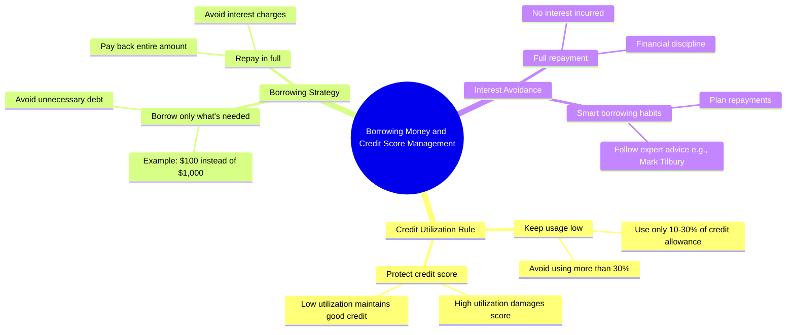

# How to Beat Evil Credit Cards

> 🌐 **Read this in:** **English** · [中文](../../zh-CN/2026-07/tiktok-transcript-how-to-beat-evil-credit-cards-learnontiktok-personalfinance-4b51.md)

> **Creator:** [@marktilbury](https://www.tiktok.com/@marktilbury) · **Views:** 17.7M · **Posted:** 2026-07-28 · **Niche:** finance
>
> **TL;DR:** The hook creates immediate intrigue by offering a large loan, then subverts expectations with a small request.

[Watch original video →](https://vt.tiktok.com/ZS4dyhkjf/)

## Why This Went Viral

## Hook (first 3 seconds)
- **Verbatim opening line:** "Hey, you got some money I can borrow?"
- **Hook pattern:** Scene + Question (a direct, personal request that feels like eavesdropping)
- **Why it stops scroll:** It opens mid-conversation with a financial ask — instantly relatable (who hasn't been asked for money?) and creates a "what’s the catch?" tension. The viewer is forced to lean in to see the reply.

## Emotional Rhythm
- **Beat 1 — Curiosity:** The loan request feels risky or awkward; viewer expects a scam or conflict.
- **Beat 2 — Surprise (twist):** "Sure, you can have up to $1,000" — unexpected generosity flips expectation.
- **Beat 3 — Cleverness / Tension:** "I'll take $100, please" — the borrower shows financial know-how, creating a power shift.
- **Beat 4 — Relief + Admiration:** "I know that if I use more than 10 to 30% of my credit allowance, you'll damage my credit score" — viewer realizes this is a *lesson*, not a transaction.
- **Beat 5 — Humor + Satisfaction:** "Oh, someone thinks they're clever… How does he know my secrets?" — the lender is outsmarted; viewer feels in on the joke.
- **Climax moment:** "I'm paying it all back in full, so I avoid paying any interest, thank you very much." — the full reveal of the borrower’s strategy.

## Keyword Density
- **"Credit"** — repeated 3 times; drives algorithmic reach (high-intent financial term, searchable).
- **"Pay back" / "paying"** — repeated 3 times; emotional pull (responsibility, trust).
- **"Interest"** — repeated 2 times; emotional resonance (fear of debt, smart money move).
- **"10 to 30%"** — specific number; algorithmic + emotional (credibility, actionable rule).
- **"Secrets"** — repeated once but lands hard; emotional pull (exclusivity, insider knowledge).
- **"Mark Tilbury"** — brand mention; algorithmic (creator tag, community signal).

*Algorithmic drivers:* "credit," "10 to 30%," "interest" — these are high-search-volume, low-competition financial keywords.  
*Emotional drivers:* "secrets," "pay back," "clever" — these create relatability and satisfaction.

## Why It Spreads
1. **Role reversal surprise:** The borrower (usually the vulnerable party) is actually the expert. This subverts a common social script — "I need money" → "I'm teaching you." The line *"Oh, someone thinks they're clever"* signals the power flip, making it shareable as a "gotcha" moment.
2. **Actionable financial rule in dialogue:** The 10–30% credit utilization rule is delivered naturally, not as a lecture. Viewers copy and share the exact phrase *"10 to 30% of my credit allowance"* because it’s a specific, usable takeaway.
3. **Cliffhanger + resolution in 30 seconds:** The entire arc — ask, counter, reveal, punchline — is complete in under 30 seconds. The line *"How does he know my secrets?"* acts as a laugh-and-share trigger, making it easy to forward to friends.
4. **Creator brand drop as social proof:** Ending with *"Because I follow Mark Tilbury"* turns the video into a referral. Viewers who want the same "secret knowledge" are motivated to follow the creator, and existing fans share to validate their own choice.
5. **Relatable awkwardness turned into empowerment:** Almost everyone has been asked to lend money. The video transforms a cringe moment into a confidence boost — *"I know how to protect my credit"* — making it aspirational to share.

## What You Can Steal
1. **Open mid-scene with a high-stakes ask:** Start with a direct, personal question that creates immediate tension ("Can I borrow money?"). Don't explain the context — let the viewer feel like they walked into a conversation.
2. **Deliver a counterintuitive rule through dialogue:** Instead of listing tips, have one character *demonstrate* the rule (e.g., "I'll only use 10–30% of my credit limit"). The viewer learns without feeling taught.
3. **End with a brand drop that rewards the viewer:** Name-drop the source of the knowledge ("Because I follow [creator]") — this gives the viewer a clear next step and turns the video into a referral engine.

## Mind Map

## Full Transcript (Generated by [free TikTok transcript generator](https://toktranscript.com/?utm_source=github&utm_medium=breakdown&utm_campaign=tool_attribution))

> 📝 Transcripts on this page are auto-generated and show the first 60%. Want to transcribe any TikTok in 30 seconds and get the full version? [Try TokTranscript free →](https://toktranscript.com/?utm_source=github&utm_medium=breakdown&utm_campaign=transcript_cta)

Hey, you got some money I can borrow? Sure, you can have up to $1,000. Cool, I'll take $100, please. Are you sure you don't want more? Yeah, because I know that if I use more than 10 to 30% of my credit allowance, you'll damage my credit score. Oh, someone thinks they're clever.

*[Read the full transcript on TokTranscript →](https://toktranscript.com/plaza/tiktok-transcript-how-to-beat-evil-credit-cards-learnontiktok-personalfinance-4b51?utm_source=github&utm_medium=breakdown&utm_campaign=transcript_full)*

## Browse More

- All [finance](../../by-niche/en/finance.md) breakdowns
- All [Unexpected Generosity](../../by-pattern/en/hook-unexpected-generosity.md) examples

## Video Info

| | |
|---|---|
| Creator | [@marktilbury](https://www.tiktok.com/@marktilbury) |
| Original video | [https://vt.tiktok.com/ZS4dyhkjf/](https://vt.tiktok.com/ZS4dyhkjf/) |
| Original title | How To Beat Evil Credit Cards! 😈 #learnontiktok #personalfinance #cre... |
| Views | 17.7M (17700000) |
| Posted | 2026-07-28 |
| Duration | 0s |
| Niche | `finance` |
| Hook pattern | `Unexpected Generosity` |
| Original language | `en` |
| Available languages | en, zh-CN |
| Generated | 2026-07-29 by [TokTranscript](https://toktranscript.com/) |

---

*This breakdown is for educational analysis under fair use. Original video © [@marktilbury](https://www.tiktok.com/@marktilbury). All transcripts are auto-generated and may contain errors.*

*Want to analyze your own TikToks like this? [TokTranscript →](https://toktranscript.com/viral-breakdown?utm_source=github&utm_medium=breakdown&utm_campaign=footer_cta)*