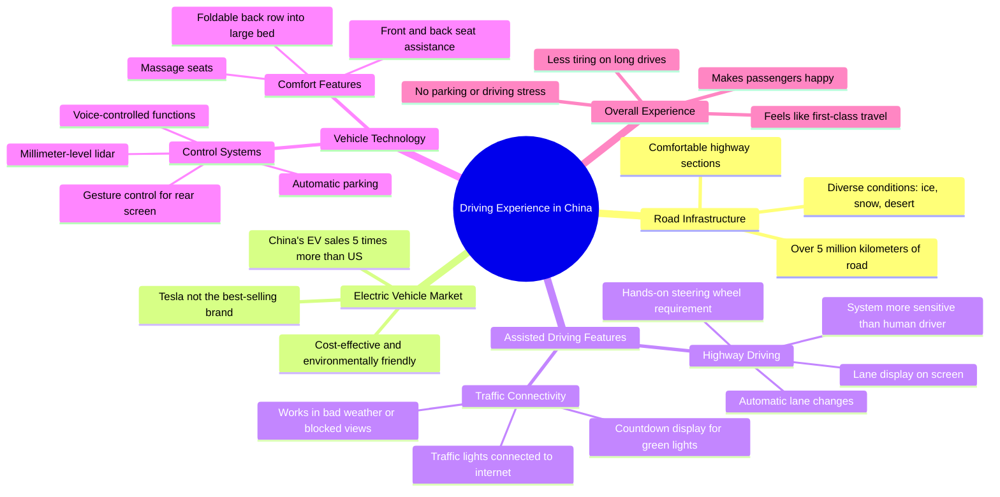

# Driving an Electric Car on a Chinese Highway

> 🌐 **Read this in:** **English** · [中文](../../zh-CN/2026-07/tiktok-transcript-if-you-come-to-china-you-might-as-well-rent-an-electric-car-336a.md)

> **Creator:** [@rogerwu_georgedeco](https://www.tiktok.com/@rogerwu_georgedeco) · **Views:** 2.3M · **Posted:** 2026-07-18 · **Niche:** other
>
> **TL;DR:** Opens with a curiosity gap about a specific, culturally intriguing experience.

[Watch original video →](https://www.tiktok.com/@rogerwu_georgedeco/video/7294087290576571680)

## Why This Went Viral

## Hook (first 3 seconds)
- **Verbatim opening:** "What's the experience of driving in China? I'm now driving on a Chinese highway to show you how it feels."
- **Hook pattern:** Question + scene-setting (curiosity-driven, immersive)
- **Why it stops scroll:** The question is universal (every driver wonders this), but the setting (China) is unfamiliar to most Western viewers. It promises a first-hand, insider perspective on a topic loaded with stereotypes and curiosity.

## Emotional Rhythm
- **Beat 1 – Curiosity:** "What's the experience of driving in China?" → opens a knowledge gap.
- **Beat 2 – Scale & surprise:** "5 million kilometers of road… ice, snow and desert" → establishes magnitude, defies expectation of "bad roads."
- **Beat 3 – Tension (comparison):** "Tesla… but China's annual sales are more than five times the US" → competitive tension, underdog narrative.
- **Beat 4 – Relief & delight:** "Automatic driveway… drives even better than me" → tech-wonder, pride.
- **Beat 5 – Escalating awe:** "Traffic lights and EVs are all connected to the internet… you don't have to worry about missing the green light" → climax of "future is now."
- **Beat 6 – Comfort & closure:** "I want to take a rest… more comfortable than at home" → aspirational lifestyle, satisfying ending.

## Keyword Density
- **"China"** (7+) – drives algorithmic reach (geopolitical curiosity, search volume).
- **"Electric car" / "EV"** (6+) – high-trend topic, algorithm-friendly.
- **"Driving" / "drive"** (8+) – core action, emotional pull (relatability).
- **"Automatic" / "assisted driving"** (4+) – tech novelty, emotional pull (wonder).
- **"Comfortable" / "comfort"** (3+) – aspirational emotion, shareability.
- **"First class"** (1, but high-impact) – luxury association, emotional pull.
- **"Tesla"** (2) – comparison anchor, algorithmic reach (brand search).
- **"Internet" / "connected"** (2) – future-tech signal, algorithmic reach.

## Why It Spreads
1. **Universal question + exotic setting:** "What's it like driving in China?" is a question millions of Westerners have but few can answer. The video positions itself as a rare, authentic POV.
2. **Underdog narrative with data:** "China sells 5x more EVs than the US" is a concrete, surprising stat that triggers pride (for Chinese viewers) or shock (for Western viewers) — both drive shares.
3. **Tech-wonder escalates visually:** Each feature (auto lane change, internet-connected traffic lights, gesture control, massage seats) is more impressive than the last, creating a "wow chain" that keeps viewers watching and commenting "we don't have this in [my country]."
4. **Relatable, humble host:** The line "I want to take a rest in the car… more comfortable than at home" makes the luxury feel accessible, not braggy. The final "I held you go to walk… oh yeah, for me, your fine friend Roger" adds personality and authenticity — people share content that feels like a friend showing off a cool thing.
5. **Contrast-driven structure:** The video constantly contrasts "what you think" (bad roads, Tesla dominance) with "what is" (5M km roads, Chinese brands leading) — this tension is the engine of virality.

## What You Can Steal
1. **Open with a universal question that implies a knowledge gap.** "What's the experience of [X] in [unfamiliar place]?" works for any niche — travel, tech, food, work culture. It hooks both insiders (who want validation) and outsiders (who want discovery).
2. **Use a "comparison escalator" — not just one contrast, but three.** Here: roads (scale) → EV sales (market) → features (tech). Each comparison raises the stakes and keeps the viewer from clicking away.
3. **End with a mundane, relatable moment that humanizes the wow.** After all the futuristic tech, the host says he wants to nap and compares the car to home. This makes the content feel like a genuine experience, not a corporate ad — and that trust is what makes people hit share.

## Mind Map

## Full Transcript (Generated by [TokTranscript](https://toktranscript.com/?utm_source=github&utm_medium=breakdown&utm_campaign=tool_attribution))

> 📝 Transcripts on this page are auto-generated and show the first 60%. Want to transcribe any TikTok in 30 seconds and get the full version? [Try TokTranscript free →](https://toktranscript.com/?utm_source=github&utm_medium=breakdown&utm_campaign=transcript_cta)

What's the experience of driving in China? I'm now driving on a Chinese highway to show you how it feels. China has a more than 5 million kilometers of road, including ice, snow and desert. In comparison, the weather was good today and I'm driving on a comfortable section of road with my electrical car. When people talk about electric cars, the usual thing of Tesla in the United States. But did you know that China's annual sales of electric cars are more than five times out of the United States? And Tesla is not the best selling here. Automatic driveway makes me less tired on long highway drives. It drives even better than me. If the car in front of you is too slow, it will automatically change lands to passage and the display will tell you exactly which land you are in. The functions in the car can be controlled by what it makes me, the driver, feel like. I'm enjoying first class. Always. I enjoy driving this car to give a ride to my friends. It always makes everyone happy. Is this ultra pilot? Yes, this. But it is still request me put my hand on the steering wheel. This is my first experience riding this panel electric car I never seen before in other countries. After leaving the highway, assisted driving. The steel effect. The system is more sensitive than me and is always paying attention to any emergencies on the road. Aradhamp has the cross team. I see How long the traffic lights will turn green in the car?

*[Read the full transcript on TokTranscript →](https://toktranscript.com/plaza/tiktok-transcript-if-you-come-to-china-you-might-as-well-rent-an-electric-car-336a?utm_source=github&utm_medium=breakdown&utm_campaign=transcript_full)*

## Browse More

- All [other](../../by-niche/en/other.md) breakdowns
- All [Question-Answer](../../by-pattern/en/hook-question-answer.md) examples

## Video Info

| | |
|---|---|
| Creator | [@rogerwu_georgedeco](https://www.tiktok.com/@rogerwu_georgedeco) |
| Original video | [https://www.tiktok.com/@rogerwu_georgedeco/video/7294087290576571680](https://www.tiktok.com/@rogerwu_georgedeco/video/7294087290576571680) |
| Original title | If you come to China, you might as well rent an electric car to exper... |
| Views | 2.3M (2300000) |
| Posted | 2026-07-18 |
| Duration | 0s |
| Niche | `other` |
| Hook pattern | `Question-Answer` |
| Original language | `en` |
| Available languages | en, zh-CN |
| Generated | 2026-07-19 by [TokTranscript](https://toktranscript.com/) |

---

*This breakdown is for educational analysis under fair use. Original video © [@rogerwu_georgedeco](https://www.tiktok.com/@rogerwu_georgedeco). All transcripts are auto-generated and may contain errors.*

*Want to analyze your own TikToks like this? [TokTranscript →](https://toktranscript.com/viral-breakdown?utm_source=github&utm_medium=breakdown&utm_campaign=footer_cta)*