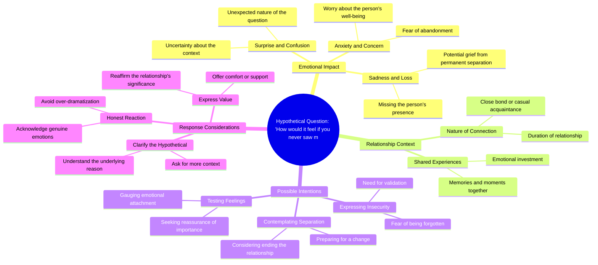

# Steve Harvey Asks How You'd Feel If You Never Saw Him Again

> 🌐 **Read this in:** **English** · [中文](../../zh-CN/2026-07/tiktok-transcript-if-you-never-saw-me-again-steveharvey-mindset-mentality-succ-5e54.md)

> **Creator:** [@_mentality4life_](https://www.tiktok.com/@_mentality4life_) · **Views:** 25.0M · **Posted:** 2026-07-02 · **Niche:** other
>
> **TL;DR:** Opens with a disarming, intimate question that creates immediate curiosity and emotional stakes.

[Watch original video →](https://www.tiktok.com/t/ZP8GBQCRW/)

## Why This Went Viral

## Hook (first 3 seconds)
- **Verbatim opening:** "Can I ask you a question? Just. Just hypothetical. How would it make you feel if you never saw me again?"
- **Hook pattern:** **Question** (personal, hypothetical, emotionally charged)
- **Why it stops scrolling:** It breaks the fourth wall, creates immediate intimacy, and triggers a visceral emotional response (guilt, curiosity, or defensiveness). The pause "Just. Just hypothetical." adds tension and makes the viewer lean in.

## Emotional Rhythm
1. **Curiosity** – "Can I ask you a question?" (low-stakes opener)
2. **Tension spike** – "How would it make you feel if you never saw me again?" (sudden, high-stakes hypothetical)
3. **Suspense** – Viewer waits for the speaker's reaction or next line (unresolved feeling)
4. **Resonance / Self-reflection** – The viewer is forced to imagine loss, creating a personal emotional hit
5. **Climax** – The moment the question lands and the viewer realizes the video is about *their* relationship with the creator (or someone in their life)
6. **Relief or guilt** – Depending on the follow-up, but the emotional peak is the question itself

## Keyword Density
- **"you"** – 4x (drives personalization, algorithmic engagement via direct address)
- **"feel"** – 2x (emotional pull, triggers empathy)
- **"hypothetical"** – 2x (reduces threat, frames as safe space)
- **"never"** – 1x (absolute, high-emotion word)
- **"question"** – 1x (sets frame, invites participation)
- **"again"** – 1x (finality, loss)

**Algorithmic reach drivers:** "you" (high engagement via comments/shares), "question" (encourages reply).  
**Emotional pull drivers:** "feel," "never," "again" (activate loss aversion and empathy).

## Why It Spreads
1. **Direct address + vulnerability = high shareability** – The question "How would it make you feel if you never saw me again?" forces viewers to imagine losing the creator. People share it to tag friends or partners, saying "This made me think of you."
2. **Open loop creates comments** – The question is unanswered, so viewers comment their feelings, guesses, or reactions. Every comment boosts algorithmic distribution.
3. **Low barrier to participation** – Anyone can answer a hypothetical. No expertise needed. This drives rapid engagement (views → comments → shares).
4. **Emotional friction** – The line between "hypothetical" and "real" is blurry. Viewers feel a mix of guilt, curiosity, and affection, which compels them to watch again or send to someone they care about.
5. **Pattern interrupt** – The pause "Just. Just hypothetical." breaks the rhythm of normal conversation, making the brain pay extra attention. This increases watch time.

## What You Can Steal
1. **Start with a personal question, not a statement.** Questions force mental participation. Use "you" to make it feel one-on-one.
2. **Insert a micro-pause or stutter for tension.** The "Just. Just hypothetical." trick adds realism and suspense. A tiny hesitation makes the hook feel unscripted and raw.
3. **Leave the loop open.** Don't answer your own question in the first 15 seconds. Let the viewer sit in the discomfort — they'll comment or watch longer to see your reaction.

## Mind Map

## Full Transcript (Generated by [TokTranscript.com](https://toktranscript.com/?utm_source=github&utm_medium=breakdown&utm_campaign=tool_attribution))

> 📝 Transcripts on this page are auto-generated and show the first 60%. Want to transcribe any TikTok in 30 seconds and get the full version? [Try TokTranscript free →](https://toktranscript.com/?utm_source=github&utm_medium=breakdown&utm_campaign=transcript_cta)

Can I ask you a question? Just. Just hypothetical.

*[Read the full transcript on TokTranscript →](https://toktranscript.com/plaza/tiktok-transcript-if-you-never-saw-me-again-steveharvey-mindset-mentality-succ-5e54?utm_source=github&utm_medium=breakdown&utm_campaign=transcript_full)*

## Browse More

- All [other](../../by-niche/en/other.md) breakdowns
- All [Hypothetical Question](../../by-pattern/en/hook-hypothetical-question.md) examples

## Video Info

| | |
|---|---|
| Creator | [@_mentality4life_](https://www.tiktok.com/@_mentality4life_) |
| Original video | [https://www.tiktok.com/t/ZP8GBQCRW/](https://www.tiktok.com/t/ZP8GBQCRW/) |
| Original title | “If you never saw me again” #steveharvey #mindset #mentality #success... |
| Views | 25.0M (25000000) |
| Posted | 2026-07-02 |
| Duration | 0s |
| Niche | `other` |
| Hook pattern | `Hypothetical Question` |
| Original language | `en` |
| Available languages | en, zh-CN |
| Generated | 2026-07-03 by [TokTranscript](https://toktranscript.com/) |

---

*This breakdown is for educational analysis under fair use. Original video © [@_mentality4life_](https://www.tiktok.com/@_mentality4life_). All transcripts are auto-generated and may contain errors.*

*Want to analyze your own TikToks like this? [try this transcription tool →](https://toktranscript.com/viral-breakdown?utm_source=github&utm_medium=breakdown&utm_campaign=footer_cta)*