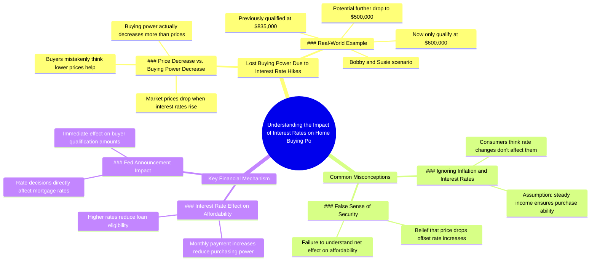

# Waiting on Market Drop to Buy? You Lost Buying Power

> 🌐 **Read this in:** **English** · [中文](../../zh-CN/2026-07/tiktok-transcript-if-you-re-waiting-on-the-market-to-go-down-to-buy-you-may-be-a80b.md)

> **Creator:** [@glenndabaker](https://www.tiktok.com/@glenndabaker) · **Views:** 1.6M · **Posted:** 2026-07-12 · **Niche:** finance
>
> **TL;DR:** Directly calls out a common objection and immediately reframes it as a loss.

[Watch original video →](https://vt.tiktok.com/ZSXN4UfJP/)

## Why This Went Viral

## Hook (first 3 seconds)
- **Verbatim:** "for those of you who said i'm gonna wait till the market comes down oh glenda the market's gonna crash it's gonna come down in value"
- **Hook pattern:** Contrast / direct address ("for those of you who said") + mockery ("oh glenda")
- **Why it stops scroll:** Immediately calls out a specific audience (people who said they'd wait) with a condescending, relatable tone. The "oh Glenda" mockery creates instant emotional tension — viewers either feel attacked or entertained.

## Emotional Rhythm
- **Curiosity →** "for those of you who said i'm gonna wait" (who's this about?)
- **Tension →** "oh glenda the market's gonna crash" (mocking tone escalates)
- **Frustration →** "hello the interest rate just went up the price came down" (rapid-fire logic)
- **Revelation →** "do you understand what you lost you lost your buying power" (climax — the real loss)
- **Resonance →** "we've got bobby and susie over here a year and a half ago they're looking at 8 35 now they're at 600" (concrete example)
- **Urgency →** "if the interest rate at 2 o'clock goes up today... they may go from 600 down to 500" (time pressure)
- **Climax:** "bull you're not" — the blunt, dismissive truth that breaks the viewer's illusion

## Keyword Density
- **"interest rate"** — 5x (algorithmic reach: trending financial topic)
- **"price came down" / "prices may come down"** — 3x (emotional pull: false hope vs. reality)
- **"buying power"** — 2x (emotional pull: core fear of losing ability)
- **"lost" / "losing"** — 2x (emotional pull: regret and scarcity)
- **"market"** — 2x (algorithmic reach: broad financial keyword)
- **"600" / "500" / "835"** — numbers (algorithmic: specific data drives credibility)

## Why It Spreads
1. **Relatable frustration** — "for those of you who said i'm gonna wait" directly targets a massive audience of people who hesitated on buying, triggering either self-recognition or schadenfreude
2. **Concrete, emotional math** — "they're looking at 8 35 now they're at 600" turns abstract market concepts into a personal story of loss (Bobby and Susie)
3. **Urgency + fear of missing out** — "if the interest rate at 2 o'clock goes up today" creates a ticking clock, making viewers feel they must act now or lose more
4. **Blunt, meme-able delivery** — "bull you're not" is short, punchy, and re-shareable as a clip or quote
5. **Algorithm-friendly topic** — "interest rate," "inflation," "market crash" are high-volume search terms that YouTube/Instagram/TikTok amplify

## What You Can Steal
1. **Call out a specific, wrong belief** — Start with "for those of you who said [common bad take]." It instantly hooks people who hold that belief or love watching it get debunked.
2. **Use a relatable "Bobby and Susie" story** — Give a concrete example with fake names and real numbers. It makes abstract financial concepts feel personal and urgent.
3. **End with a blunt, dismissive truth** — A short, punchy line like "bull you're not" is highly shareable and works as a standalone clip or meme template.

## Mind Map

## Full Transcript (Generated by [TokTranscript](https://toktranscript.com/?utm_source=github&utm_medium=breakdown&utm_campaign=tool_attribution))

> 📝 Transcripts on this page are auto-generated and show the first 60%. Want to transcribe any TikTok in 30 seconds and get the full version? [Try TokTranscript free →](https://toktranscript.com/?utm_source=github&utm_medium=breakdown&utm_campaign=transcript_cta)

for those of you who said i'm gonna wait till the market comes down oh glenda the market's gonna crash it's gonna come down in value hello the interest rate just went up the price came down the interest rate just went up do you understand what you lost you lost your buying power that's the thing that i can't get the consumer to understand we've got bobby and susie over here a year and a half ago they're looking at 8 35 now they're at 600 and if the interest rate at 2 o'clock goes

*[Read the full transcript on TokTranscript →](https://toktranscript.com/plaza/tiktok-transcript-if-you-re-waiting-on-the-market-to-go-down-to-buy-you-may-be-a80b?utm_source=github&utm_medium=breakdown&utm_campaign=transcript_full)*

## Browse More

- All [finance](../../by-niche/en/finance.md) breakdowns
- All [Direct Address + Contrarian Question](../../by-pattern/en/hook-direct-address-contrarian-question.md) examples

## Video Info

| | |
|---|---|
| Creator | [@glenndabaker](https://www.tiktok.com/@glenndabaker) |
| Original video | [https://vt.tiktok.com/ZSXN4UfJP/](https://vt.tiktok.com/ZSXN4UfJP/) |
| Original title | If you’re waiting on the market to go down to buy… You may be shit ou... |
| Views | 1.6M (1600000) |
| Posted | 2026-07-12 |
| Duration | 0s |
| Niche | `finance` |
| Hook pattern | `Direct Address + Contrarian Question` |
| Original language | `en` |
| Available languages | en, zh-CN |
| Generated | 2026-07-13 by [TokTranscript](https://toktranscript.com/) |

---

*This breakdown is for educational analysis under fair use. Original video © [@glenndabaker](https://www.tiktok.com/@glenndabaker). All transcripts are auto-generated and may contain errors.*

*Want to analyze your own TikToks like this? [analyze your own TikToks →](https://toktranscript.com/viral-breakdown?utm_source=github&utm_medium=breakdown&utm_campaign=footer_cta)*