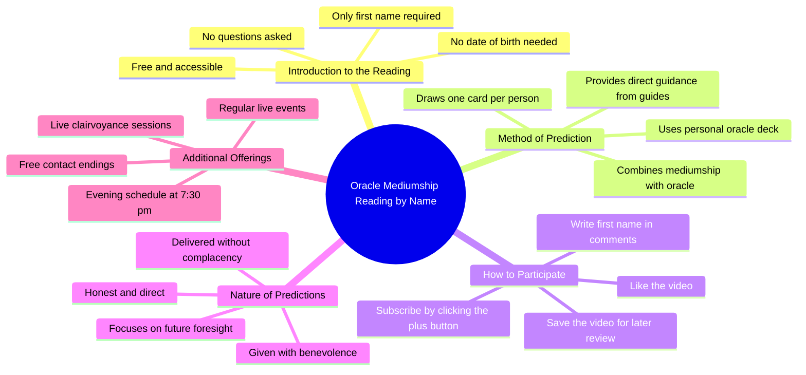

# Real Fortune Telling: Write Your First Name in Comments

> 🌐 **Read this in:** **English** · [中文](../../zh-CN/2026-07/tiktok-transcript-je-vais-te-faire-de-la-vrai-divination-crit-ton-pr-nom-en-co-8805.md)

> **Creator:** [@voyancevenda](https://www.tiktok.com/@voyancevenda) · **Views:** 630.1K · **Posted:** 2026-07-06 · **Niche:** other
>
> **TL;DR:** Commands immediate action while promising a mysterious reward, driving engagement.

[Watch original video →](https://www.tiktok.com/t/ZP8G5xN3o/)

## Why This Went Viral

## Hook (first 3 seconds)
- **What happens verbatim:** "Don't ask me any questions, just write me your first name in comments."
- **Hook pattern:** Command + curiosity gap (directive with a forbidden action)
- **Why it stops scrolling:** The opening line is a strict, mysterious command that creates immediate intrigue. It breaks the typical "ask me anything" format by forbidding questions, making viewers feel they're about to receive exclusive, private information. The phrase "no specific questions, no date of birth" adds a layer of secrecy and exclusivity.

## Emotional Rhythm
- **Beat 1 – Curiosity (0–3s):** "Don't ask me any questions" – a counterintuitive command that piques interest.
- **Beat 2 – Mystery (3–8s):** "I'll tell you what my guides tell you through 1 card, my oracle" – introduces a supernatural element, building tension.
- **Beat 3 – Suspense (8–12s):** "I do some real mediumship" – stakes are raised; this isn't a game, it's "real."
- **Beat 4 – Anticipation (12–18s):** "I will tell you what foresees your future" – the promise is explicit, creating a desire to participate.
- **Beat 5 – Urgency (18–24s):** "Subscribe, like, write your name" – a rapid-fire call to action that capitalizes on built-up curiosity.
- **Climax moment:** The phrase "without complacency but in benevolence" – this moral framing adds weight and trust, making the viewer feel the prediction will be honest and caring.

## Keyword Density
- **"Name"** – repeated 3 times. Drives algorithmic reach (comment engagement) and emotional pull (personalization).
- **"Future"** – repeated 2 times. Emotional pull – taps into universal human anxiety/curiosity.
- **"Oracle"** – repeated 2 times. Emotional pull – mystical, authoritative, creates a sense of ancient wisdom.
- **"Guides"** – repeated 1 time (implied). Emotional pull – suggests spiritual backing, not just a random person.
- **"Subscribe"** – repeated 1 time. Algorithmic reach – direct call to action for platform metrics.
- **"Comments"** – repeated 2 times. Algorithmic reach – drives engagement signals.
- **"Card"** – repeated 1 time. Emotional pull – visual, tangible, adds authenticity to the fortune-telling claim.
- **"Benevolence"** – repeated 1 time. Emotional pull – trust-building, softens the "no complacency" warning.
- **"Free"** – repeated 1 time. Algorithmic reach + emotional pull – triggers cost-benefit psychology.
- **"7:30 pm"** – repeated 1 time. Algorithmic reach – creates a time-bound urgency for live events.

## Why It Spreads
1. **Low-friction engagement loop:** The command "write your first name in comments" is the simplest possible action. No questions, no birth dates, no personal info. This dramatically lowers the barrier to participation, flooding the comment section and triggering the algorithm's engagement signals.
2. **Personalization as a reward:** The promise "I will tell you what foresees your future" makes every commenter feel they'll receive a unique, private reading. This creates a high perceived value for a zero-cost action, driving mass participation.
3. **Mystical authority + trust framing:** The phrase "without complacency but in benevolence" is a masterclass in trust-building. It admits the reading might be harsh ("no complacency") but frames it as caring ("benevolence"), making viewers more likely to believe and share.
4. **Time-sensitive scarcity:** "See you soon on my lives... at 7:30 pm" creates a deadline. Viewers who miss the live feel FOMO, while those who attend get a sense of exclusivity. This drives both immediate engagement and future viewership.
5. **Algorithm-friendly structure:** The video front-loads the hook, then immediately transitions to a clear CTA ("subscribe, like, write your name"). It also mentions saving the video ("register this video to review your prediction"), which increases watch time and saves—two key algorithmic signals.

## What You Can Steal
1. **The "forbidden action" hook:** Start with a counterintuitive command that breaks the expected pattern. Instead of "Ask me anything," say "Don't ask me anything." This creates instant curiosity and makes your video stand out in a crowded feed.
2. **The ultra-low-friction CTA:** Ask for the simplest possible action (just a first name, no questions, no details). The easier the ask, the higher the engagement. Then promise a high-value, personalized reward for that tiny action.
3. **The "honest but caring" trust frame:** Preemptively address skepticism by admitting your content might be blunt ("without complacency") but then immediately soften it with warmth ("in benevolence"). This builds credibility and emotional safety, making viewers more likely to engage and share.

## Mind Map

## Full Transcript (Generated by [TokTranscript](https://toktranscript.com/?utm_source=github&utm_medium=breakdown&utm_campaign=tool_attribution))

> 📝 Transcripts on this page are auto-generated and show the first 60%. Want to transcribe any TikTok in 30 seconds and get the full version? [Try TokTranscript free →](https://toktranscript.com/?utm_source=github&utm_medium=breakdown&utm_campaign=transcript_cta)

Don't ask me any questions, just write me your first name in comments. No specific questions, no date of birth. I'll tell you what my guides tell you through 1 card, my oracle that I created. I do some real mediumship I will do it through my oracle. You put me your name in comments and I will tell you what foresees your future without complacency but in benevolence.

*[Read the full transcript on TokTranscript →](https://toktranscript.com/plaza/tiktok-transcript-je-vais-te-faire-de-la-vrai-divination-crit-ton-pr-nom-en-co-8805?utm_source=github&utm_medium=breakdown&utm_campaign=transcript_full)*

## Browse More

- All [other](../../by-niche/en/other.md) breakdowns
- All [Direct Command with Mystery](../../by-pattern/en/hook-direct-command-with-mystery.md) examples

## Video Info

| | |
|---|---|
| Creator | [@voyancevenda](https://www.tiktok.com/@voyancevenda) |
| Original video | [https://www.tiktok.com/t/ZP8G5xN3o/](https://www.tiktok.com/t/ZP8G5xN3o/) |
| Original title | Je vais te faire de la vrai divination - écrit ton prénom en commenta... |
| Views | 630.1K (630100) |
| Posted | 2026-07-06 |
| Duration | 0s |
| Niche | `other` |
| Hook pattern | `Direct Command with Mystery` |
| Original language | `en` |
| Available languages | en, zh-CN |
| Generated | 2026-07-08 by [TokTranscript](https://toktranscript.com/) |

---

*This breakdown is for educational analysis under fair use. Original video © [@voyancevenda](https://www.tiktok.com/@voyancevenda). All transcripts are auto-generated and may contain errors.*

*Want to analyze your own TikToks like this? [TokTranscript →](https://toktranscript.com/viral-breakdown?utm_source=github&utm_medium=breakdown&utm_campaign=footer_cta)*