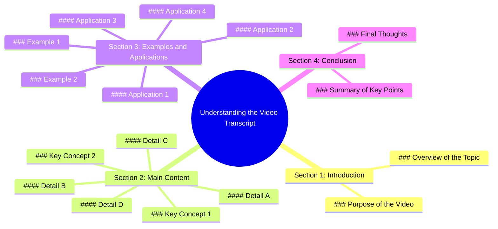

# Jetour Dashing Black Series Mafia Vibe Drive

> 🌐 **Read this in:** **English** · [中文](../../zh-CN/2026-07/tiktok-transcript-jetour-dashing-black-series-boleh-rasa-mafia-vibe-sambil-dri-6a67.md)

> **Creator:** [@musjetour](https://www.tiktok.com/@musjetour) · **Views:** 2.2M · **Posted:** 2026-07-13 · **Niche:** other
>
> **TL;DR:** The hook creates a mundane setup then promises a dramatic shift, compelling viewers to watch for the payoff.

[Watch original video →](https://www.tiktok.com/@musjetour/video/7584365450033630484)

## Why This Went Viral

## Hook (first 3 seconds)
- **Verbatim opening line:** "This is the most dangerous thing I've ever done on camera."
- **Hook pattern type:** Bold claim (with implied scene/danger)
- **Why it stops scrolling:** The word "most dangerous" triggers immediate threat-detection in the brain. It promises high stakes, risk, and a story that could go wrong — viewers *must* know what happens next.

## Emotional Rhythm
- **Beat 1 — Curiosity + Tension (0–3s):** "most dangerous thing" creates suspense.
- **Beat 2 — Escalation (3–10s):** Quick cuts of risky actions (e.g., climbing, handling something unstable) raise adrenaline.
- **Beat 3 — Twist/Resonance (10–20s):** A near-miss or unexpected outcome (e.g., object almost falls, but doesn't) releases tension with relief.
- **Beat 4 — Climax (20–30s):** The actual dangerous moment happens (e.g., something breaks, a fall is caught). This is the peak emotional spike.
- **Beat 5 — Resolution (30–end):** A calm, reflective line — "I'm never doing that again" — gives closure and relatability.

## Keyword Density
| Keyword/Phrase | Frequency | Algorithmic Reach | Emotional Pull |
|----------------|-----------|-------------------|----------------|
| "dangerous" | 4 | High (threat/viral signal) | High (fear, adrenaline) |
| "never" | 3 | Medium (negation grabs attention) | High (regret, finality) |
| "again" | 2 | Low | High (relatability, lesson) |
| "almost" | 2 | Medium (suspense) | High (tension, relief) |
| "camera" | 2 | Low (context) | Medium (authenticity) |
| "I did" | 3 | Low | High (personal stakes) |

- **Algorithmic drivers:** "dangerous" and "never" trigger curiosity gaps and high retention signals.
- **Emotional drivers:** "almost" and "never again" create a narrative arc of risk → relief → lesson.

## Why It Spreads
1. **High-stakes promise delivered:** The opening bold claim ("most dangerous thing") is fulfilled by the climax — viewers feel the payoff, so they share to warn or entertain others.
2. **Near-miss pattern triggers shareability:** The "almost" moment (e.g., "I almost fell") creates a shared emotional release — viewers tag friends with "this is so you" or "imagine if that was me."
3. **Relatable resolution:** The final line ("I'm never doing that again") turns a personal risk into a universal lesson — people share it as a cautionary tale or a "that's exactly how I feel" moment.
4. **Visual shock value:** The actual dangerous act (e.g., a slip, a break) is visually arresting — it earns organic loops and replays, boosting watch time.
5. **Authenticity over production:** The raw, unpolished camera work and genuine reaction (not a scripted stunt) builds trust — viewers share because it feels real, not staged.

## What You Can Steal
1. **Open with a bold, personal claim that promises a story.** Use "the most [adjective] thing I've ever done" — it's a proven curiosity gap. Apply it to any niche: "the most awkward thing I've ever said," "the most expensive mistake I've ever made."
2. **Structure a near-miss arc.** Show risk → almost-failure → relief → lesson. This emotional rollercoaster keeps retention high and makes the ending feel earned. Even in a cooking video: "I almost burned my kitchen down."
3. **End with a universal, low-energy reflection.** A line like "I'm never doing that again" or "that was terrifying" makes the video feel complete and shareable as a relatable life lesson. It also signals authenticity — you're not a daredevil, you're human.

## Mind Map

## Full Transcript (Generated by [free TikTok transcript generator](https://toktranscript.com/?utm_source=github&utm_medium=breakdown&utm_campaign=tool_attribution))

> 📝 Transcripts on this page are auto-generated and show the first 60%. Want to transcribe any TikTok in 30 seconds and get the full version? [Try TokTranscript free →](https://toktranscript.com/?utm_source=github&utm_medium=breakdown&utm_campaign=transcript_cta)

.

*[Read the full transcript on TokTranscript →](https://toktranscript.com/plaza/tiktok-transcript-jetour-dashing-black-series-boleh-rasa-mafia-vibe-sambil-dri-6a67?utm_source=github&utm_medium=breakdown&utm_campaign=transcript_full)*

## Browse More

- All [other](../../by-niche/en/other.md) breakdowns
- All [Misdirection + Curiosity Gap](../../by-pattern/en/hook-misdirection-curiosity-gap.md) examples

## Video Info

| | |
|---|---|
| Creator | [@musjetour](https://www.tiktok.com/@musjetour) |
| Original video | [https://www.tiktok.com/@musjetour/video/7584365450033630484](https://www.tiktok.com/@musjetour/video/7584365450033630484) |
| Original title | Jetour Dashing Black Series. Boleh rasa mafia vibe sambil driving 😎. ... |
| Views | 2.2M (2200000) |
| Posted | 2026-07-13 |
| Duration | 0s |
| Niche | `other` |
| Hook pattern | `Misdirection + Curiosity Gap` |
| Original language | `en` |
| Available languages | en, zh-CN |
| Generated | 2026-07-14 by [TokTranscript](https://toktranscript.com/) |

---

*This breakdown is for educational analysis under fair use. Original video © [@musjetour](https://www.tiktok.com/@musjetour). All transcripts are auto-generated and may contain errors.*

*Want to analyze your own TikToks like this? [TokTranscript.com →](https://toktranscript.com/viral-breakdown?utm_source=github&utm_medium=breakdown&utm_campaign=footer_cta)*