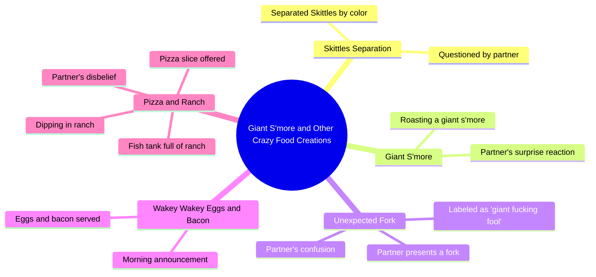

# Giant S'more Roast and Skittles Separation Reaction

> 🌐 **Read this in:** **English** · [中文](../../zh-CN/2026-07/tiktok-transcript-jtvjember-evakuasi-sidoarjo-fyp-foryou-b9ba.md)

> **Creator:** [@vincentwilliams6018](https://www.tiktok.com/@vincentwilliams6018) · **Views:** 12.0M · **Posted:** 2026-07-03 · **Niche:** other
>
> **TL;DR:** The hook uses rapid exclamations and a question to create immediate intrigue about an unexpected food item.

[Watch original video →](https://www.tiktok.com/@vincentwilliams6018/video/7643013038341164319)

## Why This Went Viral

## Hook (first 3 seconds)
- **Verbatim opening:** "Babe! Oh, my god. Oh, my god. What? What are you eating now? What? What could you possibly have? Baby, the hell is that?"
- **Hook pattern:** Scene + high-emotion reaction (shock/disbelief) + rapid-fire questions
- **Why it stops scroll:** The extreme, almost frantic reaction creates immediate curiosity—viewers need to see what’s causing this level of disbelief. The staccato delivery and repeated "What?" mimic a live, unscripted moment, making it feel authentic and urgent.

## Emotional Rhythm
1. **Confusion/shock (0–3s):** "Babe! Oh, my god." — Viewer is pulled in by raw reaction.
2. **Curiosity (3–6s):** "What are you eating now?" — Builds mystery about the object.
3. **Surprise (6–8s):** "Skittles? You separated all of that?" — First reveal, but still mundane.
4. **Escalation (8–15s):** "We are going to roast a giant s'more." — Twist: it’s a process, not just a snack.
5. **Absurdity (15–25s):** "A giant fucking fool." — Comedic tension peaks with the fork reveal.
6. **Relief/laughter (25–30s):** "Oh, no. In the actual fuck, baby, this person is crazy." — Viewer bonds with the narrator’s exasperation.
7. **New twist (30–40s):** "Wakey, wakey. Eggs and bacon." — Resets curiosity with a new absurd scenario.
8. **Climax (40–45s):** "A fish tank full of ranch?" — The most visually outrageous reveal, delivering the punchline.
- **Climax moment:** The "fish tank full of ranch" reveal—it’s the most visually absurd and unexpected item, capping the series of escalating oddities.

## Keyword Density
- **"What"** (8x) — Drives algorithmic reach via high engagement (comments, shares) and emotional pull (curiosity).
- **"Baby"** (4x) — Emotional pull; creates intimacy and relatability (couple dynamic).
- **"Giant"** (3x) — Algorithmic reach (size contrast is clickable); emotional pull (exaggeration for humor).
- **"Fool/fucking"** (2x) — Emotional pull (comedic emphasis, shock value).
- **"Ranch"** (2x) — Algorithmic reach (specific, memorable food item drives search/shares).
- **"Crazy"** (1x) — Emotional pull (labels the absurdity, making viewer feel validated in their reaction).
- **"Pizza/Skittles/eggs and bacon"** — Algorithmic reach (common foods, easy to visualize and discuss).

## Why It Spreads
- **Relatable shock loop:** The narrator’s escalating disbelief ("In the actual fuck, baby, this person is crazy") mirrors the viewer’s own reaction, creating a shared experience. Viewers tag friends saying "us" or "this is us."
- **Visual absurdity escalation:** Each reveal (separated Skittles → giant s'more → fork → fish tank of ranch) gets more ridiculous. The "fish tank" is the peak—it’s so bizarre it’s shareable as a "can you believe this?" moment.
- **High rewatchability:** The rapid-fire editing and multiple reveals reward rewatches. Viewers catch new details (e.g., the fork, the "giant" s'more) on second viewing, boosting retention metrics.
- **Comment bait:** The video ends with a question ("What's the headline for today?") and a shocking visual, prompting viewers to comment "what?" or "this is insane." The "ranch" twist also sparks debates (e.g., "ranch on pizza?!").
- **Duet/collab potential:** The format (one person reacting to another’s absurd food choices) is easily replicated. Creators can duet by reacting to the original or making their own version.

## What You Can Steal
1. **The "escalating absurdity" structure:** Start with a mildly weird thing (separated Skittles), then keep topping it with more outrageous reveals (giant s'more, fork, fish tank of ranch). Each new item raises the stakes, keeping viewers hooked.
2. **Use rapid-fire, reactive dialogue:** Short, punchy lines like "What?" and "Baby, the hell is that?" create a rhythm that feels spontaneous and high-energy. Avoid long explanations—let the visuals do the work.
3. **End on the most shareable visual:** The "fish tank full of ranch" is the video’s climax and the most likely clip to be shared out of context. Always save the wildest, most visually absurd element for last—it becomes the punchline and the shareable hook.

## Mind Map

## Full Transcript (Generated by [TokTranscript](https://toktranscript.com/?utm_source=github&utm_medium=breakdown&utm_campaign=tool_attribution))

> 📝 Transcripts on this page are auto-generated and show the first 60%. Want to transcribe any TikTok in 30 seconds and get the full version? [Try TokTranscript free →](https://toktranscript.com/?utm_source=github&utm_medium=breakdown&utm_campaign=transcript_cta)

Babe! Oh, my god. Oh, my god. What? What are you eating now? What? What could you possibly have? Baby, the hell is that? Skittles. Skittles? You separated all of that? Hey, baby, we are going to roast a giant s'more. What? A giant s'more. Oh, hey, baby, what's on the menu today? I have another step. What? What is this? A fork? A giant fucking fool. What? Oh, no.

*[Read the full transcript on TokTranscript →](https://toktranscript.com/plaza/tiktok-transcript-jtvjember-evakuasi-sidoarjo-fyp-foryou-b9ba?utm_source=github&utm_medium=breakdown&utm_campaign=transcript_full)*

## Browse More

- All [other](../../by-niche/en/other.md) breakdowns
- All [Surprise and escalating curiosity](../../by-pattern/en/hook-surprise-and-escalating-curiosity.md) examples

## Video Info

| | |
|---|---|
| Creator | [@vincentwilliams6018](https://www.tiktok.com/@vincentwilliams6018) |
| Original video | [https://www.tiktok.com/@vincentwilliams6018/video/7643013038341164319](https://www.tiktok.com/@vincentwilliams6018/video/7643013038341164319) |
| Original title | #jtvjember #evakuasi #sidoarjo #fyp#foryou |
| Views | 12.0M (12000000) |
| Posted | 2026-07-03 |
| Duration | 0s |
| Niche | `other` |
| Hook pattern | `Surprise and escalating curiosity` |
| Original language | `en` |
| Available languages | en, zh-CN |
| Generated | 2026-07-04 by [TokTranscript](https://toktranscript.com/) |

---

*This breakdown is for educational analysis under fair use. Original video © [@vincentwilliams6018](https://www.tiktok.com/@vincentwilliams6018). All transcripts are auto-generated and may contain errors.*

*Want to analyze your own TikToks like this? [TokTranscript.com →](https://toktranscript.com/viral-breakdown?utm_source=github&utm_medium=breakdown&utm_campaign=footer_cta)*